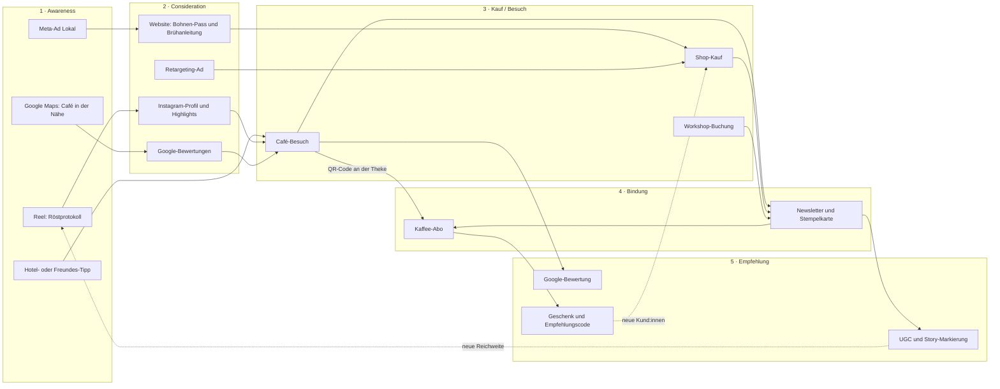
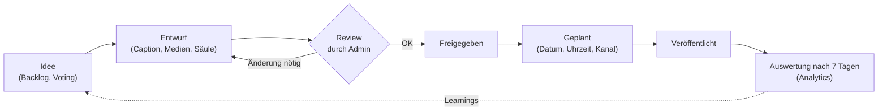
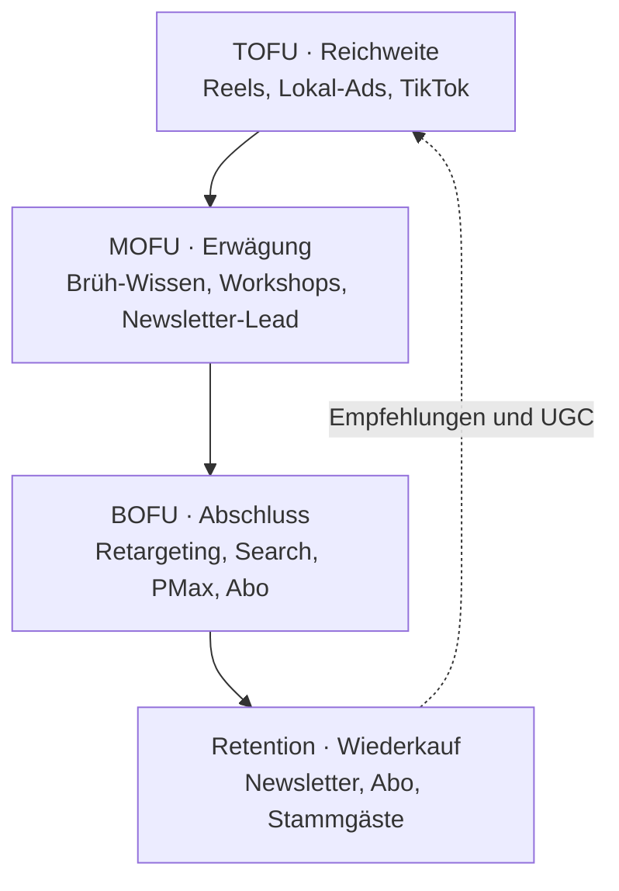
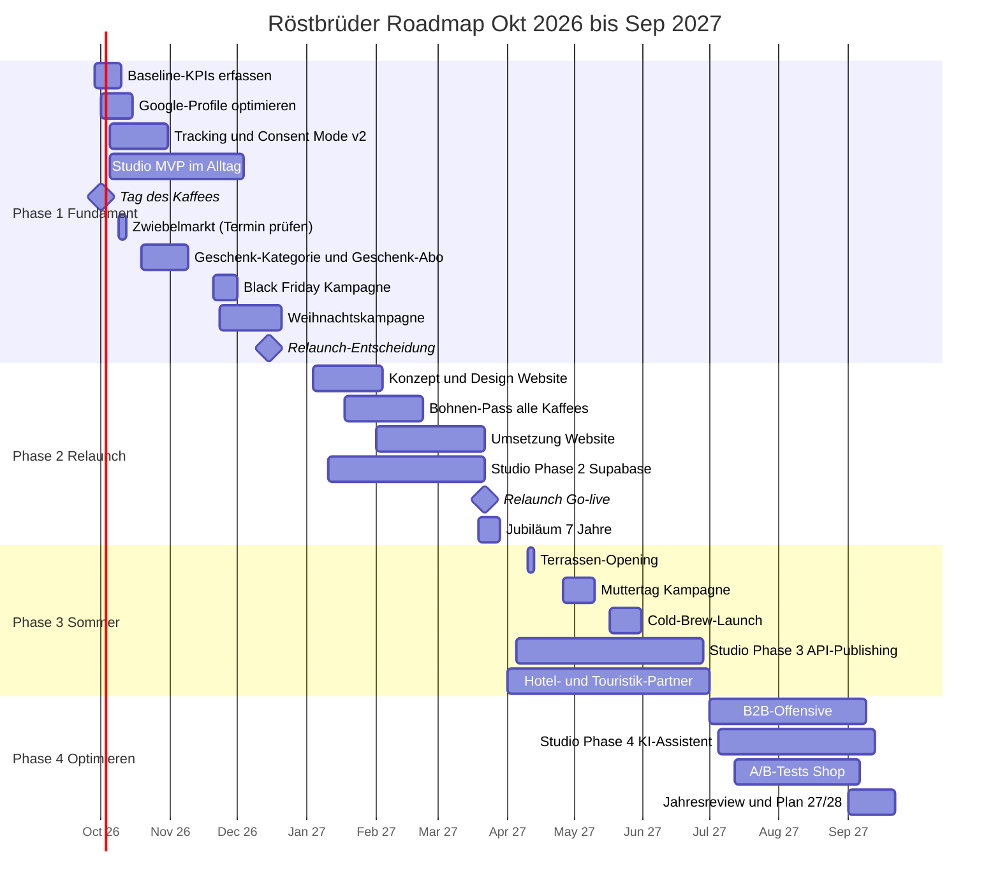

# Röstbrüder Masterplan 2026/27

> **Marke, Website, Social Media, Werbung und Admin-Dashboard – der Fahrplan für die nächsten 12 Monate.**
> Specialty Coffee aus Thüringen. Zwei Brüder, eine Trommel, zwei Orte in Weimar.

| | |
|---|---|
| **Stand** | 24.09.2026 · Version 1.0 |
| **Für** | Collin & Vincent (Röstbrüder, Weimar) |
| **Zeitraum** | Oktober 2026 – September 2027 (Q4/2026 – Q3/2027) |
| **Begleitdokumente** | [`UX-UI-KONZEPT.md`](./UX-UI-KONZEPT.md) · [`SOCIAL-MEDIA-WERBUNG-PLAYBOOK.md`](./SOCIAL-MEDIA-WERBUNG-PLAYBOOK.md) |
| **Werkzeug** | Admin-Dashboard **Röstbrüder Studio** (`/studio` in diesem Repo) |

**Legende – bitte ernst nehmen:**

| Kennzeichnung | Bedeutung |
|---|---|
| **[Fakt]** | Bekannt und belegt (Website, öffentliche Profile, Gründungsgeschichte) |
| **[Annahme]** | Plausibel, aber von euch zu prüfen |
| **[Vorschlag]** | Unsere Empfehlung – Entscheidung liegt bei euch |
| **[Zielwert]** | Zielgröße, die erst nach Erfassung der Baseline final festgelegt wird |
| **[Richtwert]** | Branchen-Richtwert als Orientierung, keine Aussage über Röstbrüder |
| `[aktueller Wert eintragen]` | Platzhalter – Wert aus Shop, Kasse, Instagram Insights o. Ä. nachtragen |

---

## Executive Summary

Röstbrüder hat, was viele Röstereien mit großem Werbebudget nicht haben: **eine echte Geschichte, echte Menschen und zwei echte Orte.** Collin und Vincent stehen selbst hinter der Bar, die Rösterei in der Richard-Wagner-Straße ist eine gläserne Manufaktur, die Espressobar am Herderplatz eine Weimar-Postkarte mit Sommerterrasse – und jeder Kaffee trägt einen Namen. Dieser Plan macht aus diesen Stärken ein **System**: eine klare Marke, eine Website, die verkauft, einen verlässlichen Content-Rhythmus und Werbung, die messbar Geld zurückbringt.

### Die 5 wichtigsten Hebel

| # | Hebel | Was konkret passiert | Wirkung |
|---|---|---|---|
| 1 | **„Jede Bohne hat einen Namen“ als Leitidee** | Namensgeber-Serie, Bohnen-Pass per QR-Code auf jeder Tüte, Namen im Shop, auf der Tafel, in Anzeigen | Merkfähigkeit, Differenzierung, Gesprächsstoff |
| 2 | **Das Abo wird zum Wachstumsmotor** | Abo-Konfigurator, Café-zu-Abo-Brücke (QR, Probier-Abo), Geschenk-Abo in Q4, Abo-Kampagne always-on | Planbarer, wiederkehrender Umsatz, höherer Kundenwert |
| 3 | **Zwei Orte, eine Bühne** | Rösterei = „Röstbrüder live“ (Führungen, Cupping), Espressobar = Tor zur Altstadt (Touristen, Google-Profil, Kooperationen) | Café-Frequenz, lokale Sichtbarkeit, Content-Quelle |
| 4 | **Content-System statt Zufallsposts** | 7 Content-Säulen, feste Serien, 1 Produktionstag pro Woche, Planung und Freigabe im Röstbrüder Studio | Konsistenz mit wenig Zeitaufwand, wachsende Reichweite |
| 5 | **Messbare, saisonale Werbung** | Kleines Always-on (lokal + Retargeting), starke Q4-Spitze, sauberes Tracking (Consent Mode v2, Conversions API, UTM) | Werbe-Euro, die zurückkommen; Budget-Steuerung nach ROAS |

### Wo ihr in 12 Monaten stehen wollt [Zielwert]

- Die **Website** ist neu, schnell, mobil hervorragend und verkauft – mit Geschmacksfinder, Abo-Konfigurator und Workshop-Kalender.
- Ihr habt **doppelt so viele aktive Abos** wie heute und einen Online-Umsatz, der **deutlich über dem Vorjahr** liegt.
- Wer in Weimar nach Kaffee sucht, **findet euch zuerst** – bei Google, auf Instagram, im Hotel und in der Touristinfo.
- Social Media läuft **planbar mit rund 5 Stunden pro Woche** für euch beide zusammen (mit Freelancer-Unterstützung ab Budget M), weil das Studio den Rest organisiert.

---

## Inhaltsverzeichnis

1. [Ausgangslage und Analyse](#1-ausgangslage-und-analyse)
2. [Marke: Vision, Mission, Markenkern](#2-marke-vision-mission-markenkern)
3. [Ziele für die nächsten 12 Monate](#3-ziele-für-die-nächsten-12-monate)
4. [Zielgruppen und Personas](#4-zielgruppen-und-personas)
5. [Customer Journey](#5-customer-journey)
6. [Website-Relaunch roestbrueder.com](#6-website-relaunch-roestbruedercom)
7. [Admin-Dashboard Röstbrüder Studio](#7-admin-dashboard-röstbrüder-studio)
8. [Social Media und Werbung im Überblick](#8-social-media-und-werbung-im-überblick)
9. [Offline und Lokal](#9-offline-und-lokal)
10. [Roadmap](#10-roadmap)
11. [KPI-Framework und Reporting](#11-kpi-framework-und-reporting)
12. [Organisation und Verantwortlichkeiten](#12-organisation-und-verantwortlichkeiten)
13. [Budget-Übersicht](#13-budget-übersicht)
14. [Risiken und Gegenmaßnahmen](#14-risiken-und-gegenmaßnahmen)
15. [Die nächsten 30 Tage](#15-die-nächsten-30-tage)
16. [Anhang: Offene Fragen und Daten, die wir brauchen](#16-anhang-offene-fragen-und-daten-die-wir-brauchen)

---

## 1. Ausgangslage und Analyse

### 1.1 Was wir wissen [Fakt]

| Thema | Stand |
|---|---|
| **Gründer** | Die Brüder Collin und Vincent, gegründet im März 2020 in Weimar. Vincents Kaffeeliebe begann im Studium beim Job in einer Rösterei. Beide stehen selbst hinter der Bar. |
| **Produkt** | Handgerösteter Specialty Coffee, Fokus auf direkt importierten Rohkaffee bzw. kleine Importeure, die direkt importieren und fair bezahlen. |
| **Sortiment (Auszug)** | „Hausbrüh“ (Espresso-Blend, 80/20), „Dörte“ (Santos, Brasilien), „Bergböe“ (Espresso), „Jörg“ (Kaffee). Kaffees tragen Personennamen. |
| **Standort 1** | Rösterei & Café, Richard-Wagner-Straße 17, Weimar – rustikal-urban, Kaffee trinken, während der Röster läuft. Öffnungszeiten ca. Mi–So 12–18 Uhr (*laut Website prüfen*). |
| **Standort 2** | Espressobar in der historischen Altstadt, Kaufstraße 19 / am Herderplatz, 99423 Weimar – Aussicht, Sommerterrasse, eröffnet 2022. Öffnungszeiten ca. Di–So (teils Mo–So) 9–18 Uhr (*laut Website prüfen*). |
| **Website** | Shop (Espresso- und Filterbohnen), Kaffee-Abo (saisonale Kaffees), Barista-Workshops (buchbar), Brühanleitungen, Import, Cafés, Über uns. Technisch vermutlich WordPress/WooCommerce **[Annahme]**. |
| **Vertrieb** | Online-Shop, zwei Cafés, Wiederverkäufer (z. B. Biohof Scharf) → B2B/Gastro ist bereits ein Kanal. |
| **Social** | Instagram @roestbrueder, Facebook /roestbrueder. Followerzahlen: `[aktueller Wert eintragen]`. |
| **Sichtbarkeit** | Gelistet bei European Coffee Trip, Röster-Guide, deutscheroestereien.de. |

### 1.2 SWOT-Analyse

| **Stärken (intern)** | **Schwächen (intern)** |
|---|---|
| Authentische Gründergeschichte: zwei Brüder, selbst hinter dem Tresen | Begrenzte Zeit: Rösten, Bar, Buchhaltung und Marketing liegen bei zwei Personen **[Annahme]** |
| Gläserne Produktion – Café direkt an der Rösterei, Röster läuft sichtbar | Social-Media-Rhythmus vermutlich unregelmäßig **[Annahme]** |
| Zweiter Standort in Top-Lage (Herderplatz, Terrasse, Aussicht) | Kein systematisches Tracking/Reporting von Marketing-Erfolg **[Annahme]** |
| Direktimport und faire Beschaffung – echte Transparenz-Story | Website-Performance und Mobile-UX unbekannt → Audit nötig |
| Kaffees mit Namen – hohe Merkfähigkeit, einzigartiges Branding | Rösterei-Café mit eingeschränkten Öffnungszeiten (Mi–So nachmittags) |
| Workshops als Erlebnis- und Umsatzprodukt | Wissen und Beziehungen hängen an zwei Köpfen (Bus-Faktor) |
| Präsenz in Coffee-Guides; bestehende B2B-Wiederverkäufer | Abo-Kommunikation vermutlich wenig prominent **[Annahme]** |
| **Chancen (extern)** | **Risiken (extern)** |
| Weimar als Kultur- und Tourismusmagnet (UNESCO-Welterbe Klassisches Weimar und Bauhaus) | Stark schwankende Rohkaffeepreise (Rekordniveaus 2024/25) drücken Marge |
| Tausende Studierende (Bauhaus-Universität, Hochschule für Musik) | Konsumzurückhaltung, Preisvergleich mit Supermarkt-„Premium“ |
| Home-Barista-Trend: Siebträger und Handfilter im Haushalt | Steigende Werbekosten, Algorithmus-Abhängigkeit (Instagram, TikTok) |
| Q4-Geschenkmarkt: Gutscheine, Workshops, Geschenk-Abos | Abmahnrisiken (DSGVO, Preisangaben, Impressum, Gewinnspiele) |
| B2B: Büros, Hotels, Restaurants, Unverpackt- und Hofläden | Saisonalität: weniger Touristen im Winter, Wetterabhängigkeit der Terrasse |
| Short-Video: Röst-Content ist organisch extrem gut teilbar | EU-Entwaldungsverordnung (EUDR): neue Sorgfaltspflichten beim Import (*Fristen prüfen*) |
| Local SEO: „Kaffeerösterei Weimar“ ist ein kleiner, gewinnbarer Markt **[Annahme]** | Ketten und Bäckerei-Cafés mit Kampfpreisen in der Innenstadt |
| Weimar-Anekdote: Goethe regte 1819 Runges Koffein-Entdeckung an (*vor Veröffentlichung Quellen prüfen*) | Personalengpässe in Gastronomie |

### 1.3 Wettbewerbsumfeld

Wir nennen bewusst keine Namen – das Muster zählt, nicht die Einzelfirma.

| Segment | Typische Stärke | Typische Schwäche | Wo Röstbrüder gewinnt |
|---|---|---|---|
| **Regionale Specialty-Röstereien** (Thüringen, Leipzig, Sachsen-Anhalt) | Qualität, Szene-Glaubwürdigkeit | Oft ohne eigenes Café in Top-Lage | Zwei Erlebnisorte + Brüder-Story + Namens-Branding |
| **Große Online-Röstereien / D2C-Marken** | Budget, Performance-Marketing, Abo-Maschine | Austauschbar, anonym | Nähe, Gesicht, Herkunftstransparenz, Workshops |
| **Supermarkt-Premium und Bio-Fair-Marken** | Preis, Verfügbarkeit | Röstdatum alt, keine Beratung | Frische („geröstet am“), Beratung, Geschmacksvielfalt |
| **Ketten und Bäckerei-Cafés in Weimar** | Lage, Preis, Tempo | Keine Kaffeekompetenz | Qualität, Atmosphäre, Barista-Handwerk |
| **Traditionelle Altstadt-Cafés** | Touristenlage, Kuchen | Kaffee oft Nebensache | Specialty-Kompetenz + trotzdem gemütlich |
| **Bohnen-Abos von Plattformen/Maschinenhändlern** | Bequemlichkeit, Vielfalt | Keine Beziehung zur Rösterei | Persönliches Abo „von den Brüdern“ mit Story je Lieferung |

### 1.4 Kernerkenntnisse

1. **Euer Asset ist Nähe.** Jeder Kanal muss Gesichter, Hände und Orte zeigen – nicht Stockfotos von Bohnen.
2. **Das Abo ist unterausgenutzt [Annahme].** Café-Gäste sind warme Leads; die Brücke vom Tresen zum Abo fehlt.
3. **Weimar ist Reichweite.** Touristen und Studierende erneuern sich jedes Jahr – lokale Sichtbarkeit (Google, Hotels, Touristinfo) zahlt sich jedes Jahr neu aus.
4. **Ohne Messung kein Wachstum.** Erst Tracking, dann Budget hochfahren.
5. **Zeit ist der Engpass.** Deshalb: Batch-Produktion, Vorlagen, Serien – und das Studio als Betriebssystem.

---

## 2. Marke: Vision, Mission, Markenkern

### 2.1 Vision [Vorschlag]

> **„Wir wollen, dass Thüringen weiß, wie guter Kaffee schmeckt – und dass jede:r weiß, wo er herkommt.“**

### 2.2 Mission [Vorschlag]

> **„Wir kaufen außergewöhnliche Rohkaffees möglichst direkt und fair ein, rösten sie in Weimar von Hand und bringen sie über unsere Cafés, unseren Shop und unsere Workshops zu Menschen, die mehr über ihren Kaffee wissen wollen.“**

### 2.3 Markenkern (Brand Onion)

Von innen nach außen gelesen: je weiter außen, desto sichtbarer für Kund:innen.

```
            ┌──────────────────────────────────────────────────────────┐
            │  BEWEISE: Röster im Café · Direktimport · Namen auf      │
            │  der Tüte · Röstdatum · Workshops · Coffee-Guides        │
            │   ┌──────────────────────────────────────────────────┐   │
            │   │  FUNKTIONALER NUTZEN: frisch, top Qualität,      │   │
            │   │  ehrliche Beratung, leicht zuzubereiten          │   │
            │   │   ┌──────────────────────────────────────────┐   │   │
            │   │   │  EMOTIONALER NUTZEN: „Ich kenne die, die │   │   │
            │   │   │  meinen Kaffee rösten.“ Zugehörigkeit    │   │   │
            │   │   │   ┌──────────────────────────────────┐   │   │   │
            │   │   │   │  PERSÖNLICHKEIT: herzlich,       │   │   │   │
            │   │   │   │  neugierig, bodenständig, frech  │   │   │   │
            │   │   │   │   ┌──────────────────────────┐   │   │   │   │
            │   │   │   │   │ WERTE: Handwerk ·        │   │   │   │   │
            │   │   │   │   │ Fairness · Transparenz · │   │   │   │   │
            │   │   │   │   │ Gastfreundschaft         │   │   │   │   │
            │   │   │   │   │  ┌──────────────────┐    │   │   │   │   │
            │   │   │   │   │  │ ESSENZ:          │    │   │   │   │   │
            │   │   │   │   │  │ Handwerk mit     │    │   │   │   │   │
            │   │   │   │   │  │ Namen.           │    │   │   │   │   │
            │   │   │   │   │  └──────────────────┘    │   │   │   │   │
            │   │   │   │   └──────────────────────────┘   │   │   │   │
            │   │   │   └──────────────────────────────────┘   │   │   │
            │   │   └──────────────────────────────────────────┘   │   │
            │   └──────────────────────────────────────────────────┘   │
            └──────────────────────────────────────────────────────────┘
```

| Schicht | Inhalt | So zeigt es sich im Alltag |
|---|---|---|
| **Essenz** | *Handwerk mit Namen* | Jeder Kaffee, jeder Mensch, jeder Ort ist konkret und benannt |
| **Werte** | Handwerk · Fairness · Transparenz · Gastfreundschaft | Röstprotokolle zeigen, Importwege offenlegen, Gäste mit Namen begrüßen |
| **Persönlichkeit** | Herzlich, neugierig, bodenständig, mit Brüder-Humor | Duzen, Insider-Witze unter Brüdern, keine Fachsimpelei von oben herab |
| **Emotionaler Nutzen** | „Ich kenne die Leute hinter meinem Kaffee“ – Zugehörigkeit, kleiner Luxus im Alltag | Stammgäste, Community, persönliche Abo-Karten |
| **Funktionaler Nutzen** | Frisch geröstet, ausgezeichnete Qualität, Beratung, einfache Zubereitung | Röstdatum, Brühanleitungen, Mahlgrad-Service |
| **Beweise** | Röster im Café, Direktimport, Namen, Workshops, Coffee-Guide-Listings | Bohnen-Pass, Fotos vom Röstvorgang, Guide-Badges auf der Website |

### 2.4 Positionierung

> **Für** Kaffeeliebhaber:innen in Weimar, Thüringen und online, **die** wissen wollen, woher ihr Kaffee kommt und wer ihn röstet,
> **ist Röstbrüder** die Specialty-Rösterei aus Weimar,
> **die** direkt importierte, fair eingekaufte Kaffees mit Namen und Geschichte von Hand röstet und an zwei Orten erlebbar macht.
> **Anders als** anonyme Online-Röstereien und Supermarkt-Marken
> **stehen bei uns** zwei Brüder selbst an Trommel und Tresen – ihr könnt vorbeikommen, zuschauen, fragen und probieren.

### 2.5 Markenversprechen

> **„Wir rösten jeden Kaffee so, als würden wir ihn am nächsten Morgen selbst trinken. Weil wir es tun.“**

Drei Garantien, die das Versprechen greifbar machen [Vorschlag]:

1. **Frische-Garantie:** Versand innerhalb von `[X]` Tagen nach Röstung, Röstdatum auf jeder Tüte.
2. **Herkunfts-Garantie:** Zu jedem Kaffee gibt es einen Bohnen-Pass (Farm/Kooperative, Importweg, Aufbereitung, Varietät).
3. **Schmeckt-nicht-Garantie:** Wenn euch ein Kaffee nicht schmeckt, tauscht ihr ihn gegen einen anderen – einmal pro Kund:in, ohne Diskussion.

### 2.6 Tonalität

| Wir sind … | … aber nicht |
|---|---|
| **herzlich** – wir duzen, wir freuen uns über jede:n | anbiedernd oder kumpelhaft-übertrieben |
| **kompetent** – wir erklären Röstung und Zubereitung genau | belehrend, snobistisch, Fachjargon ohne Erklärung |
| **humorvoll** – Brüder-Frotzeleien, Wortwitz mit Namen | albern auf Kosten von Qualität oder Menschen |
| **ehrlich** – wir sagen auch, wenn etwas nicht klappt | perfekt inszeniert oder werblich-marktschreierisch |
| **weimarerisch** – stolz auf die Stadt, ihre Geschichte, ihre Leute | provinziell oder touristisch-kitschig |

**Sprachregeln [Vorschlag]:** Du-Form in allen Kanälen · aktive Verben · Namen der Kaffees immer mit Artikel wie Personen („Dörte ist zurück!“) · Fachbegriffe beim ersten Auftreten kurz erklären · max. 1–2 Emojis pro Caption · kein „Leute, wir haben krasse News“-Influencer-Sprech.

### 2.7 Claims und Slogans [Vorschlag]

| Claim | Einsatz |
|---|---|
| **Jede Bohne hat einen Namen.** | Hauptclaim: Website-Hero, Tüten, Anzeigen |
| **Specialty Coffee aus Thüringen.** | Beschreibender Claim: SEO, Google-Profil, B2B |
| **Zwei Brüder. Eine Trommel. Ganz viel Weimar.** | Social-Bio, Merch, Café-Tafel |
| **Frisch aus der Trommel.** | Abo- und Produktkommunikation |
| **Komm vorbei, der Röster läuft.** | Lokale Anzeigen, Google-Posts, Aufsteller |

---

## 3. Ziele für die nächsten 12 Monate

### 3.1 North Star Metric

> **Aktive Kaffee-Beziehungen** = aktive Abos + Wiederkäufer:innen (≥ 2 Online-Bestellungen in 90 Tagen) + registrierte Stammgäste (digitale Stempelkarte).

Warum: Diese Zahl verbindet Online und Café, belohnt Bindung statt Einmalkäufe und ist mit Shop-, Abo- und Kassendaten messbar.

### 3.2 SMART-Ziele

Baseline bitte bis **10.10.2026** eintragen. Zielwerte sind **[Vorschlag]** und werden nach Baseline-Erfassung final festgelegt.

| Bereich | KPI | Baseline (Sep 2026) | Zwischenziel Mär 2027 | Ziel Sep 2027 [Vorschlag] | Quelle |
|---|---|---|---|---|---|
| **Online-Umsatz** | Netto-Umsatz Shop (12 Monate rollierend) | `[aktueller Wert eintragen]` | +15 % ggü. Vorjahr | **+40 % ggü. Vorjahr** | Shop-Backend |
| **Abo** | Aktive Abos | `[aktueller Wert eintragen]` | +60 netto | **×2 bzw. mind. +150 netto** | Abo-Plugin/App |
| **Abo** | Monatliche Abo-Kündigungsrate | `[aktueller Wert eintragen]` | < 6 % | **< 4 %** | Abo-Plugin/App |
| **Workshops** | Auslastung (gebuchte / angebotene Plätze) | `[aktueller Wert eintragen]` | ≥ 75 % | **≥ 85 % bei ≥ 3 Terminen/Monat** | Buchungssystem |
| **Café-Frequenz** | Bons pro Monat je Standort | `[aktueller Wert eintragen]` | +5 % ggü. Vorjahresmonat | **+10 % ggü. Vorjahresmonat** | Kassensystem |
| **Instagram** | Follower | `[aktueller Wert eintragen]` | +15 % | **+35 %** | Instagram Insights |
| **Instagram** | Engagement-Rate (reichweitenbasiert, Ø Feed + Reels) | `[aktueller Wert eintragen]` | ≥ 3,5 % | **≥ 4,5 %** | Studio → Analytics |
| **TikTok** | Follower (Neuaufbau) | `0` bzw. `[aktueller Wert eintragen]` | 500 | **2.000** | TikTok Analytics |
| **Newsletter** | Abonnent:innen | `[aktueller Wert eintragen]` | +400 | **+1.000** | Newsletter-Tool |
| **Newsletter** | Klickrate | `[aktueller Wert eintragen]` | ≥ 3 % | **≥ 4 %** | Newsletter-Tool |
| **B2B/Gastro** | Neue aktive Partner (Büro, Gastro, Wiederverkauf) | `[aktueller Wert eintragen]` | +3 | **+8** | CRM/Rechnungen |
| **Google** | Ø Bewertung / neue Bewertungen (beide Standorte) | `[aktueller Wert eintragen]` | +40 Bewertungen | **≥ 4,7 ★ und +100 Bewertungen** | Google Unternehmensprofil |
| **Website** | Shop-Conversion-Rate | `[aktueller Wert eintragen]` | ≥ 1,5 % | **≥ 2,0 %** | GA4/Matomo |
| **Werbung** | ROAS (Shop-Kampagnen) | – | ≥ 2,5 | **≥ 3,0 (Q4: ≥ 4,0)** | Studio → Kampagnen |

---

## 4. Zielgruppen und Personas

### 4.1 Überblick

| Persona | Anteil Potenzial [Annahme] | Hauptumsatz | Wichtigster Kanal | Wichtigstes Angebot |
|---|---|---|---|---|
| Lena – die Bauhaus-Studentin | hoch (Frequenz) | Café | Instagram, TikTok | Studi-Stempelkarte, Workshops |
| Markus – der Home-Barista | mittel (Wert) | Shop + Abo | Instagram, Newsletter, Google | Abo, Espresso-Kaffees, Workshops |
| Claudia & Thomas – die Kulturreisenden | hoch (saisonal) | Café + Mitnahme | Google Maps, Hotel, Touristinfo | Espressobar, Souvenir-Box |
| Sophie – die Geschenke-Käuferin | hoch in Q4 | Shop | Instagram, Meta Ads, Pinterest | Geschenk-Abo, Gutscheine, Workshops |
| Jens – der Gastro-/Büro-Entscheider | niedrig (Anzahl), hoch (Volumen) | B2B | LinkedIn, persönlich, Google | Büro-Abo, Gastro-Partnerschaft |

### 4.2 Personas im Detail

#### Persona 1: Lena, 23 – die Bauhaus-Studentin

| | |
|---|---|
| **Steckbrief** | Studiert Mediengestaltung an der Bauhaus-Uni, wohnt in einer WG, arbeitet gern im Café, Budget knapp, Qualität trotzdem wichtig |
| **Bedürfnisse** | Guter Kaffee zu fairem Preis, Ort zum Arbeiten und Treffen, Instagram-taugliche Momente, Zugehörigkeit |
| **Pain Points** | Specialty wirkt teuer und elitär; weiß nicht, welche Bohnen sie für ihre French Press kaufen soll |
| **Kanäle** | Instagram (Stories, Reels), TikTok, Mundpropaganda, Uni-Aushänge, Semesterstart-Events |
| **Botschaft** | „Guter Kaffee ist kein Luxus – komm vorbei, wir zeigen dir, wie's geht.“ |
| **Angebot** | Studi-Stempelkarte (10. Kaffee aufs Haus) [Vorschlag], Einsteiger-Workshop zum Studi-Preis, 250-g-Tüten |
| **Erfolgsmessung** | Stempelkarten-Registrierungen, Story-Interaktionen, Café-Bons am Nachmittag |

#### Persona 2: Markus, 38 – der Home-Barista

| | |
|---|---|
| **Steckbrief** | IT-Projektleiter aus Erfurt, Siebträger und Handmühle zu Hause, schaut Barista-Videos, bestellt Bohnen online |
| **Bedürfnisse** | Frische, spannende Herkunft, genaue Rezepte (Dosis, Ratio, Mahlgrad), Abwechslung ohne Aufwand |
| **Pain Points** | Supermarktbohnen sind zu alt; Online-Röstereien sind anonym; Abo-Kündigung oft kompliziert |
| **Kanäle** | Instagram, YouTube, Google-Suche („Espressobohnen kaufen“), Newsletter, Foren |
| **Botschaft** | „Frisch aus der Trommel, mit Rezept und Herkunft. Du kennst die Röster persönlich.“ |
| **Angebot** | Kaffee-Abo (flexibel pausierbar), Espresso-Rezeptkarten, Latte-Art-/Espresso-Workshop, Early Access für neue Ernten |
| **Erfolgsmessung** | Abo-Abschlüsse, Wiederkaufrate, Newsletter-Klicks |

#### Persona 3: Claudia (55) & Thomas (58) – die Kulturreisenden

| | |
|---|---|
| **Steckbrief** | Paar aus Köln, Wochenendtrip nach Weimar (Goethe, Schiller, Bauhaus-Museum), übernachten im Hotel in der Altstadt |
| **Bedürfnisse** | Schöner Ort mit Aussicht, Pause zwischen Museen, etwas Echtes aus Weimar als Mitbringsel |
| **Pain Points** | Wissen nicht, wo es in Weimar wirklich guten Kaffee gibt; Touristenfallen |
| **Kanäle** | Google Maps („Café in der Nähe“), Hotel-Empfehlung, Touristinfo, Reiseführer, European Coffee Trip |
| **Botschaft** | „Der beste Blick auf den Herderplatz – mit Kaffee, der hier in Weimar geröstet wird.“ |
| **Angebot** | Espressobar mit Terrasse, „Weimar-Souvenir-Box“ (2 Kaffees + Postkarte) [Vorschlag], Rösterei-Besuch als Geheimtipp |
| **Erfolgsmessung** | Google-Routenanfragen, Bewertungen, Souvenir-Verkäufe, spätere Online-Bestellungen mit PLZ außerhalb Thüringens |

#### Persona 4: Sophie, 34 – die Geschenke-Käuferin

| | |
|---|---|
| **Steckbrief** | Lehrerin aus Jena, sucht jedes Jahr besondere, persönliche Geschenke für Vater, Kolleg:innen, Freundinnen |
| **Bedürfnisse** | Hochwertig, persönlich, schön verpackt, schnell geliefert, Geschichte zum Erzählen |
| **Pain Points** | Kein Kaffeewissen – Angst, das Falsche zu kaufen; Last-minute-Stress |
| **Kanäle** | Instagram, Pinterest, Meta Ads, Newsletter, Weihnachtsmarkt |
| **Botschaft** | „Verschenk einen Kaffee mit Namen – oder gleich einen Workshop mit den Brüdern.“ |
| **Angebot** | Geschenk-Abo 3/6/12 Monate, Workshop-Gutschein, Geschenkboxen, digitaler Gutschein (last minute), Grußkarte |
| **Erfolgsmessung** | Gutschein- und Geschenk-Abo-Umsatz in Q4, Warenkorb-Wert, Einlösungen im Q1 |

#### Persona 5: Jens, 45 – der Gastro- oder Büro-Entscheider

| | |
|---|---|
| **Steckbrief** | Inhaber eines Restaurants in Weimar oder Office-Manager einer Agentur in Erfurt (30 Mitarbeitende) |
| **Bedürfnisse** | Verlässliche Lieferung, gleichbleibende Qualität, Schulung fürs Personal, Story für die eigenen Gäste |
| **Pain Points** | Großröstereien sind unpersönlich; Maschinenservice und Schulung fehlen |
| **Kanäle** | Persönliches Gespräch, LinkedIn, Empfehlungen, Google („Kaffeerösterei Gastronomie Thüringen“) |
| **Botschaft** | „Kaffee aus Weimar für eure Gäste und euer Team – mit Schulung und persönlichem Draht.“ |
| **Angebot** | Büro-Abo (Staffelpreise), Gastro-Paket (Barista-Schulung, Tafel „Wir servieren Röstbrüder“), Wiederverkäufer-Konditionen |
| **Erfolgsmessung** | Anzahl Partner, Monatsvolumen in kg, Wiederbestellrate |

---

## 5. Customer Journey

### 5.1 Journey-Matrix

| Phase | Ziel | Online-Touchpoints | Offline-Touchpoints | Inhalte und Angebote | KPI | Studio-Modul |
|---|---|---|---|---|---|---|
| **1. Awareness** | Röstbrüder kennenlernen | Reels/TikToks (Röst-Content), Meta-Lokal-Ads, Google Maps, Pinterest, Coffee-Guides | Espressobar-Terrasse, Hotel-Empfehlung, Touristinfo, Zwiebelmarkt | „Röstprotokoll“, „Weimar am Morgen“, Namensgeber-Storys | Reichweite, Impressionen, Profilaufrufe | Kalender, Kampagnen |
| **2. Consideration** | Vertrauen und Lust aufbauen | Website (Bohnen-Pass, Brühanleitungen), Google-Bewertungen, Retargeting, Karussells | Probieren im Café, Gespräch mit den Brüdern | Brüh-Wissen, Geschmacksfinder, Bewertungen, Workshop-Einblicke | Website-Sessions, Quiz-Starts, Saves | Pipeline, Analytics |
| **3. Kauf / Besuch** | Erster Kauf oder Besuch | Shop, Abo-Konfigurator, Workshop-Buchung, Google-Route | Café-Besuch, Tüte an der Theke, Workshop | Probier-Abo, Erstbesteller-Vorteil, Geschenkboxen | Conversions, CR, Routenanfragen, Bons | Kampagnen, Budget |
| **4. Bindung** | Wiederkauf und Abo | Newsletter, Abo-Kommunikation, Nachkauf-Erinnerung, Community-Storys | Stempelkarte, Wiedererkennen am Tresen, Cupping-Abende | „Neue Ernte ist da“, Rezeptkarten, Early Access | Wiederkaufrate, Abo-Churn, Newsletter-CTR | Kalender (Newsletter), Analytics |
| **5. Empfehlung** | Botschafter:innen gewinnen | UGC-Reposts, Google-Bewertungen, Freunde-werben-Freunde | Mitbringsel, Workshop-Gruppen, Firmenevents | „Zeig uns deine Tasse“, Empfehlungscode | Bewertungen, UGC-Posts, Empfehlungs-Käufe | Bibliothek, Ideen |

### 5.2 Journey als Flow



### 5.3 Die drei wichtigsten Brücken

| Brücke | Heute [Annahme] | Morgen [Vorschlag] |
|---|---|---|
| **Café → Online** | Gast trinkt Kaffee, geht wieder | QR-Aufsteller „Diesen Kaffee zu Hause trinken?“ → Produktseite mit Café-Code (z. B. 10 % auf die erste Bestellung) |
| **Einmalkauf → Abo** | Bestellung, danach Funkstille | Nachkauf-Mail nach 3–4 Wochen (je nach Tütengröße) mit Abo-Angebot „Nie wieder leere Dose“ |
| **Gast → Botschafter:in** | Zufällige Bewertungen | Bewertungskarte mit QR an jedem Tisch, Reposts von Story-Markierungen, Empfehlungscode im Abo |

---

## 6. Website-Relaunch roestbrueder.com

### 6.1 Ziele

| Ziel | Messgröße | Zielwert [Vorschlag] |
|---|---|---|
| Mehr Umsatz pro Besuch | Conversion-Rate Shop | ≥ 2,0 % ([Richtwert] Specialty-D2C: 1,5–3 %) |
| Mehr Abos | Anteil Abo-Umsatz am Online-Umsatz | ≥ 30 % |
| Mobil exzellent | Core Web Vitals (mobil, 75. Perzentil) | LCP < 2,5 s · INP < 200 ms · CLS < 0,1 |
| Lokal gefunden werden | Top-3-Ranking | „Kaffeerösterei Weimar“, „Café Weimar Altstadt“, „Barista Kurs Weimar“ |
| Workshops füllen | Online-Buchungsquote | ≥ 80 % aller Workshop-Buchungen online |
| Weniger Arbeit | Manuelle Anfragen per Mail/Telefon | −50 % (durch Self-Service: Abo-Verwaltung, Buchung, FAQ) |

### 6.2 Informationsarchitektur (Sitemap) [Vorschlag]

```mermaid
flowchart TD
    H["Startseite"] --> S["Shop"]
    H --> AB["Kaffee-Abo"]
    H --> W["Workshops"]
    H --> C["Cafés"]
    H --> BW["Brüh-Wissen"]
    H --> HK["Herkunft und Import"]
    H --> U["Über uns"]
    H --> B2B["Für Gastro und Büro"]
    S --> S1["Espresso"]
    S --> S2["Filter"]
    S --> S3["Geschenke und Gutscheine"]
    S --> S4["Zubehör und Merch"]
    S --> S5["Geschmacksfinder-Quiz"]
    S1 --> P["Produktseite mit Bohnen-Pass"]
    S2 --> P
    AB --> AB1["Abo-Konfigurator"]
    AB --> AB2["Abo verschenken"]
    AB --> AB3["Mein Abo verwalten"]
    W --> W1["Workshop-Kalender"]
    W --> W2["Firmen- und Gruppen-Workshops"]
    W --> W3["Gutschein"]
    C --> C1["Rösterei und Café · Richard-Wagner-Str. 17"]
    C --> C2["Espressobar · Herderplatz"]
    BW --> BW1["Brühanleitungen: V60, AeroPress, French Press, Siebträger, Mokka"]
    BW --> BW2["Mahlgrad-Guide und Rezeptrechner"]
    BW --> BW3["Kaffee-Lexikon"]
    HK --> HK1["Unsere Importwege"]
    HK --> HK2["Bohnen-Pässe aller Kaffees"]
    U --> U1["Die Brüder und das Team"]
    U --> U2["Presse und Guides"]
    U --> U3["Jobs"]
    B2B --> B1["Büro-Abo"]
    B2B --> B2["Gastro-Partnerschaft"]
    B2B --> B3["Wiederverkauf"]
```



**Hauptnavigation (max. 6 Punkte):** Shop · Abo · Workshops · Cafés · Wissen · Über uns. Footer: Herkunft, Gastro & Büro, Presse, Jobs, FAQ, Versand, rechtliche Seiten.

### 6.3 Schlüsselseiten und Conversion-Elemente

| Seite | Hauptziel | Conversion-Elemente | Trust-Elemente |
|---|---|---|---|
| **Startseite** | Orientierung in 5 Sekunden | Hero mit 3 Wegen (Kaufen · Abo · Vorbeikommen), „Aktuell in der Trommel“, Geschmacksfinder-Teaser | Brüder-Foto, Café-Status „Jetzt geöffnet“, Guide-Badges, Bewertungen |
| **Kategorieseite** | Schnell den richtigen Kaffee finden | Filter nach Zubereitung, Geschmack, Röstgrad; Schnellkauf-Button | Röstdatum, Bewertungssterne, „Bestseller“, „Neue Ernte“ |
| **Produktseite** | Kauf oder Abo | Umschalter Einmalkauf/Abo (Abo-Vorteil sichtbar), Mahlgrad-Auswahl, Versandkosten-Fortschritt, Cross-Sell passender Brühmethode | Bohnen-Pass, Namensgeber-Story, Geschmacksrad, Rezept, Bewertungen |
| **Abo-Seite** | Abo abschließen | Konfigurator in 4 Schritten, Preisrechner, „jederzeit pausierbar“ | FAQ, Kündigung in 2 Klicks, Abo-Stimmen |
| **Workshops** | Termin buchen | Kalender mit Restplätzen, Warteliste, Gutschein-Option, Gruppenanfrage | Fotos vergangener Workshops, Leistungsumfang, Bewertungen |
| **Café-Seiten** | Besuch | Live-Öffnungsstatus, Route, Karte (Zwei-Klick-Lösung), Terrassen-Status | Echte Fotos, Barrierefreiheits-Info, Google-Bewertungen |
| **Brüh-Wissen** | SEO-Traffic → Shop | Passender Kaffee zu jeder Anleitung, Newsletter-Anmeldung mit Rezeptkarten-PDF | Autor:innen-Box „Vincent erklärt“, Videos |
| **Gastro & Büro** | Lead | Anfrageformular (3 Felder), Probierpaket-Anfrage, Termin buchen | Partner-Logos (mit Erlaubnis), Referenzzitat |

### 6.4 Shop-UX-Features

#### a) Geschmacksfinder: „Welcher Bruder-Kaffee passt zu dir?“

Quiz mit 5 Fragen, Ergebnis ist ein Kaffee mit Namen – als „Match“ inszeniert.

| # | Frage | Antwortoptionen |
|---|---|---|
| 1 | Wie brühst du meistens? | Siebträger · Vollautomat · Handfilter/V60 · French Press · AeroPress · Mokkakanne |
| 2 | Wie trinkst du deinen Kaffee? | Schwarz · mit Milch · mal so, mal so |
| 3 | Welcher Geschmack klingt nach dir? | Schokolade & Nuss · Frucht & Beere · Karamell & süß · Überrasch mich |
| 4 | Wie abenteuerlustig bist du? | Ich mag's vertraut · Ab und zu was Neues · Immer das Spannendste |
| 5 | Für wen ist der Kaffee? | Für mich · Für die WG/das Büro · Als Geschenk |

**Ergebnis-Logik [Vorschlag, mit euren Cupping-Notes füllen]:** Siebträger + Milch + vertraut → **Hausbrüh** · Schokolade & Nuss, Filter/French Press → **Dörte** (Brasilien, Santos – typische Brasilien-Noten nussig/schokoladig [Annahme]) · Espresso + abenteuerlustig → **Bergböe** · Filter + fruchtig/spannend → **Jörg** bzw. aktueller Saisonkaffee · „Als Geschenk“ → Geschenkbox/Abo-Gutschein.
**Ergebnisseite:** „Dein Match: Dörte 🤎“ + Namensgeber-Story + Rezept + Buttons „Einmal probieren“ / „Als Abo“ + E-Mail-Opt-in „Schick mir mein Rezept“ (Double-Opt-in).

#### b) Abo-Konfigurator

4 Schritte, jederzeit sichtbarer Preis: **Zubereitung** (Espresso/Filter/beides) → **Kaffee** (Saisonkaffee „Überrasch mich“ oder fester Lieblingskaffee) → **Menge und Rhythmus** (250 g / 500 g / 1 kg · alle 2/4/6 Wochen) → **Mahlgrad** (ganze Bohne empfohlen / 6 Mahlgrade). Danach: Zusammenfassung mit „Jederzeit pausieren, überspringen oder kündigen – in 2 Klicks“. Geschenk-Variante: Laufzeit 3/6/12 Monate, Wunschstarttermin, Grußtext, druckbare Karte.

#### c) Workshop-Buchung mit Kalender

Monatskalender mit Terminen, Filter nach Workshop-Typ (Espresso-Basics, Latte Art, Filterkaffee, Cupping, Firmen-Workshop), Restplatz-Anzeige („Noch 2 Plätze“), Warteliste bei Ausbuchung, Gutscheincode-Einlösung, automatische Erinnerung 48 h vorher mit Anfahrt. Workshops werden als `Event`-Schema ausgezeichnet (SEO).

#### d) Café-Seiten mit Live-Öffnungszeiten

„**Jetzt geöffnet** · bis 18:00 Uhr“ bzw. „Öffnet morgen um 9:00 Uhr“, Sonderöffnungszeiten (Feiertage, Zwiebelmarkt) zentral gepflegt, Terrassen-Status in der Saison, **Röst-Ticker** [Vorschlag]: „Heute wird geröstet: 13–16 Uhr“ – ein Schalter, den ihr im Studio bzw. Backend setzt.

#### e) Import-Transparenz: der Bohnen-Pass

Jeder Kaffee bekommt eine eigene Pass-Seite, erreichbar per QR-Code auf der Tüte:

| Feld | Beispiel (Platzhalter) |
|---|---|
| Name und Namensgeber-Story | „Dörte – benannt nach `[Story eintragen]`“ |
| Herkunft | Land, Region, Farm/Kooperative, Höhe |
| Importweg | Direktimport bzw. Importpartner, Einkaufsjahr |
| Varietät und Aufbereitung | z. B. Catuaí/Natural `[eintragen]` |
| Röstung | Röstgrad, Röstprofil-Kurve (Foto aus dem Röstprotokoll) |
| Geschmack | Cupping-Notes, Geschmacksrad |
| Zubereitung | Empfohlenes Rezept je Methode |
| Transparenz [optional] | Einkaufspreis Rohkaffee pro kg im Vergleich zum Börsenpreis – nur wenn ihr das offenlegen wollt |

#### f) Weitere Quick Wins im Shop

- Röstdatum und „frisch geröstet am“ prominent · Versandkosten-Fortschrittsbalken („Noch 8,50 € bis versandkostenfrei“).
- Express-Checkout (PayPal, Apple Pay, Google Pay, Klarna – je nach System) und Gast-Checkout.
- Bundles: „Probierset 3 × 250 g“, „Espresso-Starter mit Tamper-Tuch“, „Weimar-Souvenir-Box“.
- Nachkauf-Erinnerung per E-Mail, abhängig von Tütengröße (250 g → nach ca. 2–3 Wochen, 1 kg → nach ca. 6–8 Wochen [Annahme]).
- Bewertungen nach dem Kauf automatisch anfragen (mit Hinweis auf Echtheit/Verifizierung gemäß Preisangaben- und UWG-Vorgaben).

### 6.5 SEO

#### Keyword-Cluster [Vorschlag]

| Cluster | Beispiel-Suchbegriffe | Zielseite | Priorität |
|---|---|---|---|
| **Lokal: Rösterei** | Kaffeerösterei Weimar, Rösterei Weimar, Kaffee kaufen Weimar | Startseite, Café Rösterei | Hoch |
| **Lokal: Café** | Café Weimar Altstadt, Café Herderplatz, Frühstück/Kaffee Weimar, bester Kaffee Weimar | Café Espressobar | Hoch |
| **Lokal: Workshops** | Barista Kurs Weimar/Erfurt/Jena, Latte Art Kurs Thüringen, Geschenk Erlebnis Weimar | Workshops | Hoch |
| **Shop** | Espressobohnen kaufen, Filterkaffee Bohnen, Specialty Coffee online, Kaffee Abo | Kategorie-/Abo-Seiten | Mittel |
| **Brüh-Wissen** | V60 Anleitung, French Press Verhältnis, AeroPress Rezept, Mahlgrad Espresso, Kaffee Wasser Verhältnis | Brüh-Wissen-Hub | Mittel (langfristig hoch) |
| **Geschenke** | Kaffee Geschenk, Kaffee Abo verschenken, Barista Kurs Gutschein | Geschenke, Abo verschenken | Saisonal hoch (Q4) |
| **B2B** | Kaffeerösterei Gastronomie Thüringen, Büro Kaffee Abo | Gastro & Büro | Mittel |

#### Local-SEO-Checkliste

- [ ] Zwei getrennte **Google-Unternehmensprofile** (Rösterei & Café / Espressobar) mit korrekter Kategorie („Kaffeerösterei“ bzw. „Café“), Öffnungszeiten, Sonderöffnungszeiten, Attributen, 20+ echten Fotos.
- [ ] NAP (Name, Adresse, Telefon) auf Website, Google, Apple Maps, Bing Places, Facebook, Coffee-Guides **identisch**.
- [ ] Strukturierte Daten: `CafeOrCoffeeShop` je Standort, `Product`/`Offer` im Shop, `Event` für Workshops, `BreadcrumbList`, `Organization`.
- [ ] Wöchentliche Google-Posts je Standort (im Studio als Kanal „Google Unternehmensprofil“ geplant).
- [ ] Bewertungsstrategie (siehe Playbook) – Antwort auf jede Bewertung binnen 48 h.
- [ ] Lokale Backlinks: Weimar-Tourismus, Hotels, Uni-Seiten, Kulturveranstalter, Presse, Coffee-Guides.

#### Content-Hub „Brüh-Wissen“

Pillar-Page „Kaffee zu Hause brühen – der Guide der Röstbrüder“ → Cluster-Artikel je Methode (V60, Chemex, AeroPress, French Press, Siebträger, Mokkakanne, Cold Brew) → jeweils mit Kurzvideo (Reel-Recycling), Rezeptrechner, passendem Kaffee und Newsletter-Opt-in. Ziel: **1 neuer oder überarbeiteter Artikel pro Monat [Vorschlag].**

### 6.6 Performance

| Maßnahme | Detail |
|---|---|
| Bilder | AVIF/WebP, responsive `srcset`, Lazy Loading unterhalb des Folds, Hero-Bild ≤ 150 KB |
| Schriften | Fraunces + Inter **lokal hosten** (keine Einbindung von Google-Servern – DSGVO), Subsetting, `font-display: swap` |
| JavaScript | Plugins/Apps ausmisten, Tracking erst nach Consent, Third-Party-Skripte auditieren |
| Caching/CDN | Page-Caching, CDN für Medien, Brotli-Kompression |
| Monitoring | PageSpeed Insights + Search Console (Core Web Vitals) monatlich im Report |

### 6.7 Technik-Empfehlung: WooCommerce, Shopify oder Headless?

| Kriterium | WooCommerce (optimiert) | Shopify | Headless (z. B. Next.js + Shop-Backend) |
|---|---|---|---|
| Migrationsaufwand | Keiner | Mittel (Produkte, Kund:innen, Abos, Redirects) | Hoch |
| Laufende Kosten | Hosting + Plugins (niedrig bis mittel) | Abo-Gebühr + Apps + ggf. Transaktionsgebühren | Hoch (Entwicklung, Hosting, Wartung) |
| Wartung/Sicherheit | Eigenverantwortung (Updates, Plugins) | Beim Anbieter | Eigenverantwortung + Entwickler:in |
| Abo-Funktion | Plugin (z. B. WooCommerce Subscriptions) | Native Subscriptions bzw. Abo-Apps | Frei baubar, aufwendig |
| Checkout-Conversion | Gut mit Optimierung | Sehr gut (Express-Checkouts) | Sehr gut, aber teuer |
| Content/SEO | Sehr stark (WordPress) | Gut, Blog eingeschränkter | Sehr stark |
| Workshop-Buchung | Plugin | App | Frei baubar |
| Unabhängigkeit | Hoch | Mittel (Plattform-Lock-in) | Hoch |
| Passend für 2-Personen-Team | Ja, mit Wartungsvertrag | **Ja, am wartungsärmsten** | Nein |

**Empfehlung [Vorschlag]:**
1. **Q4/2026: Keine Migration im Weihnachtsgeschäft.** Bestehende Seite per Audit und Quick Wins optimieren (Tracking, Speed, Abo-Prominenz, Geschenk-Kategorie).
2. **Relaunch-Entscheidung bis 15.12.2026** anhand eines Audits. Faustregel: **Wechsel zu Shopify**, wenn mindestens zwei zutreffen: (a) Plugin-/Update-Probleme binden euch regelmäßig, (b) Abo-Plugin macht Ärger, (c) Mobile-Checkout-Conversion liegt unter 1 %, (d) niemand im Team pflegt WordPress gern. Sonst: **WooCommerce behalten**, mit neuem Theme, Wartungsvertrag und sauberem Plugin-Set.
3. **Headless: nein.** Für eure Größe zu teuer und zu wartungsintensiv.

### 6.8 Tracking und DSGVO

| Baustein | Empfehlung [Vorschlag] | Hinweis |
|---|---|---|
| **Consent-Banner** | Zertifizierte CMP (z. B. Borlabs Cookie bei WordPress, Usercentrics, Cookiebot, CCM19) | „Ablehnen“ gleichwertig zu „Akzeptieren“; TDDDG (ehem. TTDSG) § 25 beachten |
| **Webanalyse** | GA4 mit **Google Consent Mode v2** *oder* Matomo (selbst gehostet, cookieless als Basis) | Matomo liefert auch ohne Consent Basisdaten; GA4 für Ads-Verknüpfung stärker |
| **Meta** | Meta Pixel + **Conversions API** (serverseitig, über Plugin/App) | Nur nach Einwilligung; Events: PageView, ViewContent, AddToCart, InitiateCheckout, Purchase, Lead, Subscribe |
| **Google Ads** | Conversion-Tracking + Enhanced Conversions | Consent Mode v2 zwingend für Remarketing/Personalisierung im EWR |
| **E-Mail** | Newsletter-Tool mit Double-Opt-in, Server in der EU bevorzugt | AV-Vertrag abschließen |
| **Karten/Videos** | Zwei-Klick-Lösung für Google Maps und YouTube | Kein Laden vor Einwilligung |
| **Dokumentation** | Datenschutzerklärung aktualisieren, Verzeichnis der Verarbeitungstätigkeiten, AV-Verträge | Rechtstexte über Anbieter mit Update-Service [Vorschlag] |

**UTM-Konvention (verbindlich für alle Links):**
`utm_source` = Plattform (`instagram`, `facebook`, `tiktok`, `google`, `newsletter`, `pinterest`, `linkedin`, `flyer`, `partner-hotel-xy`) ·
`utm_medium` = Art (`organic_social`, `paid_social`, `cpc`, `email`, `print`, `qr`, `influencer`, `referral`) ·
`utm_campaign` = `JJJJ-MM_anlass_ziel` (z. B. `2026-11_blackfriday_abo`) ·
`utm_content` = Creative/Variante (z. B. `reel-roesttrommel-v2`) ·
`utm_term` = Keyword oder Zielgruppe (optional).
Regeln: nur Kleinbuchstaben, keine Umlaute (ae/oe/ue/ss), Unterstrich zwischen Elementen, Bindestrich innerhalb. Der **UTM-Builder im Studio** (Kampagnen-Detail) erzeugt Links automatisch nach diesem Schema.

---

## 7. Admin-Dashboard Röstbrüder Studio

### 7.1 Zweck

Das Studio ist euer **Marketing-Betriebssystem**: Ein Ort für Ideen, Planung, Freigaben, Kampagnen, Budget und Auswertung. Ziel: **Ein Post in unter 2 Minuten geplant, ein Monatsreport in unter 15 Minuten erstellt, kein Anlass mehr verpasst.**

### 7.2 Module

| Modul | Route | Zweck | Hauptnutzer:innen | Rhythmus |
|---|---|---|---|---|
| **Cockpit** | `/` | KPIs (Reichweite, Engagement-Rate, Follower-Zuwachs, Ad-Spend vs. Budget, ROAS), nächste Posts, aktive Kampagnen mit Pacing, Content-Mix nach Säulen, offene Freigaben | Collin, Vincent | täglich 2 Min. |
| **Redaktionskalender** | `/kalender` | Monats-/Wochenansicht, Drag & Drop, Filter nach Kanal/Säule/Status, Anlässe im Kalender | alle | Mo-Planung |
| **Content-Pipeline** | `/pipeline` | Kanban: Idee → Entwurf → Review → Freigegeben → Geplant → Veröffentlicht | alle | laufend |
| **Post-Editor** | Drawer | Kanäle, Format, Caption mit Zeichenlimit, Hashtag-Sets, Säule, Standort, Verantwortliche:r, Checkliste, Kampagnen-Verknüpfung, Live-Vorschau, „Beste Posting-Zeit“ | Team, Freelancer | laufend |
| **Kampagnen & Werbung** | `/kampagnen`, `/kampagnen/:id` | Ziel, Kanäle, Budget/Tageslimit, Laufzeit, Zielgruppe & Radius, Angebot, Landingpage + UTM-Builder, KPIs, Pacing-Chart, Funnel | Collin (Vorschlag) | wöchentlich |
| **Budget-Planer** | `/budget` | Jahresbudget Monat × Kanal, Plan vs. Ist | Collin, Vincent | monatlich |
| **Ideen & Jahresplan** | `/ideen` | Ideen-Backlog mit Voting & Aufwand, Anlässe-Kalender, Idee → Post | alle | fortlaufend, Voting Mo |
| **Analytics** | `/analytics` | Follower-Wachstum, Engagement je Kanal, Posting-Zeit-Heatmap, Top-Posts, Säulen-Performance | Collin, Vincent | monatlich |
| **Bibliothek** | `/bibliothek` | Hashtag-Sets, Caption-Vorlagen, Markenstimme, Do's & Don'ts | alle | bei Bedarf |
| **Einstellungen** | `/einstellungen` | Kanäle, Team, Export/Import (JSON), Demo-Daten zurücksetzen | Admin | selten |

**Content-Säulen im Studio (Schlüssel identisch mit Code):** `bohne` Bohne & Herkunft · `roesten` Röst-Handwerk · `cafe` Café-Leben Weimar · `bruehen` Brüh-Wissen · `brueder` Die Brüder & Team · `events` Events & Workshops · `shop` Shop & Abo.

### 7.3 Rollen

| Rolle | Wer [Vorschlag] | Darf |
|---|---|---|
| **Admin** | Collin, Vincent | Alles: Budget, Kampagnen, Team, Einstellungen, finale Freigabe |
| **Redaktion** | Freelancer:in Content, Social-Media-affine Baristas | Ideen, Entwürfe, Planung, Kommentare; keine Budget-Änderung |
| **Mitwirkende** | Baristas, Aushilfen | Ideen einreichen, Fotos/Videos hochladen, Checklisten abhaken |
| **Lesend** | Steuerberatung, Partner, Agentur (optional) | Reports und Kalender ansehen |

### 7.4 Freigabe-Workflow



**Regeln [Vorschlag]:** Standard-Posts brauchen **1 Freigabe** (Collin oder Vincent). Werbeanzeigen, Gewinnspiele, Kooperationen und alles mit Preisen/Rabatten brauchen **beide**. Stories und spontane Café-Momente sind **freigabefrei**, solange die Do's & Don'ts aus der Bibliothek eingehalten werden. Freigaben älter als 48 h erscheinen im Cockpit rot.

### 7.5 Ausbaustufen

| Phase | Zeitraum [Vorschlag] | Umfang | Nutzen |
|---|---|---|---|
| **1 · MVP lokal** | jetzt – Nov 2026 | React-App, Daten im Browser (localStorage), Demo-Daten, JSON-Export/Import | Sofort planen, Workflow testen, ohne Kosten |
| **2 · Supabase Multi-User** | Jan – Mär 2027 | Login, Rollen, gemeinsame Daten, Freigaben mit Kommentaren, Datei-Uploads, Audit-Log | Echtes Teamarbeiten, Freelancer:in anbinden |
| **3 · API-Publishing** | Apr – Jun 2027 | Meta Graph API (Instagram/Facebook), TikTok, Google Business Profile API; geplantes Veröffentlichen via Edge Functions; Metriken automatisch importieren | Kein Copy-Paste mehr, echte Zahlen im Cockpit |
| **4 · Automatisierung und KI-Assistent** | Jul – Sep 2027 | Caption-Vorschläge in Markenstimme, Hashtag-Empfehlung, Wochenreport per Mail, Anomalie-Hinweise („Budget-Pacing 30 % über Plan“) | Zeitersparnis, bessere Entscheidungen |

**Datenmodell Phase 2 (Skizze):** `posts`, `post_channels`, `campaigns`, `campaign_metrics_daily`, `budgets`, `ideas`, `idea_votes`, `key_dates`, `channels`, `team_members`, `approvals`, `assets`, `library_items`, `social_metrics_daily`. Row Level Security je Rolle.

---

## 8. Social Media und Werbung im Überblick

Details, Skripte, Redaktionsplan und Anzeigentexte: **[SOCIAL-MEDIA-WERBUNG-PLAYBOOK.md](./SOCIAL-MEDIA-WERBUNG-PLAYBOOK.md)**.

### 8.1 Rollen der Kanäle

| Kanal | Rolle | Hauptzielgruppe | Priorität |
|---|---|---|---|
| **Instagram** | Markenbühne, Community, Café-Frequenz | Lena, Markus, Sophie | ★★★ |
| **TikTok** | Reichweite, neue Zielgruppen, Röst-Content | Lena, junge Home-Baristas | ★★☆ |
| **Google Unternehmensprofil** | Lokale Auffindbarkeit, Bewertungen, Routen | Claudia & Thomas, alle Lokalen | ★★★ |
| **Newsletter** | Bindung, Abo, Wiederkauf, Launches | Markus, Sophie, Bestandskund:innen | ★★★ |
| **Facebook** | Events, ältere Lokale, Werbeausspielung | Lokale 40+, Kulturreisende | ★☆☆ |
| **Pinterest** | Evergreen-Traffic für Brühanleitungen und Geschenke | Sophie, Einsteiger:innen | ★☆☆ |
| **LinkedIn** | B2B, Gastro, Arbeitgebermarke | Jens | ★☆☆ |
| **YouTube Shorts** | Zweitverwertung, Suche nach Brühanleitungen | Markus | ★☆☆ |

### 8.2 Posting-Frequenz [Vorschlag]

| Kanal | Pro Woche | Formate |
|---|---|---|
| Instagram | 4 Feed-Posts (2 Reels, 1 Karussell, 1 Foto) + Stories an 5–7 Tagen | Reel, Karussell, Story, Feed |
| TikTok | 3 Videos (Zweitverwertung der Reels + 1 TikTok-nativ) | Video |
| Facebook | 2–3 (Crossposting + Events) | Feed, Event |
| Google Unternehmensprofil | 1 Post je Standort | Neuigkeit, Angebot, Event |
| Pinterest | 5 Pins (Evergreen) | Pin, Idea Pin |
| LinkedIn | 1 alle 2 Wochen | Text + Bild, Karussell (PDF) |
| YouTube Shorts | 2 (Recycling) | Short |
| Newsletter | 2 pro Monat (+ Kampagnenmails in Q4) | E-Mail |

### 8.3 Content-Säulen und Mix

| Säule | Schlüssel | Anteil [Vorschlag] | Ziel | Beispiel |
|---|---|---|---|---|
| Bohne & Herkunft | `bohne` | 20 % | Qualität, Transparenz | Bohnen-Pass-Karussell, Namensgeber-Story |
| Röst-Handwerk | `roesten` | 15 % | Faszination, Expertise | Röstprotokoll-Reel, First Crack in Zeitlupe |
| Café-Leben Weimar | `cafe` | 20 % | Frequenz, lokaler Stolz | „Weimar am Morgen“, Terrassen-Saison |
| Brüh-Wissen | `bruehen` | 15 % | Saves, SEO, Shop | „3 Fehler beim Filterkaffee“ |
| Die Brüder & Team | `brueder` | 10 % | Nähe, Sympathie | „Brüderzwist“-Duell, Team-Porträts |
| Events & Workshops | `events` | 10 % | Buchungen | Workshop-Einblick, Cupping-Einladung |
| Shop & Abo | `shop` | 10 % | Umsatz | Neue Ernte, Abo-Vorteil, Geschenkideen |

In Q4 verschiebt sich der Mix temporär: `shop` 20 %, `events` 15 % (Gutscheine), `bohne` 15 %, `cafe` 15 %, `roesten` 15 %, `bruehen` 10 %, `brueder` 10 %.

### 8.4 Budget-Szenarien pro Monat [Vorschlag]

| Kanal | **S ≈ 300 €** | **M ≈ 800 €** | **L ≈ 2.000 €** |
|---|---|---|---|
| Meta Ads (Instagram/Facebook) | 180 € | 400 € | 850 € |
| Google Search | 80 € | 150 € | 300 € |
| Google Performance Max (Shop) | – | 100 € | 350 € |
| TikTok Ads | – | – | 200 € |
| Pinterest Ads | – | – | 100 € |
| Influencer/Kooperationen | Produkt-Tausch | 100 € | 150 € |
| Lokal/Print (Flyer, Aufsteller, QR) | 40 € | 50 € | 50 € |
| **Summe** | **300 €** | **800 €** | **2.000 €** |

**Empfehlung:** Start mit **S im Oktober**, **M ab November** (Weihnachtsgeschäft), Wechsel zu **L nur**, wenn der ROAS der Shop-Kampagnen zwei Monate in Folge ≥ 3 liegt.

### 8.5 Funnel-Struktur

| Stufe | Ziel | Kampagnen | Zielgruppe | Budget-Anteil [Vorschlag] |
|---|---|---|---|---|
| **TOFU** – Aufmerksamkeit | Reichweite, Videoaufrufe | Lokal-Awareness (Meta), Reels-Boosts, TikTok | Weimar + 25 km, Touristen, Interessen Kaffee | 30 % |
| **MOFU** – Erwägung | Traffic, Engagement, Leads | Brüh-Wissen-Traffic, Workshop-Kampagne, Newsletter-Lead | Videozuschauer:innen, Interessierte, Lookalikes | 25 % |
| **BOFU** – Abschluss | Verkäufe, Abos, Buchungen | Retargeting, Google Search, PMax, Abo-Conversion | Website-Besucher:innen, Warenkorb-Abbrecher | 35 % |
| **Retention** | Wiederkauf | Newsletter, Bestandskunden-Ads (Custom Audience) | Käufer:innen, Abo-Kund:innen | 10 % |



---

## 9. Offline und Lokal

### 9.1 Weimar-Kooperationen [Vorschlag]

| Partner-Typ | Idee | Gegenleistung | Ziel |
|---|---|---|---|
| **Hotels und Pensionen** | Röstbrüder-Kaffee auf dem Zimmer oder beim Frühstück, Gäste-Gutschein „Espresso aufs Haus bei Vorlage der Zimmerkarte“ | Qualität für das Hotel, Gäste für euch | Touristen in die Espressobar |
| **Touristinfo und Stadtführer:innen** | Flyer „Kaffee-Stopp in der Altstadt“, Stadtführung mit Kaffeepause am Herderplatz | Provision/Pauschale oder Gegenwerbung | Sichtbarkeit bei Kulturreisenden |
| **Bauhaus-Uni und Hochschulen** | Semesterstart-Aktion, Workshop für Fachschaften, Kaffee bei Uni-Events | Rabatt/Sponsoring | Studierende als Stammgäste |
| **Kulturveranstalter (Theater, Museen, Festivals)** | Kaffee-Partner bei Premieren/Festivals, gemeinsame Gewinnspiele | Sichtbarkeit, Kaffee | Reichweite in Kulturpublikum |
| **Hof- und Unverpacktläden, Feinkost** | Wiederverkauf mit Aufsteller und Probieraktion | Marge | Mehr Verkaufsstellen |
| **Büros, Coworkings, Agenturen** | Büro-Abo + Team-Workshop | Staffelpreise | B2B-Umsatz |
| **Bäckereien/Konditoreien ohne eigene Rösterei** | Gastro-Partnerschaft mit Schulung | Lieferkonditionen | Volumen |

### 9.2 Events [Vorschlag]

| Format | Rhythmus | Ort | Kapazität | Preis | Ziel |
|---|---|---|---|---|---|
| **Cupping-Abend** „Neue Ernte“ | alle 6–8 Wochen | Rösterei | 12–16 | `[Preis]` bzw. Spende | Community, Abo-Verkauf |
| **Latte-Art-Throwdown** | 2× im Jahr (z. B. Feb + Sep) | Rösterei | 16 Teilnehmende, 60 Gäste | Startgeld klein | Szene, Reichweite, Content |
| **Röstereiführung** „Röstbrüder live“ | 1× im Monat, Samstag | Rösterei | 10 | `[Preis]` inkl. Kaffee & Tüte | Erlebnis, Geschenk-Gutscheine |
| **Barista-Workshops** | 3–4× im Monat | Rösterei | 4–6 | `[aktueller Preis]` | Umsatz, Bindung |
| **Terrassen-Opening** | 1× im Frühjahr | Espressobar | offen | – | Saisonstart, Presse, Content |
| **Jubiläum** (März) | jährlich | beide | offen | – | Community feiern, Limited Edition |
| **Firmen-Workshops** | auf Anfrage | Rösterei / vor Ort | 6–20 | Paketpreis | B2B |

### 9.3 Merch [Vorschlag]

Kleine, hochwertige Linie statt Bauchladen: **Tasse** (Keramik aus der Region, falls möglich), **Stoffbeutel** „Jede Bohne hat einen Namen“, **Beanie** (Q4), **Sticker-Set** mit den Kaffee-Namen als Figuren, **Postkarten** mit Weimar-Motiven. Merch dient als Content-Motiv, Geschenk-Add-on und Bundle-Baustein.

### 9.4 Loyalty: Stempelkarte

| Variante | Vorteil | Nachteil | Empfehlung |
|---|---|---|---|
| Papier-Stempelkarte | Einfach, charmant, sofort startklar | Keine Daten, kein Kontakt | Start sofort (Design mit Kaffee-Namen) |
| Digitale Stempelkarte (Wallet/App, ggf. im Kassensystem) | Daten, Push/Newsletter-Anbindung, North-Star-messbar | Kosten, Einrichtung | Ab Q1/2027 prüfen |

Mechanik [Vorschlag]: 10 Stempel = 1 Getränk frei · Studi-Karte mit doppelten Stempeln Mo–Do · Bonusstempel bei Mitbringen eigener Tasse.

### 9.5 POS-Material mit QR-Codes

| Material | Ort | QR-Ziel (mit UTM `utm_medium=qr`) |
|---|---|---|
| Tresen-Aufsteller „Diesen Kaffee zu Hause trinken?“ | beide Cafés | Produktseite des aktuellen Kaffees + Café-Code |
| Tischkarte „Wie war's? Sag's Google“ | beide Cafés | Google-Bewertungslink des Standorts |
| Tütenaufkleber „Bohnen-Pass scannen“ | jede Tüte | Bohnen-Pass-Seite |
| Abo-Flyer im Workshop-Paket | Workshops | Abo-Konfigurator mit Workshop-Vorteil |
| Schaufenster-Plakat „Neue Ernte: [Name] ist da“ | Espressobar | Newsletter-Anmeldung |
| Hotel-Karte „Espresso aufs Haus“ | Partnerhotels | Café-Seite mit Anfahrt |

---

## 10. Roadmap

### 10.1 Die vier Phasen

| Phase | Zeitraum | Motto | Meilensteine |
|---|---|---|---|
| **1 · Fundament und Weihnachten** | Okt – Dez 2026 | „Messen, sichtbar werden, Q4 gewinnen“ | Baseline-KPIs erfasst (10.10.) · Tracking-Audit + Consent Mode v2 live (31.10.) · Google-Profile optimiert (15.10.) · Studio im Alltag (ab KW 41) · Tag des Kaffees + Zwiebelmarkt bespielt · Geschenk-Kategorie + Geschenk-Abo live (09.11.) · Black-Friday-Kampagne (27.11.) · Relaunch-Entscheidung (15.12.) |
| **2 · Relaunch und Abo-Offensive** | Jan – Mär 2027 | „Neue Website, mehr Abos“ | Website-Konzept + Design (Jan) · Bohnen-Pass für alle Kaffees (Feb) · Abo-Konfigurator (Mär) · Studio Phase 2 (Supabase) · Relaunch Go-live zum Jubiläum (Ende Mär) · 7 Jahre Röstbrüder |
| **3 · Sommer und Skalierung** | Apr – Jun 2027 | „Terrasse, Touristen, Tempo“ | Terrassen-Opening · Cold-Brew-Launch · Muttertag-Kampagne · Studio Phase 3 (API-Publishing) · Budget-Stufe L prüfen · 5 Hotel-/Touristik-Partner |
| **4 · Optimieren und B2B** | Jul – Sep 2027 | „Besser werden, Partner gewinnen“ | B2B-Offensive (LinkedIn, Gastro-Paket) · Studio Phase 4 (KI-Assistent) · A/B-Tests Shop · Jahresreview + Plan 2027/28 · Vorbereitung Tag des Kaffees 2027 |

### 10.2 Gantt



---

## 11. KPI-Framework und Reporting

### 11.1 KPI-Ebenen

| Ebene | Frage | KPIs |
|---|---|---|
| **North Star** | Wachsen unsere Beziehungen? | Aktive Kaffee-Beziehungen |
| **Business** | Verdienen wir mehr? | Online-Umsatz, Abo-Umsatz, Café-Bons, Workshop-Umsatz, B2B-kg, Deckungsbeitrag |
| **Marketing** | Bringt Marketing Umsatz? | ROAS, CPA, Conversion-Rate, Newsletter-Umsatz, Kosten pro Abo |
| **Content** | Kommt Content an? | Reichweite, Engagement-Rate, Saves, Shares, Follower-Zuwachs, Säulen-Performance |

### 11.2 Dashboard-KPIs mit Formeln

| KPI | Formel | Richtwert/Ziel | Wo im Studio |
|---|---|---|---|
| **Reichweite** | Summe erreichter Konten (unique) je Zeitraum und Kanal | wachsend ggü. Vormonat | Cockpit, Analytics |
| **Engagement-Rate** | (Likes + Kommentare + Shares + Saves) ÷ Reichweite × 100 | [Richtwert] 3–6 % bei kleinen Accounts | Cockpit, Analytics |
| **Follower-Zuwachs** | (Follower Ende − Follower Anfang) ÷ Follower Anfang × 100 | ≥ 2,5 %/Monat [Zielwert] | Cockpit |
| **Save-Rate** | Saves ÷ Reichweite × 100 | ≥ 1 % bei Brüh-Wissen [Zielwert] | Analytics |
| **CTR** | Klicks ÷ Impressionen × 100 | [Richtwert] Meta 0,8–1,5 %, Search 4–8 % | Kampagnen |
| **CPC** | Ausgaben ÷ Klicks | [Richtwert] 0,30–1,20 € | Kampagnen |
| **CPM** | Ausgaben ÷ Impressionen × 1.000 | [Richtwert] 4–12 € (Meta, DE) | Kampagnen |
| **Conversion-Rate** | Conversions ÷ Sessions × 100 | ≥ 2 % [Zielwert] | Kampagnen, GA4 |
| **CPA** | Ausgaben ÷ Conversions | Abo ≤ 25 €, Kauf ≤ 12 € [Zielwert] | Kampagnen |
| **ROAS** | Umsatz aus Werbung ÷ Werbeausgaben | ≥ 3,0 [Zielwert] | Cockpit, Kampagnen |
| **Budget-Pacing** | Ist-Ausgaben ÷ (Budget × vergangene Tage ÷ Laufzeit-Tage) × 100 | 90–110 % | Cockpit, Kampagnen |
| **Ad-Spend vs. Budget** | Ist-Ausgaben Monat ÷ Planbudget Monat × 100 | ≤ 100 % | Cockpit, Budget |
| **Abo-Churn** | Gekündigte Abos im Monat ÷ aktive Abos am Monatsanfang × 100 | < 4 % [Zielwert] | Import aus Shop |
| **Customer Lifetime Value** | Ø Bestellwert × Bestellungen pro Jahr × Ø Kundendauer (Jahre) × Rohertragsmarge | wachsend | Report |
| **Workshop-Auslastung** | Gebuchte Plätze ÷ angebotene Plätze × 100 | ≥ 85 % | Kampagnen (Ziel „Leads“) |
| **Content-Mix-Abweichung** | Ist-Anteil Säule − Soll-Anteil Säule | ± 5 Prozentpunkte | Cockpit |

### 11.3 Reporting-Rhythmus

| Rhythmus | Wann | Dauer | Wer | Inhalt | Ergebnis |
|---|---|---|---|---|---|
| **Täglich** | morgens | 2 Min. | wer Dienst hat | Cockpit: offene Freigaben, heutige Posts, Kommentare | Nichts bleibt liegen |
| **Wöchentlich** | Montag 9:00 | 15–30 Min. | Collin, Vincent (+ Freelancer) | Wochen-Report (Vorlage im Playbook), Kalender der Woche, Budget-Pacing | 3 Entscheidungen, Wochenplan steht |
| **Monatlich** | 1. Montag im Monat | 60 Min. | Collin, Vincent | Monats-Report, Top-/Flop-Posts, Säulen-Performance, Plan vs. Ist Budget | Budget-Anpassung, 1–2 Tests für nächsten Monat |
| **Quartalsweise** | erste Woche im Quartal | 2–3 Std. | beide + Team | Zielerreichung SMART-Ziele, Roadmap-Check, Personas prüfen | Roadmap-Update, Prioritäten |

---

## 12. Organisation und Verantwortlichkeiten

### 12.1 Rollen [Vorschlag – bitte an eure Realität anpassen]

| Person | Schwerpunkt im Marketing | Warum |
|---|---|---|
| **Vincent** | Kaffee & Produkt: Bohnen-Pass, Röst-Content, Brüh-Wissen, Workshops, Cupping | Kaffee-Wurzeln in der Rösterei, Fachstimme der Marke |
| **Collin** | Marke & Wachstum: Kampagnen, Budget, Kooperationen, B2B, Reporting | Klarer Owner für Zahlen und Partner **[Annahme]** |
| **Team/Baristas** | Café-Momente, Stories, UGC sammeln, Bewertungskarten verteilen, Community vor Ort | Sind täglich am Gast |
| **Freelancer:in Content (optional, ab M)** | Schnitt, Captions, Planung im Studio, Community-Management | Entlastet die Brüder um 5–8 Std./Woche |
| **Freelancer:in Web/Ads (projektweise)** | Relaunch, Tracking, Kampagnen-Setup | Spezialwissen nur punktuell nötig |

### 12.2 RACI

R = Responsible (macht) · A = Accountable (entscheidet) · C = Consulted (wird gefragt) · I = Informed

| Aufgabe | Collin | Vincent | Team/Baristas | Freelancer:in |
|---|---|---|---|---|
| Markenstrategie und Tonalität | A/R | R | I | C |
| Redaktionsplan (Monat) | A | C | C | R |
| Content-Produktion Röstung/Bohne | C | A/R | I | R (Schnitt) |
| Café-Stories und Alltagsmomente | I | I | R | A (Kuratierung) |
| Freigabe von Posts | A | A | I | R (reicht ein) |
| Werbekampagnen und Budget | A/R | C | I | R (Setup) |
| Community-Management | A | C | R (vor Ort) | R (online) |
| Workshops und Events | C | A/R | R | C |
| B2B/Gastro-Akquise | A/R | C | I | – |
| Website-Relaunch | A | C | I | R |
| Tracking und DSGVO | A | I | – | R |
| Monats-Report | A/R | C | I | R (Vorbereitung) |

### 12.3 Zeitaufwand pro Woche [Vorschlag]

| Person | Ohne Freelancer:in | Mit Freelancer:in (ab Budget M) |
|---|---|---|
| Collin | 5–6 Std. | 3 Std. |
| Vincent | 3–4 Std. | 2 Std. |
| Team/Baristas | 2 Std. (im Dienst) | 2 Std. (im Dienst) |
| Freelancer:in | – | 8–10 Std. |
| **Summe** | **10–12 Std.** | **15–17 Std., davon nur 5 Std. Brüder** |

**Wochenrhythmus:** Montag Planung (30 Min.) · Mittwoch Produktionsblock in der Rösterei (2 Std., Röstvorgang filmen) · Donnerstag Freigaben (15 Min.) · Freitag Einplanen + Community (45 Min.) · Wochenende Stories live aus den Cafés. Details im Playbook, Kapitel 13.

---

## 13. Budget-Übersicht

Alle Beträge **[Vorschlag]**, netto, als Planungsrahmen. Angebote einholen, bevor ihr entscheidet.

### 13.1 Einmalige Investitionen

| Posten | Spanne | Wann | Priorität |
|---|---|---|---|
| Website-Relaunch (Konzept, Design, Umsetzung, Migration) | 6.000 – 15.000 € | Q1/2027 | Hoch |
| Tracking-Setup (CMP, GA4/Matomo, CAPI, Ads-Conversions) | 600 – 1.500 € | Q4/2026 | Hoch |
| Professionelles Fotoshooting (Brüder, Röstung, beide Cafés, Produkte) | 800 – 1.800 € | Okt 2026 + Frühjahr 2027 | Hoch |
| Content-Ausstattung (Gimbal/Stativ, Licht, Ansteckmikro) | 300 – 600 € | Okt 2026 | Mittel |
| POS-Material (Aufsteller, Tischkarten, Tütenaufkleber, Flyer) | 300 – 800 € | Okt 2026 | Hoch |
| Merch-Erstauflage | 1.000 – 2.500 € | Nov 2026 | Mittel |
| Geschenkverpackung/Boxen | 400 – 1.200 € | Okt 2026 | Hoch (Q4) |
| Studio Phase 2–4 (Supabase, APIs, KI) – Freelancer oder Eigenleistung | 2.000 – 8.000 € | Q1–Q3/2027 | Mittel |
| **Summe einmalig** | **ca. 11.400 – 31.400 €** | | |

### 13.2 Laufende Kosten pro Monat

| Posten | S | M | L |
|---|---|---|---|
| Werbebudget (siehe 8.4) | 300 € | 800 € | 2.000 € |
| Freelancer:in Content (8–10 Std./Woche) | – | 900 € | 1.500 € |
| Tools (Newsletter, CMP, Rechtstexte, Stockmusik, Supabase) | 60 € | 120 € | 180 € |
| Website-Wartung/Hosting bzw. Shop-Plattform | 50 € | 100 € | 150 € |
| Content-Produktion extern (Shootings anteilig) | – | 100 € | 300 € |
| **Summe laufend/Monat** | **ca. 410 €** | **ca. 2.020 €** | **ca. 4.130 €** |
| **Summe laufend/Jahr** | **ca. 4.900 €** | **ca. 24.200 €** | **ca. 49.600 €** |

**Empfehlung:** Einstieg mit **S + Tracking + Fotoshooting + POS** im Oktober; **M ab November**, wenn Tracking sauber läuft. Werbebudget saisonal verteilen (12-Monats-Kalender im Playbook).

---

## 14. Risiken und Gegenmaßnahmen

| Risiko | Wahrscheinlichkeit | Auswirkung | Gegenmaßnahme | Frühwarnsignal |
|---|---|---|---|---|
| Zeitmangel der Brüder → Content schläft ein | hoch | hoch | Batch-Produktion, Serien, Freelancer:in ab M, Vorlagen in der Bibliothek | < 3 Posts/Woche zwei Wochen in Folge |
| Relaunch verzögert sich oder kollidiert mit Q4 | mittel | hoch | Kein Relaunch im Q4, Go-live-Puffer bis Ende März, Code Freeze 15.11.–06.01. | Meilensteine > 2 Wochen im Verzug |
| Tracking/Consent fehlerhaft → falsche Entscheidungen | mittel | hoch | Tracking-Audit, Testkäufe, monatlicher Datencheck | Große Abweichung Shop-Umsatz vs. gemessene Conversions |
| Abmahnung (DSGVO, Gewinnspiel, Preisangaben, Kennzeichnung) | mittel | mittel | Rechtstexte-Service, Checklisten im Studio, Gewinnspiel-Leitfaden | Unklare Rechtslage → vorher prüfen lassen |
| Rohkaffeepreis-Steigerung drückt Marge | hoch | hoch | Preiskommunikation transparent (Bohnen-Pass), Abo-Preisbindung zeitlich begrenzen, Mix-Kalkulation | Marge pro kg sinkt > 10 % |
| Werbekonto gesperrt oder Anzeigen abgelehnt | niedrig | mittel | Zwei Admins im Business Manager, 2FA, Richtlinien beachten | Anzeigen-Ablehnungen |
| Algorithmus-Änderung senkt Reichweite | hoch | mittel | Eigene Kanäle stärken (Newsletter, Website, Google), Kanal-Mix | Reichweite −30 % ohne erkennbaren Grund |
| Negative Bewertungen/Shitstorm | niedrig | mittel | Krisenplan und Antwortvorlagen (Playbook), schnelle ehrliche Reaktion | Mehrere 1–2-★-Bewertungen in kurzer Zeit |
| Lieferengpass beliebter Kaffees (Namen verschwinden) | mittel | mittel | „Abschied“ als Story nutzen („Tschüss, Dörte – bis zur nächsten Ernte“), Nachfolger ankündigen | Bestand < 4 Wochen |
| Winterflaute in der Espressobar | hoch | mittel | Workshops, Events, Lokal-Angebote für Einheimische in Jan/Feb | Bons < Vorjahr |
| EUDR-Pflichten beim Direktimport | mittel | mittel | Mit Importpartnern Sorgfaltspflichten klären, Geodaten der Farmen sammeln (nutzbar im Bohnen-Pass) | Neue Fristen/Anforderungen (*Stand prüfen*) |
| Überlastung/Burnout | mittel | hoch | Feste Content-freie Tage, Aufgaben delegieren, realistische Frequenz | Ständige Rückstände in der Pipeline |

---

## 15. Die nächsten 30 Tage

Heute ist Donnerstag, der 24.09.2026. Tag des Kaffees ist in einer Woche – los geht's.

### Woche 1 · 24.09. – 30.09. (Sprint „Tag des Kaffees“)

- [ ] Dieses Dokument gemeinsam lesen, Rollen (Kapitel 12) festlegen, offene Fragen (Kapitel 16) beantworten
- [ ] Tag des Kaffees (Do, 01.10.) planen: Aktion in beiden Cafés + Reel + Story-Serie + Google-Posts (Vorlage im Playbook)
- [ ] Röstbrüder Studio starten: Kanäle und Team in `/einstellungen` anlegen, Demo-Daten durch echte Daten ersetzen
- [ ] Anlässe Q4 in `/ideen` prüfen: Zwiebelmarkt-Termin, Weihnachtsmarkt-Termin, Versandschluss Weihnachten eintragen
- [ ] Baseline-Werte für alle SMART-Ziele sammeln (Shop, Abo, Kasse, Instagram, Newsletter, Google)

### Woche 2 · 01.10. – 07.10.

- [ ] Tag des Kaffees umsetzen, Content für die nächsten 2 Wochen mitdrehen
- [ ] Beide Google-Unternehmensprofile vollständig pflegen (Kategorien, Fotos, Öffnungszeiten, Attribute, Produkte)
- [ ] Tracking-Audit: Was ist installiert? Consent korrekt? Conversions messbar? Maßnahmenliste erstellen
- [ ] Zwiebelmarkt (voraussichtlich 09.–11.10., *Termin prüfen*): Sonderöffnungszeiten, Aktion, Content-Plan
- [ ] Bewertungskarten mit QR-Code für beide Cafés drucken lassen
- [ ] Hashtag-Sets und Caption-Vorlagen aus dem Playbook in die Studio-Bibliothek übernehmen

### Woche 3 · 08.10. – 14.10.

- [ ] Baseline in der SMART-Tabelle eintragen, Zielwerte final beschließen
- [ ] Fotoshooting buchen/durchführen (Brüder, Röstung, Hände, Dampf, beide Cafés, Produkte, Geschenkboxen)
- [ ] Geschenk-Sortiment Q4 festlegen: Geschenk-Abo, Workshop-Gutschein, Boxen, digitaler Gutschein; Verpackung bestellen
- [ ] Black-Friday-Strategie entscheiden (Rabatt vs. Mehrwert – siehe Playbook Kapitel 8)
- [ ] Newsletter: Anmeldeformular auf Website und im Café (QR), Willkommensstrecke (3 Mails) aufsetzen
- [ ] Meta Business Manager + Werbekonto prüfen: zwei Admins, 2FA, Pixel/CAPI, Katalog

### Woche 4 · 15.10. – 24.10.

- [ ] Consent Mode v2 und Conversion-Tracking live und mit Testkäufen geprüft
- [ ] Kampagne „Lokal Awareness“ (Budget S) starten, UTM-Links über Studio-Builder
- [ ] Geschenk-Kategorie im Shop anlegen, Geschenk-Abo-Produkt vorbereiten (Go-live spätestens 09.11.)
- [ ] 3 Hotels und die Touristinfo für Kooperation ansprechen (Vorlage im Playbook anpassen)
- [ ] Freelancer:in Content ausschreiben bzw. anfragen (falls Budget M)
- [ ] Erster Wochen-Report im Studio, erste Monatsplanung November fertig

---

## 16. Anhang: Offene Fragen und Daten, die wir brauchen

| # | Frage/Datenpunkt | Warum | Wer |
|---|---|---|---|
| 1 | Aktuelle Follower- und Reichweitenzahlen (Instagram, Facebook) | Baseline | Collin |
| 2 | Online-Umsatz der letzten 12 Monate, nach Monat | Saisonalität, Ziele | Collin |
| 3 | Anzahl aktiver Abos, Kündigungen pro Monat | Abo-Ziele | Collin |
| 4 | Workshop-Formate, Preise, Termine, Auslastung | Kampagnen, Kalender | Vincent |
| 5 | Kassensystem beider Cafés: Bons pro Monat, Export möglich? | Café-Frequenz, digitale Stempelkarte | Collin |
| 6 | Technische Basis der Website (Theme, Plugins, Hosting, Abo-Lösung) | Relaunch-Entscheidung | Web-Freelancer:in |
| 7 | Namensgeber-Geschichten aller Kaffees (Wer ist Dörte? Wer ist Jörg? Was ist Bergböe?) | Serie „Namensgeber“, Bohnen-Pass | Vincent |
| 8 | Herkunftsdaten und Importwege aller Kaffees | Bohnen-Pass, EUDR | Vincent |
| 9 | Welche B2B-Partner und Wiederverkäufer gibt es aktuell? | B2B-Ziele, Referenzen | Collin |
| 10 | Gibt es Fotos/Videos-Archiv? Rechte geklärt? | Content-Start | beide |
| 11 | Gewünschter Umgang mit Rabatten (Black Friday, Abo-Rabatt) | Preisstrategie | beide |
| 12 | Wie viel Zeit pro Woche könnt ihr realistisch investieren? | Frequenz, Budget M/L | beide |

---

*Röstbrüder Masterplan 2026/27 · Version 1.0 · Nächste Überprüfung: erste Januarwoche 2027 (Quartals-Review).*
