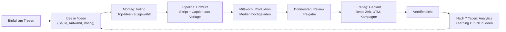

# Röstbrüder Social-Media- und Werbe-Playbook

> **Was wir posten, wann, wo, warum – und wie jeder Werbe-Euro zurückkommt.**
> Das operative Handbuch zum [Masterplan](./MASTERPLAN.md), gesteuert im Admin-Dashboard **Röstbrüder Studio**.

| | |
|---|---|
| **Stand** | 24.09.2026 · Version 1.0 |
| **Zeitraum** | Redaktionsplan KW 40–51/2026 · Anlässe Okt 2026 – Sep 2027 |
| **Kanäle** | Instagram @roestbrueder · Facebook /roestbrueder · TikTok · Google Unternehmensprofil (2 Standorte) · Pinterest · LinkedIn · YouTube Shorts · Newsletter |
| **Legende** | **[Vorschlag]** Empfehlung · **[Annahme]** zu prüfen/validieren · **[Richtwert]** Branchen-Orientierung · **[Zielwert]** Ziel nach Baseline · `{Platzhalter}` in Vorlagen ersetzen |

---

## Inhaltsverzeichnis

1. [Die 10 Grundregeln](#1-die-10-grundregeln)
2. [Kanal-Playbooks](#2-kanal-playbooks)
3. [Content-Säulen im Detail](#3-content-säulen-im-detail)
4. [Formate-Bibliothek: unsere Serien](#4-formate-bibliothek-unsere-serien)
5. [Fertige Reel- und TikTok-Skripte](#5-fertige-reel--und-tiktok-skripte)
6. [12-Wochen-Redaktionsplan KW 40–51/2026](#6-12-wochen-redaktionsplan-kw-40512026)
7. [Jahres-Anlässe Okt 2026 – Sep 2027](#7-jahres-anlässe-okt-2026--sep-2027)
8. [Caption-Vorlagen und Hashtag-Sets](#8-caption-vorlagen-und-hashtag-sets)
9. [Werbung: Kampagnen-Architektur](#9-werbung-kampagnen-architektur)
10. [Budget-Szenarien und Jahreskalender](#10-budget-szenarien-und-jahreskalender)
11. [Testen, Tracking und UTM](#11-testen-tracking-und-utm)
12. [Influencer und Kooperationen](#12-influencer-und-kooperationen)
13. [Community-Management](#13-community-management)
14. [UGC und Gewinnspiele](#14-ugc-und-gewinnspiele)
15. [Reporting-Vorlagen](#15-reporting-vorlagen)
16. [So arbeitet ihr mit dem Röstbrüder Studio](#16-so-arbeitet-ihr-mit-dem-röstbrüder-studio)

---

## 1. Die 10 Grundregeln

1. **Gesichter vor Produkten.** Collin, Vincent und das Team sind die Marke. Jedes zweite Video zeigt mindestens eine Person.
2. **Der Hook entscheidet.** Die ersten 1–2 Sekunden müssen Bewegung, Ton oder eine Frage liefern – sonst ist der Rest egal.
3. **Serien statt Einzelstücke.** Wiederkehrende Formate sparen Denkzeit und bauen Erwartung auf (Kapitel 4).
4. **Einmal drehen, fünfmal nutzen.** Ein Röstvorgang ergibt Reel, TikTok, Short, Story, Pinterest-Pin und Newsletter-Bild.
5. **Jeder Post hat eine Aufgabe.** Reichweite, Speichern, Besuch, Kauf oder Gespräch – im Studio als Säule und CTA hinterlegt.
6. **Weimar immer mitdenken.** Standort-Tags, Stadtmotive, lokale Anlässe – das ist euer Heimvorteil.
7. **Namen wie Personen behandeln.** „Dörte ist zurück“, nicht „Brasilien Santos wieder verfügbar“.
8. **Antworten gehört zum Posten.** Die erste Stunde nach einem Post ist Community-Zeit.
9. **80/20 statt Dauerverkauf.** Maximal jeder fünfte Post verkauft direkt; der Rest gibt Wissen, Einblick, Unterhaltung.
10. **Messen, lernen, nachschärfen.** Jeden Montag 15 Minuten Zahlen, jeden Monat eine bewusste Änderung.

---

## 2. Kanal-Playbooks

Beste Zeiten sind **[Annahme]** auf Basis typischer Nutzungsmuster und werden nach 8 Wochen mit der Posting-Zeit-Heatmap in `/studio/analytics` validiert.

### 2.1 Instagram – die Hauptbühne

| | |
|---|---|
| **Rolle** | Markenbühne, Community, Café-Frequenz, Shop-Traffic |
| **Zielgruppe** | Lena (Studierende), Markus (Home-Barista), Sophie (Geschenke), lokale Stammgäste |
| **Formate** | Reels (Reichweite) · Karussells (Speichern, Wissen) · Stories (Alltag, Umfragen, Restplätze) · Feed-Fotos (Ästhetik) · Collab-Posts mit Partnern · Highlights: *Cafés, Abo, Workshops, Brühen, Herkunft, FAQ* · optional Broadcast-Kanal „Röstbrüder Insider“ (neue Ernten zuerst) |
| **Frequenz** | 4 Feed-Posts/Woche (2 Reels, 1 Karussell, 1 Foto/Collab) + Stories an 5–7 Tagen (3–8 Frames) |
| **Beste Zeiten** | Mo–Fr 7:00–8:30 (Kaffee-Moment), 12:00–13:00, 18:00–20:00 · Sa/So 9:00–11:00 |
| **KPIs** | Reichweite (davon Nicht-Follower bei Reels), Saves, Shares, Profilaufrufe, Link-Klicks, Story-Antworten, Follower-Zuwachs |
| **Do's** | Hook in 1–2 s · Untertitel · Standort-Tag (Weimar, Herderplatz) · Alt-Text · in der ersten Stunde auf Kommentare antworten · Collab-Funktion mit Partnern |
| **Don'ts** | Stockfotos · Rabatt-Dauerbeschallung · Hashtag-Blöcke (Instagram erlaubt inzwischen nur noch wenige Hashtags pro Beitrag, aktuell max. 5 – Stand prüfen) · Reels mit Wasserzeichen anderer Apps |

### 2.2 TikTok – die Reichweiten-Maschine

| | |
|---|---|
| **Rolle** | Neue, jüngere Zielgruppen; Röst-Faszination; Brüder-Persönlichkeit |
| **Zielgruppe** | Lena, junge Home-Baristas, Kaffee-Neugierige in ganz Deutschland |
| **Formate** | 15–45-s-Videos, Serien („Röstprotokoll“, „Mythos oder Wahrheit“), Antwort-Videos auf Kommentare, Stitches zu Kaffee-Mythen |
| **Frequenz** | 3/Woche (2 Zweitverwertungen + 1 TikTok-natives Video) |
| **Beste Zeiten** | 12:00–14:00 und 18:00–22:00 |
| **KPIs** | Views, durchschnittliche Wiedergabedauer, Watch-Through-Rate, Shares, Follower, Profilaufrufe |
| **Do's** | Nativ und roh wirken lassen · Talking Heads der Brüder · Text on Screen · auf Kommentare mit Video antworten |
| **Don'ts** | Hochglanz-Werbelook · nicht lizenzierte Musik (Business-Accounts nur „Commercial Music Library“) · zu lange Intros |

### 2.3 Facebook – lokal und für Events

| | |
|---|---|
| **Rolle** | Veranstaltungen, lokale Zielgruppe 40+, Kulturreisende; Werbeausspielung über Meta |
| **Formate** | Crossposts von Instagram, **Veranstaltungen** (Cupping, Workshops, Zwiebelmarkt), Fotoalben, Reels |
| **Frequenz** | 2–3/Woche, Events immer als Facebook-Veranstaltung anlegen |
| **Beste Zeiten** | Mo–Fr 12:00–13:00 und 19:00–21:00 |
| **KPIs** | Event-Zusagen/Interessiert, lokale Reichweite, Link-Klicks, Empfehlungen |
| **Do's** | Events 3–4 Wochen vorher anlegen · Fotos nach Events als Album · lokale Anlässe |
| **Don'ts** | Unkommentiertes Crossposten von Story-Formaten · Hashtag-Blöcke |

### 2.4 Google Unternehmensprofil – das Schaufenster auf der Karte

| | |
|---|---|
| **Rolle** | Lokale Auffindbarkeit, Bewertungen, Routen, Anrufe – für **beide Standorte getrennt** |
| **Zielgruppe** | Claudia & Thomas (Touristen), alle Lokalen mit „Café in der Nähe“-Suche |
| **Formate** | Neuigkeiten, Angebote, Veranstaltungen, Fotos (Innen, Außen, Team, Produkte), Produkte, Menü/Karte, Sonderöffnungszeiten |
| **Frequenz** | 1 Post/Woche je Standort · 3–5 neue Fotos/Monat je Standort · Sonderöffnungszeiten 2 Wochen vorher |
| **Beste Zeiten** | Montag früh (Wochenstart) bzw. 3–5 Tage vor Events |
| **KPIs** | Aufrufe in Suche/Maps, Routenanfragen, Anrufe, Website-Klicks, Anzahl und Ø der Bewertungen, Antwortquote |
| **Do's** | Jede Bewertung beantworten · Attribute pflegen (Terrasse, WLAN, vegane Optionen, Barrierefreiheit) · Kategorie Rösterei vs. Café sauber trennen |
| **Don'ts** | Bewertungen gegen Belohnung erbitten · Keyword-Stuffing im Namen · veraltete Öffnungszeiten |

### 2.5 Pinterest – der Evergreen-Traffic

| | |
|---|---|
| **Rolle** | Langfristiger Traffic auf Brühanleitungen, Geschenkideen und Weimar-Inhalte |
| **Zielgruppe** | Sophie, Kaffee-Einsteiger:innen, Weimar-Reiseplaner:innen |
| **Formate** | Pins im 2:3-Format mit Text-Overlay, Video-Pins (Reel-Recycling); Boards: *Kaffee zu Hause brühen · Geschenkideen für Kaffeeliebhaber · Latte Art lernen · Cold Brew & Sommerkaffee · Weimar entdecken* |
| **Frequenz** | 5 Pins/Woche, einmal im Monat gebündelt vorplanen |
| **Beste Zeiten** | Abends und am Wochenende; saisonale Themen **45–60 Tage vorher** starten [Richtwert] (Weihnachten ab Mitte Oktober) |
| **KPIs** | Ausgehende Klicks, Saves, Impressionen |
| **Do's** | Keywords in Pin-Titel und Beschreibung · immer auf passende Website-Seite verlinken |
| **Don'ts** | Pins ohne Link · Querformat |

### 2.6 LinkedIn – B2B, Gastro, Arbeitgebermarke

| | |
|---|---|
| **Rolle** | Büro-Abos, Gastro-Partnerschaften, Firmen-Workshops, Recruiting |
| **Zielgruppe** | Jens (Gastronom:innen, Office-Manager:innen, HR, Agenturen in Weimar/Erfurt/Jena) |
| **Formate** | Persönliche Posts von Collin (wirken stärker als Unternehmensseite), PDF-Karussells („5 Gründe für regionalen Kaffee im Büro“), Fotos von Firmen-Workshops, Partner-Spotlights |
| **Frequenz** | Unternehmensseite 1 alle 2 Wochen · Collin persönlich 1/Woche [Vorschlag] |
| **Beste Zeiten** | Di–Do 7:30–9:00 |
| **KPIs** | Impressionen bei Entscheider:innen, Anfragen, Profilbesuche, Reaktionen von Zielkunden |
| **Do's** | Zahlen, Lernmomente, Gründer-Perspektive · Partner markieren |
| **Don'ts** | Instagram-Captions 1:1 übernehmen · reine Werbung |

### 2.7 YouTube Shorts – Zweitverwertung mit Suchpotenzial

| | |
|---|---|
| **Rolle** | Zusätzliche Reichweite aus bestehenden Reels; Such-Traffic für Brühanleitungen |
| **Formate** | Shorts (Recycling); optional 1 längeres Tutorial pro Quartal (z. B. „V60 – der komplette Guide“, 6–8 Min.) zum Einbetten im Brüh-Wissen-Hub |
| **Frequenz** | 2 Shorts/Woche |
| **KPIs** | Views, Abonnent:innen, Klicks auf verknüpfte Videos |
| **Do's** | Suchbegriffe im Titel („V60 Anleitung in 30 Sekunden“) |
| **Don'ts** | Videos mit TikTok-Wasserzeichen hochladen |

### 2.8 Newsletter „Der Röstbrief“ – der eigene Kanal

| | |
|---|---|
| **Rolle** | Bindung, Wiederkauf, Abo-Wachstum, Launches – unabhängig von Algorithmen |
| **Zielgruppe** | Bestandskund:innen, Café-Stammgäste, Workshop-Teilnehmende |
| **Formate** | **Röstbrief** 2×/Monat: 1 Geschichte (Namensgeber/Herkunft) · 1 Rezept · Termine · 1 Angebot · Gruß der Brüder. **Automationen:** Willkommen (3 Mails) · Nach dem Kauf (Brühtipp + Bewertungsbitte) · Nachkauf-Erinnerung · Abo-Onboarding · Win-back nach 90 Tagen · Workshop-Nachfass |
| **Frequenz** | 2 Röstbriefe/Monat + Kampagnenmails in Q4 (max. 1 zusätzliche pro Woche) |
| **Beste Zeiten** | Donnerstag 7:00 oder Sonntag 9:00 |
| **KPIs** | Klickrate ≥ 3 % [Zielwert], Umsatz pro Versand, Abmelderate < 0,3 %, Listenwachstum (Öffnungsrate nur als Tendenz – durch Apple Mail Privacy Protection verzerrt) |
| **Do's** | Absender „Collin & Vincent von Röstbrüder“ · ein Haupt-CTA · persönliche Betreffzeilen · Double-Opt-in |
| **Don'ts** | Newsletter ohne Anlass · Bildlastige Mails ohne Text |

---

## 3. Content-Säulen im Detail

Mix-Ziel im Normalbetrieb (Q4-Anpassung siehe Masterplan 8.3). Die Schlüssel entsprechen den Säulen im Studio.

### 3.1 Bohne & Herkunft (`bohne`) · 20 %

**Ziel:** Qualität und Transparenz beweisen, Preis begründen. **Leit-KPI:** Saves.

| # | Idee | Format | Hook |
|---|---|---|---|
| 1 | Bohnen-Pass eines Kaffees in 6 Slides | Karussell | „Das steht NICHT auf Supermarkt-Kaffee.“ |
| 2 | Unboxing: Rohkaffee-Säcke der neuen Ernte kommen an | Reel | „60 kg frische Ernte. Und alle haben schon einen Namen.“ |
| 3 | Natural, Washed, Honey – Aufbereitung erklärt | Karussell | „Warum schmeckt dieser Kaffee nach Beeren?“ |
| 4 | Wie ein Kaffee zu seinem Namen kommt | Reel (Talking Head) | „Wer ist eigentlich Dörte?“ |
| 5 | Was kostet eine Tasse wirklich? (nur mit Zahlen, die ihr teilen wollt) | Karussell | „3,20 € für einen Espresso – wohin geht das Geld?“ |
| 6 | Importweg auf der Karte: von der Farm nach Weimar | Reel/Animation | „8.000 km bis zur Richard-Wagner-Straße.“ |
| 7 | Weimarer Kaffeegeschichte: Goethe gab Runge 1819 Kaffeebohnen – der Rest ist Koffein-Geschichte (*Fakten vor Veröffentlichung prüfen*) | Karussell | „Ohne Weimar kein Koffein?“ |

### 3.2 Röst-Handwerk (`roesten`) · 15 %

**Ziel:** Faszination und Expertise. **Leit-KPI:** Nicht-Follower-Reichweite, Shares.

| # | Idee | Format | Hook |
|---|---|---|---|
| 1 | Röstprotokoll: eine Charge von grün bis braun | Reel 20 s | „12 Minuten. 12 Kilo. Eine Entscheidung.“ |
| 2 | First Crack – nur Ton, keine Musik | Reel (ASMR) | „Mach den Ton an.“ |
| 3 | Röstkurve erklärt (Screenshot der Rösterei-Software) | Karussell | „So sieht ein perfekter Kaffee als Kurve aus.“ |
| 4 | Ein Kaffee, zwei Röstungen: hell vs. dunkel im Blindtest | Reel | „Gleiche Bohne. Komplett anderer Kaffee.“ |
| 5 | Kühlsieb-Loop (perfekte Endlosschleife) | Reel 7 s | – (Loop wirkt ohne Worte) |
| 6 | „Das ist schiefgegangen“ – eine missglückte Probe-Röstung | Reel/Story | „Die hier haben wir NICHT verkauft.“ |
| 7 | Ein Tag an der Trommel | Story-Serie | „Röst-Tag! Kommt mit.“ |

### 3.3 Café-Leben Weimar (`cafe`) · 20 %

**Ziel:** Besuche in beiden Cafés, lokaler Stolz. **Leit-KPI:** Routenanfragen, Story-Antworten.

| # | Idee | Format | Hook |
|---|---|---|---|
| 1 | Weimar am Morgen: Espressobar öffnet, Herderplatz im ersten Licht | Reel 10 s | „8:59 Uhr am Herderplatz.“ |
| 2 | Stammgast der Woche (mit Einwilligung) | Foto + Zitat | „Seit 2022 jeden Dienstag hier: …“ |
| 3 | Terrassen-Countdown im Frühjahr | Story-Serie | „Noch 5 Tage bis Terrasse.“ |
| 4 | POV: Kaffee trinken, während der Röster läuft | Reel | „POV: Dein Cappuccino und nebenan wird geröstet.“ |
| 5 | Saison-Getränk vorstellen | Reel/Foto | „Nur bis Ende November.“ |
| 6 | Nachbarschaft: Lieblingsorte der Brüder in Weimar | Karussell | „5 Orte in Weimar, die Touristen verpassen.“ |
| 7 | Live-Story „Heute wird geröstet – kommt vorbei“ | Story | „Riecht ihr das?“ |

### 3.4 Brüh-Wissen (`bruehen`) · 15 %

**Ziel:** Nützlichkeit, Saves, SEO-Recycling, Shop-Brücke. **Leit-KPI:** Saves, Website-Klicks.

| # | Idee | Format | Hook |
|---|---|---|---|
| 1 | 3 Fehler, die deinen Filterkaffee ruinieren | Reel | „Fehler Nr. 2 macht fast jede:r.“ |
| 2 | Rezeptkarte pro Kaffee | Karussell | „Speicher dir das für morgen früh.“ |
| 3 | Mahlgrad erklärt mit Salz, Zucker und Mehl | Reel | „Dein Kaffee ist bitter? Schau auf die Mühle.“ |
| 4 | Frag den Röster: Antworten auf Community-Fragen | Reel/Story | „Ihr habt gefragt: …“ |
| 5 | Mythos oder Wahrheit (z. B. „Kaffee in den Kühlschrank?“) | Reel 15 s | „Mythos oder Wahrheit?“ |
| 6 | Wasser: warum es 98 % deiner Tasse ist | Karussell | „Dein Leitungswasser schmeckt mit.“ |
| 7 | Cold Brew in 3 Schritten (Sommer) | Reel | „Kaffee, der sich über Nacht selbst macht.“ |

### 3.5 Die Brüder & Team (`brueder`) · 10 %

**Ziel:** Nähe, Sympathie, Wiedererkennung. **Leit-KPI:** Kommentare, Follower-Zuwachs.

| # | Idee | Format | Hook |
|---|---|---|---|
| 1 | Wie alles anfing: Vincents Rösterei-Job im Studium, Gründung 2020 | Reel (Talking Head) | „2020 war ein seltsamer Zeitpunkt, eine Rösterei zu gründen.“ |
| 2 | Brüderzwist: Brüh-Duell mit Blindverkostung | Reel | „Nur einer von uns hat recht.“ |
| 3 | Team-Porträts der Baristas | Karussell/Reel | „Ohne sie läuft hier gar nichts.“ |
| 4 | Packtag vor Weihnachten | Reel/Story | „So sieht Dezember bei uns aus.“ |
| 5 | 7 Jahre in 7 Bildern (Jubiläum März) | Karussell | „März 2020 vs. heute.“ |
| 6 | Bloopers und Fails des Monats | Reel | „Das hier hat es nicht in den Feed geschafft.“ |

### 3.6 Events & Workshops (`events`) · 10 %

**Ziel:** Buchungen, Gutscheinverkauf, Community-Events. **Leit-KPI:** Buchungen, Link-Klicks.

| # | Idee | Format | Hook |
|---|---|---|---|
| 1 | Workshop-Einblick: das erste Latte-Art-Herz einer Teilnehmerin (mit Einwilligung) | Reel | „Vor 2 Stunden hatte sie noch nie Milch geschäumt.“ |
| 2 | „Noch 2 Plätze“ – Restplatz-Countdown | Story mit Link | „Samstag, 10 Uhr, 2 Plätze.“ |
| 3 | Cupping-Abend: Einladung + Recap | Karussell/Reel | „Wir schlürfen laut. Ihr auch?“ |
| 4 | Latte-Art-Throwdown: Ankündigung + Highlights | Reel | „Weimars bestes Herz gesucht.“ |
| 5 | Röstereiführung als Geschenk | Reel | „Das Geschenk für Leute, die schon alles haben.“ |
| 6 | Firmen-Workshop-Case | LinkedIn-Post | „Teamevent mit Espresso statt Escape Room.“ |

### 3.7 Shop & Abo (`shop`) · 10 %

**Ziel:** Umsatz, Abo-Abschlüsse. **Leit-KPI:** Link-Klicks, Conversions (UTM).

| # | Idee | Format | Hook |
|---|---|---|---|
| 1 | Neue Ernte ist da: Launch-Post mit Bohnen-Pass | Karussell + Story-Link | „Sie ist da. Und sie heißt …“ |
| 2 | Das Abo in 15 Sekunden erklärt | Reel | „Nie wieder leere Kaffeedose.“ |
| 3 | Geschenk-Guide (Einsteiger:innen, Nerds, Eilige) | Karussell | „Für jede:n den richtigen Kaffee.“ |
| 4 | Packing-ASMR: „Wir packen deine Bestellung“ | Reel | „Bestellt um 9. Gepackt um 11.“ |
| 5 | Probierset/Bundle des Monats | Foto/Karussell | „Drei Namen, eine Box.“ |
| 6 | Abo-Stimmen (UGC) | Reel/Karussell | „Warum Anna seit 2 Jahren im Abo ist.“ (echte Stimmen, mit Einwilligung) |
| 7 | Versandschluss-Countdown Weihnachten | Story/Reel | „Noch 3 Tage, dann wird's knapp.“ |

---

## 4. Formate-Bibliothek: unsere Serien

| Serie | Säule | Format & Länge | Rhythmus | Kanäle | Ablauf (Skript-Outline) |
|---|---|---|---|---|---|
| **Bohne der Woche** | `bohne` | Karussell 6 Slides / Reel 20 s | wöchentlich, Mo | IG, FB, PI | 1 Name + Foto + Hook · 2 Herkunft · 3 Aufbereitung · 4 Geschmack · 5 Rezept · 6 CTA „Im Shop & an der Bar“ |
| **Röstprotokoll #n** | `roesten` | Reel 15–25 s | wöchentlich, Mi | IG, TT, YT | Grüne Bohnen einfüllen (Hook „Charge #n: 12 kg Dörte“) · Temperatur-Overlay · First-Crack-Ton · Auswurf ins Kühlsieb · Nahaufnahme · CTA |
| **Brüderzwist** | `brueder` | Reel 30–45 s | alle 2 Wochen, Do | IG, TT | Streitfrage stellen · beide bereiten zu · Blindverkostung durch Gast/Team · Ergebnis · „Wer hat recht? Kommentiert!“ |
| **Weimar am Morgen** | `cafe` | Reel/Story 7–12 s | wöchentlich, Di oder Sa früh | IG, TT, GB | Tür auf · erster Shot · Herderplatz-Totale · Text „Wir sind wach. Du auch?“ |
| **Frag den Röster** | `bruehen` | Story-Fragesticker (Mo) → Antwort-Reels/Stories (Do) | wöchentlich | IG, TT | Frage einblenden · Vincent antwortet in ≤ 30 s · Tipp als Text-Overlay · „Nächste Frage?“ |
| **Namensgeber** | `bohne` | Reel 30–60 s + Karussell | bei jedem neuen Kaffee, mind. monatlich | IG, TT, NL | „Wer ist eigentlich {Name}?“ · Geschichte · Geschmack in 3 Worten · Rezept · CTA |
| **Mythos oder Wahrheit?** | `bruehen` | Reel 15 s | alle 2 Wochen | IG, TT, YT | Mythos als Text · 3-s-Pause „Was meinst du?“ · Auflösung · Beweis/Demo |
| **Stammgast der Woche** | `cafe` | Foto + Zitat / Story | wöchentlich | IG, FB | Porträt · Lieblingsgetränk · ein Satz über Röstbrüder (Einwilligung!) |
| **Weimarer Kaffeegeschichten** | `cafe` / `bohne` | Karussell 5–7 Slides | monatlich | IG, FB, PI | Historische Anekdote · Bezug heute · Foto aus Weimar · Quelle nennen |
| **Packtag** | `shop` | Story / ASMR-Reel | Q4 wöchentlich, sonst bei Bedarf | IG, TT | Bestellzettel · Tüte füllen · Siegel · Karton · „Unterwegs zu dir“ |
| **Der Röstbrief** | alle | Newsletter | 2×/Monat | E-Mail | Geschichte · Rezept · Termine · Angebot · Gruß |
| **Latte-Art-Freitag** | `events` | Reel 10 s | alle 2 Wochen, Fr | IG, TT | Ein Gießen in Zeitlupe · Team gegen Team · Fail erlaubt |

---

## 5. Fertige Reel- und TikTok-Skripte

Alle Skripte: 9:16, Untertitel an, Text im oberen/mittleren Drittel (UI-Safe-Zone), Musik aus lizenzierten Bibliotheken (TikTok Commercial Music Library, Instagram-Audio für Business) oder Originalton.

### Skript 1 · „Von grün zu braun“ (Röstprotokoll) · 20 s · `roesten`

| Zeit | Bild | Text-Overlay | Ton |
|---|---|---|---|
| 0–2 s | Extreme Nahaufnahme: grüne Bohnen rieseln in den Trichter | **„Das ist Kaffee. Noch.“** | Rieseln (O-Ton) |
| 2–6 s | Vincents Hand am Regler, Temperaturanzeige | „Charge #12 · 12 kg Dörte · Brasilien“ | Trommel-Brummen |
| 6–11 s | Sichtfenster: Farbe wechselt von grün über gelb zu zimtbraun (Zeitraffer) | „Minute 8: Es wird gelb und riecht nach Brot“ | Ansteigende Musik, leise |
| 11–14 s | Ohr nah an der Trommel, Vincent hebt den Finger | „Jetzt: First Crack“ | **Knacken laut**, Musik aus |
| 14–18 s | Auswurf ins Kühlsieb, Rührarme drehen, Dampf im Gegenlicht | „Und … raus.“ | Rauschen, Musik zurück |
| 18–20 s | Hand greift in die Bohnen, Tüte mit „Dörte“ im Hintergrund | **„Morgen in deiner Tasse.“** | Musik-Akzent |

**CTA (Caption):** „Frisch geröstet heißt bei uns: diese Woche. Link in der Bio.“ · **Säule:** Röst-Handwerk · **Recycling:** TikTok, Short, Pinterest-Video-Pin, GIF für den Röstbrief.

### Skript 2 · „Brüderzwist: V60 vs. AeroPress“ · 40 s · `brueder` / `bruehen`

| Zeit | Bild | Text-Overlay | Ton |
|---|---|---|---|
| 0–3 s | Collin und Vincent stehen sich gegenüber, jeder hält sein Gerät hoch | **„Wir streiten seit 2020 darüber.“** | O-Ton: „V60!“ – „AeroPress!“ |
| 3–8 s | Split-Screen: beide wiegen ab | „Gleicher Kaffee: Jörg · 15 g · 250 ml“ | Musik startet |
| 8–20 s | Zeitraffer beider Zubereitungen, Blicke zueinander | „V60: 3:00 min“ / „AeroPress: 2:00 min“ | Musik |
| 20–30 s | Barista aus dem Team verkostet blind aus zwei Tassen (A/B) | „Blindverkostung. Keine Gnade.“ | O-Ton Schlürfen |
| 30–36 s | Barista zeigt auf Tasse A … Schnitt | „Gewonnen hat …“ | Trommelwirbel |
| 36–40 s | Beide schauen in die Kamera | **„Sagen wir euch im nächsten Video. Wer hat recht?“** | Musik-Akzent |

**CTA:** „Kommentiert V60 oder AeroPress – die Mehrheit bekommt Rezept-Karussell.“ · **Ziel:** Kommentare, Folgevideo (Teil 2 zwei Tage später).

### Skript 3 · „Wer ist eigentlich Dörte?“ (Namensgeber) · 35 s · `bohne`

| Zeit | Bild | Text-Overlay | Ton |
|---|---|---|---|
| 0–2 s | Tüte „Dörte“ wird zur Kamera gedreht | **„Wer ist eigentlich Dörte?“** | O-Ton Vincent: „Das fragen uns alle.“ |
| 2–15 s | Vincent erzählt vor der Trommel (Talking Head, 2 Schnitte) | Stichworte: `{Namensgeber-Story in 3 Stichworten}` | O-Ton |
| 15–25 s | B-Roll: Bohnen, Brühen, Tasse auf der Terrasse | „Brasilien · Santos · {Geschmacksnoten}“ | Leise Musik |
| 25–32 s | Collin trinkt, nickt | „Schmeckt wie: {Vergleich aus dem Alltag}“ | O-Ton Collin |
| 32–35 s | Beide mit Tüte | **„Jede Bohne hat einen Namen.“** | Musik-Akzent |

**CTA:** „Welchen Namen sollen wir als Nächstes erklären?“ · **Hinweis:** Story mit echten Fakten füllen; Person nur mit deren Einverständnis nennen.

### Skript 4 · „3 Fehler, die deinen Filterkaffee ruinieren“ · 30 s · `bruehen`

| Zeit | Bild | Text-Overlay | Ton |
|---|---|---|---|
| 0–2 s | Vincent kippt demonstrativ eine Tasse weg | **„Dein Filterkaffee ist bitter? Das sind die 3 Gründe.“** | O-Ton |
| 2–10 s | Handmühle: grob vs. fein nebeneinander | „1 · Mahlgrad: zu fein = bitter, zu grob = sauer“ | Musik |
| 10–18 s | Thermometer im Wasserkessel | „2 · Wasser: 92–96 °C, nicht kochend drauf“ [Richtwert] | Musik |
| 18–26 s | Waage mit 15 g und 250 ml | „3 · Verhältnis: ca. 60 g pro Liter“ [Richtwert] | Musik |
| 26–30 s | Perfekte Tasse, Dampf im Gegenlicht | **„Speichern für morgen früh.“** | Musik-Akzent |

**CTA:** „Die ganze Anleitung für V60, Chemex & French Press: Link in Bio.“ · **Recycling:** Pinterest-Pin mit gleichem Titel, Brüh-Wissen-Artikel.

### Skript 5 · „POV: Dein Morgen in Weimar“ · 15 s · `cafe`

| Zeit | Bild | Text-Overlay | Ton |
|---|---|---|---|
| 0–2 s | Handykamera läuft über Kopfsteinpflaster Richtung Herderplatz | **„POV: Du hast einen freien Vormittag in Weimar.“** | Straßengeräusch |
| 2–5 s | Tür der Espressobar geht auf, Barista winkt | „9:00 Uhr. Erste:r.“ | Türglocke/Ambient |
| 5–9 s | Espresso läuft aus dem Siebträger (Nahaufnahme) | – | Mühle, Maschine |
| 9–13 s | Tasse auf der Terrasse, Blick auf den Platz | „Bester Blick der Altstadt.“ | Musik |
| 13–15 s | Logo-Schild / Tafel | **„Espressobar am Herderplatz · bis 18 Uhr“** | Musik-Akzent |

**CTA:** „Speicher dir das für deinen Weimar-Trip.“ · **Paid-Variante:** Creative für Kampagne *Lokal Awareness* (Kapitel 9).

### Bonus-Skript 6 · „Das Last-Minute-Geschenk“ · 20 s · `shop` (Q4)

| Zeit | Bild | Text-Overlay | Ton |
|---|---|---|---|
| 0–2 s | Collin panisch mit leerem Geschenkpapier | **„Noch kein Geschenk? Wir auch nicht. Früher.“** | O-Ton |
| 2–8 s | Handy: Geschenk-Abo wird in 3 Taps konfiguriert | „Geschenk-Abo: 3, 6 oder 12 Monate“ | Tipp-Geräusche |
| 8–14 s | Gedruckte Grußkarte + Tüte werden verpackt | „Mit Karte. Mit Namen. Mit Liebe geröstet.“ | Musik |
| 14–20 s | Beschenkte:r öffnet (gestellt, Team) | **„Oder digitaler Gutschein – in 2 Minuten im Postfach.“** | Musik-Akzent |

**CTA:** „Link in Bio · Versandschluss {Datum}.“

---

## 6. 12-Wochen-Redaktionsplan KW 40–51/2026

Hero-Posts pro Woche. **Zusätzlich jede Woche:** Stories an 5–7 Tagen · 1 Google-Post je Standort · 2–3 TikTok-/Shorts-Zweitverwertungen · 5 Pins · Community-Zeit täglich. Termine mit „prüfen“ vor Planung bestätigen. Kürzel: IG Instagram · TT TikTok · FB Facebook · GB Google · PI Pinterest · LI LinkedIn · YT YouTube · NL Newsletter.

| KW | Datum | Kanal | Format | Säule | Thema / Hook | CTA |
|---|---|---|---|---|---|---|
| 40 | Mo 28.09. | IG, FB | Karussell | `bohne` | Bohne der Woche: „Dörte ist zurück.“ | Shop / an der Bar probieren |
| 40 | Do 01.10. | IG, TT, GB ×2 | Reel + Posts | `cafe` | **Tag des Kaffees:** „Heute feiern wir – mit euch.“ Aktion [Vorschlag]: jede 2. Filterkaffee-Tasse aufs Haus | Vorbeikommen |
| 40 | Fr 02.10. | NL | Röstbrief #18 | `events` | Tag-des-Kaffees-Rückblick + Workshop-Termine Oktober | Workshop buchen |
| 41 | Mi 07.10. | IG, TT, YT | Reel | `roesten` | Röstprotokoll #1 (Skript 1): „Das ist Kaffee. Noch.“ | Frisch im Shop |
| 41 | Fr 09.10. | IG Story, GB ×2, FB Event | Story + Posts | `cafe` | **Zwiebelmarkt** (voraussichtlich 09.–11.10., *prüfen*): Sonderöffnungszeiten, Kaffee to go am Herderplatz | Route |
| 41 | So 11.10. | IG, TT | Reel | `cafe` | Weimar am Morgen – Zwiebelmarkt-Edition: „Bevor die Massen kommen.“ | Folgen |
| 42 | Mo 12.10. | IG, Story | Karussell | `cafe` | **Semesterstart** (Vorlesungsbeginn ca. Mitte Okt., *prüfen*): Studi-Stempelkarte | Karte abholen |
| 42 | Mi 14.10. | IG, TT, PI | Reel + Pin | `bruehen` | Skript 4: „3 Fehler, die deinen Filterkaffee ruinieren“ | Speichern, Brühanleitung |
| 42 | Sa 17.10. | IG | Reel + Story | `events` | Workshop-Recap Espresso-Basics: „Vor 3 Stunden noch nie getampt.“ | Nächster Termin |
| 43 | Di 20.10. | IG, FB | Karussell | `bohne` | „Natural, Washed, Honey – was heißt das?“ | Speichern |
| 43 | Do 22.10. | IG, TT | Reel | `brueder` | Skript 2: Brüderzwist #1 – V60 vs. AeroPress | Abstimmen in Kommentaren |
| 43 | Sa 24.10. | IG Story, GB ×2 | Story + Posts | `cafe` | Zeitumstellung (So 25.10.): „Eine Stunde mehr – für einen Kaffee mehr.“ | Vorbeikommen |
| 44 | Mo 26.10. | IG, FB, PI | Karussell + Pins | `shop` | Geschenk-Guide Teil 1: Kaffee-Einsteiger:innen (Pinterest früh starten) | Geschenke-Seite |
| 44 | Mi 28.10. | IG, TT | Reel | `bohne` | Skript 3: „Wer ist eigentlich Dörte?“ | Produktseite |
| 44 | Fr 30.10. | NL, GB ×2 | Röstbrief #19 + Posts | `events` | Workshop-Termine Nov/Dez, Firmen-Workshops; Hinweis Reformationstag 31.10. (Feiertag in Thüringen – Öffnungszeiten *prüfen*) | Workshop/Gutschein |
| 45 | Mo 02.11. | LI | Beitrag (Collin) | `events` | „Weihnachtsfeier mal anders: Barista-Workshop fürs Team.“ | Anfrage |
| 45 | Mi 04.11. | IG, TT | Reel | `roesten` | Röstprotokoll #5: Probe-Röstung Winterkaffee [Vorschlag] – „Wie soll er heißen?“ | Namen in die Kommentare |
| 45 | Fr 06.11. | IG Story | Umfrage | `bohne` | Top-3-Namensvorschläge zur Abstimmung | Abstimmen |
| 46 | Mo 09.11. | IG, FB, NL-Sondermail | Karussell + Mail | `shop` | **Launch Geschenk-Abo:** „Verschenk einen Kaffee mit Namen.“ | Abo verschenken |
| 46 | Mi 11.11. | IG, TT | Reel | `shop` | Bonus-Skript 6: „Das Last-Minute-Geschenk“ (frühe Version: „Diesmal rechtzeitig“) | Link in Bio |
| 46 | Sa 14.11. | IG | Reel | `events` | Röstereiführung als Gutschein: „Für Leute, die schon alles haben.“ | Gutschein |
| 47 | Mo 16.11. | IG, PI | Karussell + Pins | `bruehen` | „Kaffee-Setup unterm Baum: Was Einsteiger:innen wirklich brauchen.“ | Zubehör |
| 47 | Mi 18.11. | IG, TT | Reel | `brueder` | Brüderzwist #2: „Wer packt schneller?“ (Packtag) | „Bestellt bis …“ |
| 47 | Fr 20.11. | NL #20 | Mail (Early Access) | `shop` | **Black Coffee Friday** – Vorschau exklusiv für Newsletter-Leser:innen | Erinnerung setzen |
| 48 | Di 24.11. | IG Stories, Reel | Teaser | `shop` | „Keine Rabattschlacht. Dafür ein Extra obendrauf.“ (Mechanik Kapitel 9, K5) | Erinnerung |
| 48 | Fr 27.11. | IG, FB, TT, NL, GB | Launch-Paket | `shop` | **Black Coffee Friday ist live** (bis Mo 30.11.) | Shop |
| 48 | So 29.11. | IG | Reel | `cafe` | 1. Advent: Espressobar mit Blick auf den Weihnachtsmarkt (Termine Weihnachtsmarkt *prüfen*) | Vorbeikommen |
| 49 | Mo 30.11. | IG Story, NL | Reminder | `shop` | Cyber Monday: „Letzter Tag Black-Coffee-Week.“ | Shop |
| 49 | Mi 02.12. | IG, TT | Reel | `bohne` | Winterkaffee-Reveal: „Ihr habt entschieden: Er heißt {Name}.“ [Vorschlag] | Produktseite |
| 49 | So 06.12. | IG | Karussell + Gewinnspiel | `brueder` | Nikolaus: „Was wir uns gegenseitig in den Stiefel stecken“ + Verlosung Workshop-Gutschein (Kapitel 14) | Teilnehmen |
| 50 | Di 08.12. | IG, PI | Karussell + Pins | `shop` | Geschenk-Guide Teil 2: Kaffee-Nerds & Eilige | Geschenke-Seite |
| 50 | Do 10.12. | IG, TT | Reel | `events` | „So sieht ein Workshop-Gutschein aus“ – Auspacken + Einblick | Gutschein |
| 50 | Fr 11.12. | NL #21, GB ×2 | Röstbrief + Posts | `shop` | Versandschluss-Erinnerung, digitaler Gutschein, Öffnungszeiten Feiertage | Bestellen |
| 51 | Mo 14.12. | IG Story, GB ×2 | Countdown | `shop` | „Noch {X} Tage bis Versandschluss“ (Versandschluss mit Versanddienstleister *prüfen*, [Annahme] ca. 17./18.12.) | Bestellen |
| 51 | Do 17.12. | IG, FB, NL-Sondermail | Post + Mail | `shop` | „Zu spät? Digitaler Gutschein – in 2 Minuten im Postfach.“ | Gutschein |
| 51 | So 20.12. | IG, TT | Reel | `brueder` | 4. Advent: „Danke, 2026.“ – Jahresrückblick der Brüder | Kommentieren |

**Ausblick KW 52–53:** Weihnachtsgrüße (24.12.), Öffnungszeiten zwischen den Jahren, „Gutschein einlösen“-Hinweis, Jahresrückblick-Karussell (31.12.), Januar-Thema „Brühen lernen statt Vorsätze brechen“.

---

## 7. Jahres-Anlässe Okt 2026 – Sep 2027

Alle Anlässe sind im Studio unter `/studio/ideen` → Anlässe-Kalender gepflegt und erscheinen im Redaktionskalender. Termine mit „prüfen“ vor Planung bestätigen.

| Datum | Anlass | Marketing-Winkel | Säule | Kanäle |
|---|---|---|---|---|
| 01.10.2026 | Internationaler Tag des Kaffees | Aktion in beiden Cafés, Röstbrief | `cafe` | IG, TT, GB, NL |
| 03.10.2026 | Tag der Deutschen Einheit | Öffnungszeiten, Ausflugsziel Weimar | `cafe` | GB, IG Story |
| ca. 09.–11.10.2026 (*prüfen*) | Weimarer Zwiebelmarkt | Sonderöffnung, Kaffee to go, Touristen | `cafe` | GB, IG, FB |
| ca. Mitte Okt. (*prüfen*) | Semesterstart Wintersemester | Studi-Stempelkarte, Einsteiger-Workshop | `cafe` / `events` | IG, TT |
| 25.10.2026 | Zeitumstellung | „Eine Stunde mehr für Kaffee“ | `cafe` | IG Story, GB |
| 31.10.2026 | Reformationstag (Feiertag Thüringen) / Halloween | Öffnungszeiten, „gruseligste Kaffee-Mythen“ | `bruehen` | IG, TT |
| 10.11.2026 | Schillers Geburtstag (1759) | Weimarer Kaffeegeschichten | `cafe` | IG, FB |
| 27.–30.11.2026 | Black Friday bis Cyber Monday | Black Coffee Friday (Mehrwert statt Rabattschlacht) | `shop` | alle, Paid |
| ab Ende Nov. (*prüfen*) | Weimarer Weihnachtsmarkt | Espressobar als Aufwärm-Stopp, Touristen | `cafe` | GB, IG |
| 29.11. / 06.12. / 13.12. / 20.12. | Advent | Geschenk-Guides, Adventsaktionen | `shop` | IG, NL |
| 06.12.2026 | Nikolaus | Gewinnspiel Workshop-Gutschein | `brueder` | IG |
| ca. 17.12.2026 (*prüfen*) | Versandschluss Weihnachten | Countdown, digitaler Gutschein | `shop` | IG, NL, GB |
| 24.–31.12.2026 | Weihnachten, zwischen den Jahren, Silvester | Grüße, Jahresrückblick, Öffnungszeiten | `brueder` | IG, GB |
| Januar 2027 | Neujahr / Gutschein-Einlösung | „Brühen lernen statt Vorsätze brechen“, Workshops füllen | `events` | IG, NL |
| 14.02.2027 (So) | Valentinstag | „Date im Latte-Art-Workshop“, Latte-Art-Herzen | `events` | IG, TT |
| Februar 2027 [Vorschlag] | Latte-Art-Throwdown #1 | Community-Event, viel Content | `events` | IG, FB, TT |
| März 2027 (`[Gründungsdatum eintragen]`) | **7 Jahre Röstbrüder** + Website-Relaunch | Jubiläums-Edition, Party, Rückblick | `brueder` | alle |
| 26.–29.03.2027 | Ostern (Karfreitag bis Ostermontag) + Zeitumstellung 28.03. | Öffnungszeiten, Oster-Brunch-Kaffee | `cafe` | GB, IG |
| April 2027 (*prüfen*) | Semesterstart Sommersemester | Studi-Aktion | `cafe` | IG, TT |
| April/Mai 2027 [Vorschlag] | Terrassen-Opening Espressobar | Saisonstart, Countdown, Presse | `cafe` | IG, GB, FB |
| 01.05.2027 | Tag der Arbeit | Öffnungszeiten, Ausflugsziel | `cafe` | GB |
| 06.05.2027 | Christi Himmelfahrt / Vatertag | „Vatertag mit Cupping statt Bollerwagen“ | `events` | IG, FB |
| 09.05.2027 | Muttertag | Geschenk-Abo, Workshop zu zweit | `shop` | IG, NL, Paid |
| 16.–17.05.2027 | Pfingsten | Öffnungszeiten, Touristen | `cafe` | GB |
| Mai/Juni 2027 | Cold-Brew-Saisonstart | Cold-Brew-Launch, Rezepte | `bruehen` / `shop` | IG, TT, PI |
| Juli/Aug. 2027 (*prüfen*) | Sommerferien Thüringen, Tourismus-Hochsaison | Terrasse, Souvenir-Box, Weimar-Content | `cafe` | IG, GB, PI |
| 28.08.2027 | Goethes Geburtstag (1749) | Goethe, Runge und das Koffein (*Fakten prüfen*) | `bohne` | IG, FB, NL |
| Ende Aug./Anfang Sep. (*prüfen*) | Kulturfestivals in Weimar (z. B. Kunstfest) | Kooperationen, Festival-Kaffee | `cafe` | IG, FB |
| 12.09.2027 | Tag des offenen Denkmals | Altstadt-Content, Espressobar | `cafe` | IG, GB |
| laufend (mit Importpartnern abstimmen) | **Ankunft neuer Rohkaffee-Ernten** | Launch: Namensgeber, Bohnen-Pass, Cupping-Abend | `bohne` | alle |
| September 2027 | Vorbereitung Tag des Kaffees + Zwiebelmarkt 2027 | Jahresplanung, Rückblick | – | Studio |

---

## 8. Caption-Vorlagen und Hashtag-Sets

Alle Vorlagen liegen in `/studio/bibliothek` → Caption-Vorlagen und lassen sich im Post-Editor mit `/` einfügen. `{Platzhalter}` springen per Tab.

### 8.1 Caption-Vorlagen

**V1 · Bohne der Woche**
```
{Name} ist {zurück/neu/da}. 🤎
{Herkunft in einem Satz} – {Aufbereitung}, {Varietät}.
In der Tasse: {3 Geschmacksnoten}.
Unser Tipp: {Zubereitung} mit {Rezept kurz}.
Jetzt im Shop und an beiden Bars. Wer probiert zuerst?
```

**V2 · Röstprotokoll**
```
Röstprotokoll #{n}: {Menge} kg {Name} in {Minuten} Minuten.
Bei Minute {x} kam der First Crack – ab da entscheidet jede Sekunde über den Geschmack.
Heute geröstet, {morgen/diese Woche} bei euch.
Fragen zur Röstung? Ab in die Kommentare – Vincent antwortet.
```

**V3 · Neue Ernte / Launch**
```
Sie ist da: {Name} aus {Land/Region}.
{Namensgeber-Story in einem Satz}.
{Geschmacksnoten} – und {persönlicher Satz eines Bruders}.
Nur solange die Ernte reicht. Bohnen-Pass und Shop: Link in Bio.
```

**V4 · Workshop mit Restplätzen**
```
{Wochentag}, {Datum}, {Uhrzeit}: {Workshop-Name} in der Rösterei.
{Was man lernt in einem Satz}. Inklusive {Leistungen}.
Noch {Anzahl} Plätze frei – danach geht's auf die Warteliste.
Buchen: Link in Bio. Auch als Gutschein. 🎁
```

**V5 · Café-Moment / Weimar am Morgen**
```
{Uhrzeit} am {Herderplatz/in der Richard-Wagner-Straße}.
{Beobachtung aus dem Moment, ein Satz}.
Wir sind bis {Uhrzeit} für euch da. {Terrasse offen/Röster läuft}.
Wer kommt vorbei?
```

**V6 · Brüh-Tipp (Karussell)**
```
{Problem als Frage}? Das liegt meistens an {Ursache}.
Swipe für {Anzahl} Schritte zur besseren Tasse. →
Speichern nicht vergessen – morgen früh wirst du es brauchen.
Welche Methode sollen wir als Nächstes erklären?
```

**V7 · Brüderzwist**
```
Brüderzwist #{n}: {Streitfrage}.
{Bruder 1} sagt {Position A}. {Bruder 2} sagt {Position B}.
Blindverkostet hat {Person}. Ergebnis: {Ergebnis oder „im nächsten Video“}.
Und ihr? Team {A} oder Team {B}? 👇
```

**V8 · Namensgeber**
```
Wer ist eigentlich {Name}?
{Story in 2–3 Sätzen}.
Deshalb schmeckt {Name} nach {Geschmacksnoten} – {augenzwinkernder Bezug zur Person}.
Jede Bohne hat einen Namen. Welche Story wollt ihr als Nächstes hören?
```

**V9 · Abo**
```
Nie wieder leere Kaffeedose.
Mit dem Röstbrüder-Abo kommt {Kaffee/Saisonkaffee} alle {2/4/6} Wochen frisch aus der Trommel zu dir.
Pausieren, tauschen, kündigen – jederzeit, in 2 Klicks.
{Abo-Vorteil}. Link in Bio.
```

**V10 · Geschenk (Q4)**
```
Das Geschenk für {Zielperson}: {Produkt}.
{Warum es passt, ein Satz}.
Mit Grußkarte, schön verpackt – oder als digitaler Gutschein in 2 Minuten.
Bestellt bis {Versandschluss-Datum}, ist es unterm Baum.
```

**V11 · Event-Einladung (Cupping)**
```
Cupping-Abend am {Datum}, {Uhrzeit} in der Rösterei.
Wir probieren {Anzahl} Kaffees nebeneinander – mit Löffel, laut schlürfend und ganz ohne Vorwissen.
{Preis/Spende}. {Anzahl} Plätze.
Anmelden: Link in Bio oder direkt an der Bar.
```

**V12 · UGC-Repost / Danke**
```
Das hier hat uns {Name/@handle} geschickt – und wir freuen uns riesig. 🤎
{Kaffee-Name} in {Ort/Situation}.
Zeigt uns eure Röstbrüder-Momente mit #jedebohnehateinennamen – jeden Monat verlosen wir 250 g unter allen Fotos.
```

**V13 · Google-Post (Neuigkeit, max. ca. 1.500 Zeichen)**
```
{Anlass}: {Was passiert} in unserer {Rösterei/Espressobar}.
{Datum, Uhrzeit}. {Adresse}.
{Ein Satz Nutzen}. Wir freuen uns auf euch!
Button: {Mehr erfahren/Anrufen/Buchen}
```

**V14 · LinkedIn (B2B)**
```
{Beobachtung aus dem Alltag mit Büros/Gastro}.
Bei {Partner-Typ} in {Ort} haben wir {Lösung} umgesetzt: {2–3 konkrete Punkte}.
Ergebnis: {qualitatives Ergebnis}.
Wer in Weimar, Erfurt oder Jena Kaffee fürs Team sucht: Schreibt mir direkt.
– Collin
```

### 8.2 Hashtag-Sets (Pools)

Die Sets sind **Pools**: Pro Beitrag wählt ihr 3–5 passende Tags (Instagram-Limit, Stand prüfen), bei TikTok 3–5, bei Pinterest 2–5 als Keywords. Mischformel: **1 Marke + 1–2 Lokal + 1–2 Thema.** Vor der ersten Nutzung prüfen, ob ein Tag aktiv und unauffällig ist.

| Set | Tags |
|---|---|
| **Marke (immer 1)** | #röstbrüder #roestbrueder #jedebohnehateinennamen #bruederzwist #röstprotokoll |
| **Lokal Weimar** (15) | #weimar #weimarcity #weimarliebe #visitweimar #weimarerleben #weimaraltstadt #herderplatz #kaffeeweimar #cafeweimar #thüringen #thueringen #thüringenentdecken #erfurt #jena #weimartipps |
| **Specialty & Rösterei** (17) | #specialtycoffee #specialtycoffeeroasters #kaffeerösterei #kaffeeroesterei #röstkaffee #handgeröstet #coffeeroasting #coffeeroaster #freshlyroasted #singleorigin #rohkaffee #greencoffee #thirdwavecoffee #fairerkaffee #kaffeeliebe #kaffeeliebhaber #coffeelover |
| **Brühen & Home-Barista** (16) | #pourover #v60 #filterkaffee #handfilter #aeropress #chemex #frenchpress #espresso #siebträger #homebarista #brewguide #kaffeezubereitung #manualbrew #latteart #coffeegeek #baristalife |
| **Geschenke & Saison** (14) | #geschenkidee #kaffeegeschenk #weihnachtsgeschenk #geschenkefürihn #geschenkefürsie #lastminutegeschenk #geschenkgutschein #kaffeeabo #kaufregional #shoplocal #handmadeingermany #adventszeit #weihnachtsmarktweimar #muttertagsgeschenk |
| **Café-Leben & Events** (13) | #kaffeepause #kaffeezeit #cafelife #cafehopping #coffeetime #cupping #baristaworkshop #kaffeeworkshop #lattearttraining #sommerterrasse #weimarevents #wochenendeinweimar #coffeeshopvibes |

---

## 9. Werbung: Kampagnen-Architektur

### 9.1 Überblick

| # | Kampagne | Funnel | Ziel (Studio) | Kanäle | Laufzeit | Budget M/Monat [Vorschlag] |
|---|---|---|---|---|---|---|
| K1 | **Lokal Awareness Weimar** | TOFU | Bekanntheit / Café-Besuche | Meta Ads | always-on | 100 € |
| K2 | **Retargeting** | BOFU | Verkäufe | Meta Ads (später + Google) | always-on | 120 € |
| K3 | **Abo-Conversion** | MOFU/BOFU | Verkäufe (Abo) | Meta Ads + Google Search | always-on, Push Jan & Sep | 100 € + Anteil Search |
| K4 | **Workshop-Buchungen** | MOFU | Leads/Verkäufe | Meta Ads + Google Search | always-on, Push vor Q4 & Jan | 80 € + Anteil Search |
| K5 | **Black Coffee Friday & Weihnachten** | alle | Verkäufe | Meta, Google, (Pinterest), Newsletter | 16.11.–23.12.2026 | Zusatzbudget laut Jahreskalender |
| K6 | **Google Search + Shopping/PMax** | BOFU | Traffic/Verkäufe | Google Ads | always-on | Search 150 € + Shopping/PMax 100 € |

**Namenskonvention in allen Werbekonten:** `JJJJ-MM_anlass_ziel` (identisch mit `utm_campaign`), z. B. `2026-10_lokal_awareness`, Anzeigengruppen `zielgruppe_radius`, Anzeigen `format-motiv-vN`.

### 9.2 K1 · Lokal Awareness Weimar (Meta)

| | |
|---|---|
| **Ziel** | Reichweite bei Menschen in und um Weimar; Café-Besuche; Profilaufbau |
| **Targeting** | Weimar + 15 km (Kern) bzw. + 25 km (Erfurt/Jena-Rand), 18–65; Advantage+ Zielgruppe mit Vorschlägen *Kaffee, Specialty Coffee, Café, Espresso, Barista*; Touristen-Anzeigengruppe mit Standortoption für Reisende/kürzliche Besucher, **sofern im Werbeanzeigenmanager verfügbar** (Optionen ändern sich) |
| **Ausschlüsse** | Bestehende Follower (Custom Audience), Mitarbeitende |
| **Creatives** | Skript 5 „POV Weimar“ · Röstprotokoll-Reel · Terrassen-Foto · „Komm vorbei, der Röster läuft“ (9:16 + 4:5) |
| **Frequenz** | Ziel 1,5–3 pro Woche; Creatives alle 4–6 Wochen tauschen |
| **KPIs [Richtwert]** | CPM 3–8 € · ThruPlay-Kosten < 0,05 € · Profilaufrufe · indirekt: Google-Routenanfragen, Café-Bons |

**Anzeigentexte:**
1. *Primärtext:* „Mitten in Weimar läuft ein Röster. Komm vorbei, schau zu – und trink den Kaffee, der gerade aus der Trommel kommt.“ · *Headline:* „Rösterei & Café · Richard-Wagner-Str. 17“
2. *Primärtext:* „Der beste Blick auf den Herderplatz? Mit Espresso, geröstet ein paar Straßen weiter.“ · *Headline:* „Espressobar in der Altstadt“
3. *Primärtext:* „Zwei Brüder, eine Trommel, ganz viel Weimar. Specialty Coffee, bei dem jede Bohne einen Namen hat.“ · *Headline:* „Röstbrüder – seit 2020 in Weimar“

### 9.3 K2 · Retargeting (Meta, später auch Google)

| | |
|---|---|
| **Ziel** | Käufe von Menschen, die euch schon kennen |
| **Zielgruppen** | Website-Besucher:innen 30 Tage (ohne Käufer:innen der letzten 14 Tage) · Warenkorb-Abbrecher 7 Tage · Instagram/Facebook-Interagierende 90 Tage · Video-Zuschauer:innen (≥ 50 %) 30 Tage |
| **Creatives** | Dynamische Produktanzeigen aus dem Katalog · Bohnen-Pass-Karussell · Kundenstimmen · „Schmeckt-nicht-Garantie“ [Vorschlag] |
| **Frequenz** | max. 6 pro Woche |
| **KPIs [Zielwert]** | ROAS ≥ 4 · CPA ≤ 12 € · CTR ≥ 1,2 % |

**Anzeigentexte:**
1. „Noch unentschlossen? {Produktname} wartet schon – frisch geröstet, mit Rezept und Bohnen-Pass.“ · *Headline:* „Dein Kaffee liegt noch im Korb“
2. „Schmeckt dir nicht? Dann tauschen wir. So sicher sind wir uns bei unseren Kaffees.“ · *Headline:* „Frisch aus der Trommel“
3. „Du weißt schon, wie er heißt. Jetzt fehlt nur noch, wie er schmeckt.“ · *Headline:* „{Name} · ab X,XX €“

### 9.4 K3 · Abo-Conversion (Meta + Google Search)

| | |
|---|---|
| **Ziel** | Neue Abos (Einmalkäufer:innen und Neukund:innen) |
| **Targeting Meta** | Deutschland; Lookalike 1–3 % auf Basis von Käufer:innen/Abo-Kund:innen (**nur mit sauberer Rechtsgrundlage und Hashing**); Interessen *Siebträger, Espresso, Pour-over, Specialty Coffee*; Retargeting Produktseiten-Besucher:innen ohne Abo |
| **Google Search** | „kaffee abo“, „kaffee abo specialty“, „espresso abo“, „kaffee abo verschenken“ (Q4) – Phrase/Exact, DE-weit, Tagesbudget gedeckelt |
| **Angebot [Vorschlag – A/B-Test]** | A: erste Lieferung −20 % · B: dauerhaft versandkostenfrei im Abo |
| **Creatives** | „Nie wieder leere Kaffeedose“-Reel · Abo in 15 s · Unboxing einer Abo-Lieferung mit Namenskarte |
| **KPIs [Zielwert]** | CPA pro Abo ≤ 25 € · Abo-Behalt nach 3 Lieferungen ≥ 70 % |

**Anzeigentexte:**
1. „Frisch geröstet, pünktlich geliefert, jederzeit pausierbar. Das Röstbrüder-Abo bringt jeden Monat einen Kaffee mit Namen und Geschichte zu dir.“ · *Headline:* „Kaffee-Abo aus Weimar“
2. „Du bestimmst: Espresso oder Filter, alle 2, 4 oder 6 Wochen. Wir rösten – du trinkst.“ · *Headline:* „{Abo-Vorteil} auf die erste Lieferung“
3. „Kündigen in 2 Klicks. Aber das wirst du nicht wollen.“ · *Headline:* „Das Abo von den Röstbrüdern“

### 9.5 K4 · Workshop-Buchungen (Meta + Google Search)

| | |
|---|---|
| **Ziel** | Auslastung ≥ 85 %, Gutscheinverkauf in Q4 |
| **Targeting Meta** | Weimar + 40 km (Erfurt, Jena), 20–60; Interessen *Kaffee, Siebträger, Latte Art, Kochkurse, Erlebnisgeschenke*; Retargeting Workshop-Seiten-Besucher:innen |
| **Google Search** | „barista kurs weimar“, „barista kurs erfurt“, „barista kurs jena“, „latte art kurs thüringen“, „kaffee workshop geschenk“ |
| **Creatives** | Workshop-Recap-Reel (erstes Herz) · Karussell „Was du lernst“ · Gutschein-Unboxing |
| **KPIs [Zielwert]** | Kosten pro Buchung ≤ 15 € · Auslastung ≥ 85 % |

**Anzeigentexte:**
1. „In 3 Stunden vom Kapselkaffee zum ersten Latte-Art-Herz. Barista-Workshops in unserer Rösterei in Weimar – in kleinen Gruppen.“ · *Headline:* „Barista-Workshop in Weimar“
2. „Das Geschenk für Menschen, die schon alles haben: ein Vormittag an Siebträger und Röster.“ · *Headline:* „Workshop-Gutschein verschenken“
3. „Espresso, Filter oder Latte Art – lern es da, wo der Kaffee geröstet wird.“ · *Headline:* „Noch Plätze im {Monat}“

### 9.6 K5 · Black Coffee Friday & Weihnachten

**Grundsatzentscheidung [Vorschlag]:** Keine Rabattschlacht, sondern **Mehrwert** – passt zu Specialty und Fairness-Versprechen.

| Option | Mechanik | Vorteil | Nachteil |
|---|---|---|---|
| **A · Mehrwert (Empfehlung)** | „Black Coffee Friday“: ab {X} € Bestellwert gratis {Tasse/Probier-Tüte/Workshop-Gutschein im Wert von Y €}; Geschenk-Abo mit gratis Grußkarte + Tasse | Marge und Markenwert bleiben, Grund für höheren Warenkorb | Etwas weniger „Schnäppchen-Reichweite“ |
| **B · Rabatt** | z. B. 15 % auf alles außer Abos | Einfach, bekannt | Margenverlust, Gewöhnungseffekt; bei Preisermäßigung den **niedrigsten Preis der letzten 30 Tage** angeben (§ 11 PAngV) |

**Phasen:**

| Phase | Zeitraum | Botschaft | Kanäle |
|---|---|---|---|
| Teaser | 16.–22.11. | „Diesmal kein Rabatt-Chaos. Sondern …“ | IG, TT, Newsletter-Anmeldung pushen |
| Early Access | Fr 20.11. | Exklusiv für Röstbrief-Leser:innen | NL |
| Black-Coffee-Week | 23.–30.11. | Extra obendrauf, Geschenk-Abo | Meta (K2 + Prospecting), Google, NL, GB |
| Geschenk-Phase | 01.–17.12. | Geschenk-Guides, Workshop-Gutscheine | Meta, Pinterest (L), Google Search „kaffee geschenk“ |
| Last Minute | 18.–23.12. | Digitaler Gutschein in 2 Minuten | Meta Retargeting, NL, IG Stories |

**Targeting:** Retargeting (alle Pools) · Lookalikes · Interessen *Geschenkideen, Kaffee, Kochen, Wohnen* · Geschenkkäufer:innen DE-weit (für Abo/Gutschein) · Weimar 25 km für Café-Gutscheine.
**KPIs [Zielwert]:** ROAS ≥ 4 · Q4-Online-Umsatz deutlich über Vorjahr (`[Vorjahreswert eintragen]`) · ≥ `[X]` Geschenk-Abos.

**Anzeigentexte:**
1. „Black Coffee Friday: Keine Rabattschlacht – dafür ein Extra obendrauf. Ab {X} € gibt's {Extra} gratis. Nur bis Montag.“ · *Headline:* „Black Coffee Friday bei Röstbrüder“
2. „Verschenk einen Kaffee mit Namen. Das Geschenk-Abo: 3, 6 oder 12 Monate frisch geröstet aus Weimar – mit Grußkarte.“ · *Headline:* „Geschenk-Abo · jetzt verschenken“
3. „Zu spät für die Post? Der digitale Gutschein ist in 2 Minuten im Postfach – einlösbar für Kaffee, Abo und Workshops.“ · *Headline:* „Last-Minute-Gutschein“

### 9.7 K6 · Google Search, Shopping und Performance Max

| Kampagne | Keywords/Setup | Ziel | Hinweis |
|---|---|---|---|
| **Brand** | röstbrüder, roestbrueder, röstbrüder weimar | Marke schützen | günstig, verhindert Konkurrenz-Anzeigen auf eurem Namen |
| **Lokal** | kaffeerösterei weimar, rösterei weimar, café weimar altstadt, kaffee kaufen weimar, café herderplatz | Besuche, Anrufe, Routen | Radius Weimar 20 km; Standort-Assets aus dem Unternehmensprofil |
| **Workshops** | siehe K4 | Buchungen | eigene Anzeigengruppe je Stadt |
| **Abo & Geschenke** | siehe K3/K5 | Verkäufe | DE-weit, Budget gedeckelt |
| **Shopping / PMax** | Merchant-Center-Feed, Asset-Gruppen: Espresso · Filter · Geschenke · Abo | Verkäufe | **PMax braucht Daten und Budget** ([Richtwert] ≥ 15–20 €/Tag); darunter besser Standard-Shopping. Markenbegriffe ausschließen. |

**Negative Keywords (Start-Liste):** jobs, ausbildung, kostenlos, gratis, maschine reparatur, entkalken, kapseln, pads, nespresso, rezept (außer Brüh-Wissen-Kampagne), selbst rösten, gebraucht.

**Responsive Suchanzeige – Lokal (Anzeigentitel ≤ 30 Zeichen, Beschreibungen ≤ 90 Zeichen):**

| Anzeigentitel | Zeichen |
|---|---|
| Kaffeerösterei in Weimar | 24 |
| Röstbrüder – Specialty Coffee | 29 |
| Frisch geröstet in Weimar | 25 |
| Rösterei & Café in Weimar | 25 |
| Espressobar am Herderplatz | 26 |
| Jede Bohne hat einen Namen | 26 |
| Kaffee trinken am Röster | 24 |
| Direkt importierter Kaffee | 26 |
| Barista-Workshops buchen | 24 |
| Jetzt online bestellen | 22 |

| Beschreibung | Zeichen |
|---|---|
| Handgeröstet von zwei Brüdern in Weimar. Direkt importierte Kaffees mit Namen. | 78 |
| Besuch unsere Rösterei in der Richard-Wagner-Straße oder die Espressobar am Herderplatz. | 88 |
| Espresso & Filter frisch aus der Trommel. Schneller Versand, Abo jederzeit pausierbar. | 86 |
| Specialty Coffee aus Thüringen – probier ihn im Café oder bestell ihn nach Hause. | 81 |

**Drei Anzeigen-Varianten (Pinning):** V1 Lokal (Titel 1 fixiert: „Kaffeerösterei in Weimar“) · V2 Qualität (Titel 1: „Jede Bohne hat einen Namen“) · V3 Shop (Titel 1: „Jetzt online bestellen“). CTR nach 4 Wochen vergleichen.

---

## 10. Budget-Szenarien und Jahreskalender

### 10.1 Szenarien pro Monat [Vorschlag]

| Kanal / Kampagne | **S ≈ 300 €** | **M ≈ 800 €** | **L ≈ 2.000 €** |
|---|---|---|---|
| Meta · K1 Lokal Awareness | 70 € | 100 € | 150 € |
| Meta · K2 Retargeting | 60 € | 120 € | 250 € |
| Meta · K3 Abo | – | 100 € | 300 € |
| Meta · K4 Workshops | 50 € | 80 € | 150 € |
| **Meta gesamt** | **180 €** | **400 €** | **850 €** |
| Google Search (Brand, Lokal, Workshops, Abo) | 80 € | 150 € | 300 € |
| Google Shopping / PMax | – | 100 € (Standard-Shopping) | 350 € (PMax) |
| TikTok Ads (Spark Ads aus organischen Hits) | – | – | 200 € |
| Pinterest Ads (Q4 & Muttertag) | – | – | 100 € |
| Influencer / Kooperationen | Produkt-Tausch | 100 € | 150 € |
| Lokal / Print (Flyer, Aufsteller, QR) | 40 € | 50 € | 50 € |
| **Summe** | **300 €** | **800 €** | **2.000 €** |

**Regel für den Aufstieg:** S → M, sobald Tracking sauber läuft (Ziel: November). M → L nur, wenn der ROAS der Shop-Kampagnen **zwei Monate in Folge ≥ 3** liegt und die Workshop-Auslastung ≥ 85 % ist.

### 10.2 12-Monats-Budgetkalender (Saisonalität)

| Monat | S | M | L | Schwerpunkt |
|---|---|---|---|---|
| Okt 2026 | 300 € | 800 € | 2.000 € | Tag des Kaffees, Zwiebelmarkt, Lokal-Awareness, Tracking-Start |
| Nov 2026 | 500 € | 1.300 € | 3.200 € | Geschenk-Abo-Launch, Black Coffee Friday |
| Dez 2026 | 500 € | 1.400 € | 3.500 € | Weihnachtsgeschäft, Gutscheine, Last Minute |
| Jan 2027 | 200 € | 500 € | 1.300 € | Workshops füllen, Abo-Push („Neues Jahr, neue Routine“) |
| Feb 2027 | 200 € | 600 € | 1.500 € | Valentinstag, Latte-Art-Throwdown |
| Mär 2027 | 350 € | 900 € | 2.300 € | Jubiläum + Relaunch-Kampagne |
| Apr 2027 | 250 € | 700 € | 1.800 € | Ostern, Terrassen-Opening, Semesterstart |
| Mai 2027 | 300 € | 800 € | 2.000 € | Muttertag, Cold-Brew-Launch |
| Jun 2027 | 200 € | 600 € | 1.500 € | Sommer, Touristen-Awareness |
| Jul 2027 | 200 € | 600 € | 1.500 € | Ferien, Terrasse, Souvenir-Box |
| Aug 2027 | 250 € | 600 € | 1.500 € | Kulturfestivals, B2B-Vorbereitung |
| Sep 2027 | 350 € | 800 € | 1.900 € | Vorbereitung Tag des Kaffees, Abo-Push |
| **Summe** | **3.600 €** | **9.600 €** | **24.000 €** | Q4 = 36–38 % des Jahresbudgets |

Empfohlener Pfad: **Oktober nach S, ab November M-Kalender.** Pflege im Studio unter `/studio/budget` (Monat × Kanal), Ist-Werte monatlich nachtragen.

---

## 11. Testen, Tracking und UTM

### 11.1 A/B-Test-Plan (ein Test pro Monat)

| # | Monat | Hypothese | Variante A | Variante B | Metrik | Kanal |
|---|---|---|---|---|---|---|
| 1 | Okt | Gesichter im Hook halten länger | Reel startet mit Vincent | Reel startet mit Bohnen | 3-s-Hold-Rate, Ø Wiedergabedauer | IG/TT organisch |
| 2 | Nov | UGC-Look schlägt Hochglanz | Handy-Video | Professionelles Foto | CTR, CPA | Meta K2 |
| 3 | Dez | Geschenk-Botschaft emotional vs. praktisch | „Verschenk einen Kaffee mit Namen“ | „Fertig verpackt in 2 Minuten“ | CTR, ROAS | Meta K5 |
| 4 | Jan | Abo-Angebot | −20 % erste Lieferung | Dauerhaft versandkostenfrei | CPA Abo, Behalt nach 3 Lieferungen | Meta K3 |
| 5 | Feb | Landingpage-Einstieg | Produktseite | Geschmacksfinder-Quiz | Conversion-Rate | Meta K3 |
| 6 | Mär | Newsletter-Betreff persönlich vs. sachlich | „Vincent hat was Neues geröstet“ | „Neue Ernte: {Name}“ | Klickrate (nicht Öffnungsrate) | NL |
| 7 | Apr | Posting-Zeit morgens vs. abends | 7:30 Uhr | 18:30 Uhr | Reichweite nach 24 h | IG |
| 8 | Mai | Caption kurz vs. Storytelling | ≤ 150 Zeichen | 600–900 Zeichen | Saves, Kommentare | IG |
| 9 | Jun | Google-Anzeigentitel Lokal vs. Qualität | „Kaffeerösterei in Weimar“ | „Jede Bohne hat einen Namen“ | CTR | Google K6 |
| 10 | Jul | Abo-Vorteil prominent – **ohne** Vorauswahl | Einmalkauf/Abo neutral | Abo-Vorteil als Badge hervorgehoben | Abo-Anteil | Website |

**Regeln:** Nur eine Variable pro Test · mind. 7 Tage Laufzeit · für CTR-Tests möglichst ≥ 1.000 Impressionen je Variante; bei kleinen Conversion-Zahlen Ergebnisse als **Tendenz** werten · Abo nie vorauswählen (Dark Pattern) · Ergebnis mit Learning in `/studio/analytics` bzw. als Idee-Karte dokumentieren.

### 11.2 UTM-Konvention

| Parameter | Regel | Werte |
|---|---|---|
| `utm_source` | Plattform/Quelle | `instagram` · `facebook` · `tiktok` · `google` · `pinterest` · `linkedin` · `youtube` · `newsletter` · `espressobar` · `roesterei` · `partner-{name}` |
| `utm_medium` | Art des Kanals | `organic_social` · `paid_social` · `cpc` · `shopping` · `email` · `qr` · `print` · `influencer` · `referral` |
| `utm_campaign` | `JJJJ-MM_anlass_ziel` oder `always-on_{thema}` | `2026-11_blackfriday_abo` · `2026-10_workshops_buchungen` · `always-on_bio` |
| `utm_content` | Creative/Variante/Platzierung | `reel-roesttrommel-v2` · `story-restplaetze` · `button-geschenkabo` |
| `utm_term` | Keyword/Zielgruppe (optional) | `lal-kaeufer-1pct` · `barista-kurs-erfurt` |

**Schreibregeln:** klein, keine Umlaute (ae/oe/ue/ss), `_` zwischen Bausteinen, `-` innerhalb. Links immer über den **UTM-Builder im Studio** (Kampagnen-Detail) erzeugen.

| Einsatz | Beispiel-Link (an die Ziel-URL anhängen) |
|---|---|
| Instagram-Bio | `?utm_source=instagram&utm_medium=organic_social&utm_campaign=always-on_bio` |
| Story-Link Workshop | `?utm_source=instagram&utm_medium=organic_social&utm_campaign=2026-10_workshops_buchungen&utm_content=story-restplaetze` |
| Meta-Anzeigen (dynamisch) | `?utm_source={{site_source_name}}&utm_medium=paid_social&utm_campaign={{campaign.name}}&utm_content={{ad.name}}` |
| Röstbrief-Button | `?utm_source=newsletter&utm_medium=email&utm_campaign=2026-11_roestbrief-20&utm_content=button-geschenkabo` |
| QR-Aufsteller Espressobar | `?utm_source=espressobar&utm_medium=qr&utm_campaign=always-on_tresen-abo` |
| Influencer | `?utm_source=instagram&utm_medium=influencer&utm_campaign=2026-11_geschenke_verkauf&utm_content=creator-{name}` |
| Google Ads | Auto-Tagging (gclid) aktiv; UTMs optional ergänzend |

### 11.3 Tracking-Setup-Checkliste

**Recht und Einwilligung**
- [ ] Consent-Management-Plattform live, „Ablehnen“ gleichwertig, Einwilligungen protokolliert (TDDDG, ehem. TTDSG, § 25; DSGVO)
- [ ] **Google Consent Mode v2** mit allen vier Signalen: `ad_storage`, `analytics_storage`, `ad_user_data`, `ad_personalization`
- [ ] Kein Tag feuert vor Einwilligung (Test mit Tag Assistant / Browser-Entwicklertools)
- [ ] Datenschutzerklärung aktualisiert, AV-Verträge mit allen Tools, Custom-Audience-Uploads nur mit Rechtsgrundlage

**Meta**
- [ ] Business-Manager mit 2 Admins und 2FA, Domain verifiziert
- [ ] Meta Pixel + **Conversions API** (serverseitig), Deduplizierung über `event_id`
- [ ] Events: `PageView`, `ViewContent`, `AddToCart`, `InitiateCheckout`, `Purchase` (mit Wert), `Lead` (Workshop-/B2B-Anfrage), `Subscribe` (Abo)
- [ ] Produktkatalog verbunden (für dynamische Anzeigen)

**Google**
- [ ] GA4 mit E-Commerce-Events (`view_item`, `add_to_cart`, `begin_checkout`, `purchase`, `generate_lead`, `sign_up`) – alternativ/ergänzend Matomo
- [ ] Schlüsselereignisse (Key Events) definiert: Kauf, Abo-Start, Workshop-Buchung, Newsletter-Anmeldung
- [ ] Google Ads Conversion-Tracking + Enhanced Conversions, Verknüpfung GA4 ↔ Ads
- [ ] Merchant Center mit Produkt-Feed, Search Console verifiziert
- [ ] Unternehmensprofile mit Google Ads verknüpft (Standort-Assets)
- [ ] Internen Traffic ausfiltern (eigene IPs/Geräte)

**Qualitätssicherung**
- [ ] 3 Testkäufe (Einmalkauf, Abo, Workshop) – erscheinen korrekt in GA4, Meta, Google Ads?
- [ ] Externe Buchungs- oder Zahlungstools: Cross-Domain-Tracking bzw. Rückleitung geprüft
- [ ] Monatlicher Abgleich: Shop-Umsatz vs. gemessener Umsatz (Abweichung dokumentieren; durch Consent-Ablehnungen sind Lücken normal)

---

## 12. Influencer und Kooperationen

### 12.1 Stufen

| Stufe | Reichweite | Typische Partner | Gegenleistung [Richtwert] | Einsatz |
|---|---|---|---|---|
| **Lokal-Nano** | 1.000–10.000 | Weimar/Erfurt/Jena-Creator, Studierende, Food-Accounts, Stadtblogs | Kaffee + Workshop-Platz | Café-Besuche, Workshops, Zwiebelmarkt |
| **Nischen-Micro** | 10.000–50.000 | Home-Barista-, Kaffee- und Küchen-Creator in DE | Produkt + 150–600 € je Reel | Abo, neue Ernten |
| **Mid** | 50.000–250.000 | Lifestyle/Food mit Kaffee-Bezug | 800–3.000 € je Paket | nur Q4 oder Jubiläum, nach Test mit Micro |
| **Marken-Kooperation** | – | Lokale Bäckerei, Keramik, Buchhandlung, Hotel, Kulturveranstalter | Gegenseitige Sichtbarkeit, Collab-Posts | Bundles, Gewinnspiele, Events |

### 12.2 Auswahlkriterien

- [ ] Zielgruppe passt (Anteil Deutschland; bei Lokal-Creators Anteil Thüringen/Weimar – Screenshot der Insights anfordern)
- [ ] Engagement-Rate ≥ 3 % und echte, inhaltliche Kommentare
- [ ] Werte-Fit: Qualität, Handwerk, Nachhaltigkeit – keine Discounter-Kaffee-Deals in den letzten 3 Monaten
- [ ] Content-Qualität: Licht, Ton, eigener Stil
- [ ] Saubere Werbekennzeichnung in der Vergangenheit
- [ ] Keine problematischen Inhalte (Brand Safety)

### 12.3 Outreach-Vorlagen

**Instagram-DM (Lokal-Nano):**
```
Hey {Vorname}! Wir sind Collin & Vincent von Röstbrüder – die Rösterei in der
Richard-Wagner-Straße und die Espressobar am Herderplatz. Wir mögen deinen Blick auf
Weimar sehr (vor allem {konkreter Post}). Hättest du Lust, bei einem Röst-Tag
vorbeizukommen, zuzuschauen und deinen eigenen Kaffee mitzurösten? Ganz unverbindlich –
wenn's dir gefällt, reden wir über eine Zusammenarbeit. Liebe Grüße aus der Rösterei!
```

**E-Mail (Nischen-Micro):**
```
Betreff: Kooperation mit Röstbrüder – Specialty Coffee aus Weimar

Hallo {Vorname},

wir sind Collin und Vincent und rösten seit 2020 in Weimar Specialty Coffee – möglichst
direkt importiert, jeder Kaffee mit eigenem Namen. Deine Videos zu {Thema} verfolgen wir
schon länger; besonders {konkretes Video} hat uns überzeugt.

Unsere Idee: {1 Reel + 3 Stories} rund um {neue Ernte/unser Abo}, gern mit Besuch in
der Rösterei. Wir bieten {Honorar/Leistung} plus {Produkt}. Nutzungsrechte für
Anzeigen würden wir für {3 Monate} anfragen.

Hast du Lust auf ein kurzes Gespräch? Wir schicken dir vorab gern eine Probier-Box.

Viele Grüße
Collin & Vincent · Röstbrüder
{Telefon} · roestbrueder.com
```

### 12.4 Briefing-Vorlage

```
KOOPERATIONS-BRIEFING · {Kampagnenname} · {Datum}
1. Ziel:            {z. B. Abo-Abschlüsse / Workshop-Buchungen / Bekanntheit in Jena}
2. Produkt/Anlass:  {Kaffee-Name, Angebot, Laufzeit}
3. Kernbotschaft:   „Jede Bohne hat einen Namen“ + {1 konkreter Nutzen}
4. Must-haves:      Röstbrüder-Tüte mit Namen sichtbar · 1 Zubereitungs-Moment ·
                    Link/Code {CODE} · Standort-Tag bei Café-Besuch
5. No-Gos:          Vergleich mit Konkurrenzmarken · Discounter-Kaffee im Bild ·
                    Heilversprechen · unkommentierte Rabatt-Schreie
6. Formate/Termine: {1 Reel bis TT.MM., 3 Stories am TT.MM.}
7. Kennzeichnung:   „Anzeige“/„Werbung“ zu Beginn + Instagram-Label „Bezahlte Partnerschaft“
8. Freigabe:        Entwurf 48 h vor Posting an {Mail}; Freigabe durch Collin oder Vincent
9. Tracking:        UTM-Link {Link aus dem Studio}, Rabattcode {CODE}
10. Rechte:         Nutzung für Organic + Anzeigen (Partnership Ads) für {3 Monate}
11. Vergütung:      {Betrag/Produkt}, Zahlung nach Veröffentlichung und Insights-Screenshot
```

### 12.5 Kennzeichnungspflicht

- Bezahlte oder anderweitig vergütete Inhalte (Geld, Produkte, Workshop-Plätze, Provision) **klar als „Anzeige“ oder „Werbung“** kennzeichnen – am Anfang des Beitrags, nicht im Hashtag-Block versteckt. Bei Stories auf jedem Frame.
- Zusätzlich das Plattform-Tool „Bezahlte Partnerschaft“ (Branded Content) nutzen.
- Im Zweifel kennzeichnen. Die Pflicht liegt bei Creator:in **und** Unternehmen – deshalb Kennzeichnung ins Briefing und in die Freigabe-Checkliste im Studio aufnehmen.

---

## 13. Community-Management

### 13.1 Reaktionszeiten [Zielwert]

| Kanal | Ziel |
|---|---|
| Kommentare Instagram/TikTok/Facebook | erste Stunde nach Posting aktiv; sonst < 4 h werktags, < 24 h am Wochenende |
| Direktnachrichten | < 4 h werktags, < 24 h am Wochenende |
| Beschwerden (alle Kanäle) | Erstreaktion < 4 h, Lösung < 48 h |
| Google-Bewertungen | < 48 h, **jede** Bewertung |
| E-Mail/Kontaktformular | < 24 h werktags |

### 13.2 Tonalität im Dialog

Du-Form · mit Namen ansprechen · kurz und herzlich · Kürzel des Antwortenden (–C, –V, –Team) · nie Copy-Paste-Floskeln · Humor ja, Ironie bei Kritik nein · Fehler zugeben, Lösung anbieten, ins Private (DM/Mail) verlagern, wenn es um Bestellungen oder Daten geht.

### 13.3 Antwort-Vorlagen

| Situation | Vorlage |
|---|---|
| **Lob** | „Danke dir, {Name}! Das geht direkt an {Barista/Vincent an der Trommel}. Bis bald an der Bar! –C“ |
| **Frage Produkt** | „Gute Frage! {Kaffee} ist {Kurzprofil}. Für {Zubereitung} empfehlen wir {Rezept}. Alle Details stehen im Bohnen-Pass: {Link} –V“ |
| **Frage Öffnungszeiten** | „Die Espressobar hat {Tage} von {Zeit} geöffnet, die Rösterei {Tage} von {Zeit}. Aktuelle Sonderzeiten findest du immer bei Google und auf unserer Website. –Team“ |
| **Sachliche Kritik** | „Danke, dass du das so offen schreibst, {Name}. Das ist nicht der Anspruch, den wir an uns haben. Magst du uns per DM erzählen, was genau passiert ist? Wir wollen das verstehen und besser machen. –C“ |
| **Beschwerde Bestellung** | „Oh nein, das tut uns leid! Schick uns bitte kurz deine Bestellnummer per DM oder an {Mail} – wir kümmern uns heute noch darum. –Team“ |
| **Google 5★** | „Danke für die schöne Bewertung, {Name}! Schön, dass dir {Detail aus der Bewertung} gefallen hat. Komm gern wieder – der Röster läuft. –Collin & Vincent“ |
| **Google 1–2★** | „Hallo {Name}, danke für dein Feedback – das tut uns leid. {Kurz auf den Punkt eingehen, ohne Rechtfertigung}. Wir würden gern mehr erfahren: {Mail}. Beim nächsten Besuch wollen wir es besser machen. –Collin“ |
| **Beleidigung/Troll** | Nicht diskutieren. Einmal sachlich auf Hausregeln hinweisen; bei Beleidigungen ausblenden bzw. melden. Hausregeln im Profil/Website verlinken. |

### 13.4 Krisenplan

| Stufe | Beispiel | Wer | Reaktion |
|---|---|---|---|
| **1 · Einzelfall** | Einzelne Beschwerde, schlechte Bewertung | Team/Freelancer:in | Vorlage anpassen, lösen, im Wochen-Report notieren |
| **2 · Häufung** | Mehrere ähnliche Beschwerden, kritischer Post mit Resonanz | Collin + Vincent | Ursache klären, gemeinsame Antwort, ggf. Story mit Erklärung |
| **3 · Krise** | Viraler Shitstorm, Produktsicherheit (z. B. Fremdkörper), Presseanfrage | beide, ggf. Rechtsberatung | Siehe Ablauf unten |

**Ablauf Stufe 3:** (1) **Alle geplanten Posts pausieren** (Studio → Kalender → Filter „Geplant“ → Mehrfachauswahl → Pausieren) · (2) Fakten sammeln, eine Person als Stimme festlegen · (3) Erste Reaktion binnen 2 Stunden: „Wir haben es gesehen und kümmern uns. Update bis {Uhrzeit}.“ · (4) Stellungnahme: Was ist passiert, was tun wir, was ändern wir · (5) Nachsorge: Betroffene direkt kontaktieren, Learnings dokumentieren, Content-Pause bewusst beenden.
**Nie:** Kritik löschen (außer Beleidigungen/Rechtsverstöße), öffentlich streiten, Schuld zuweisen, Rabattcodes als Schweigegeld.

### 13.5 Strategie für Google-Bewertungen [Zielwert: +100 Bewertungen/Jahr, Ø ≥ 4,7]

- **Richtiger Moment:** nach einem guten Gespräch am Tresen, am Ende eines Workshops, in der Nachfass-Mail nach Workshop und Bestellung.
- **Einfacher Weg:** Tischkarten und Kassenaufsteller mit QR-Code direkt auf das Bewertungsformular des **jeweiligen** Standorts; Kurzlink im Röstbrief.
- **Sauber bleiben:** keine Belohnung für Bewertungen, kein Filtern (nur zufriedene Gäste fragen), keine Bewertungen von Team/Familie – verstößt gegen Google-Richtlinien und Wettbewerbsrecht.
- **Antworten als Marketing:** Antworten lesen auch Interessierte – Details der Bewertung aufgreifen, Standort und Angebot natürlich erwähnen.
- **Monitoring:** Anzahl und Ø pro Standort im Monatsreport.

---

## 14. UGC und Gewinnspiele

### 14.1 UGC-Strategie

| Baustein | Umsetzung |
|---|---|
| **Hashtag** | #jedebohnehateinennamen auf Tüten-Aufkleber, Tischkarten, Abo-Karte |
| **Täglicher Repost** | Story-Markierungen noch am selben Tag reposten (Team-Aufgabe im Café) |
| **Monatliches Feature** | „Tasse des Monats“: bestes Foto im Feed, Gewinner:in bekommt 250 g |
| **Abo-Karte** | Jede Abo-Lieferung mit Karte: „Zeig uns, wo {Kaffee-Name} gelandet ist.“ |
| **Rechte** | Für Feed-Nutzung per Kommentar/DM fragen („Dürfen wir dein Foto zeigen? Antworte mit #jaröstbrüder“), Screenshot der Zustimmung ablegen. **Für Anzeigen schriftliche Lizenz.** |
| **Einsatz** | Feed, Stories, Produktseiten (mit Einwilligung), Retargeting-Anzeigen (mit Lizenz) |

### 14.2 Gewinnspiel-Leitfaden

**Rechtliche Mindestinhalte der Teilnahmebedingungen (verlinkt im Post):**
- [ ] Veranstalter mit Anschrift
- [ ] Zeitraum (Start und Ende mit Uhrzeit)
- [ ] Teilnahmeberechtigung (z. B. ab 18 Jahren, Wohnsitz in Deutschland), Ausschluss von Mitarbeitenden
- [ ] Teilnahmemechanik und Gewinn (genau beschrieben, kein Barauszahlungsanspruch)
- [ ] Auslosung, Benachrichtigung (Frist zur Rückmeldung), Versand bzw. Einlösung
- [ ] Datenschutzhinweise: welche Daten, wofür, wie lange; Nutzung nur für das Gewinnspiel
- [ ] **Freistellung der Plattform:** „Dieses Gewinnspiel steht in keiner Verbindung zu Instagram bzw. Facebook und wird in keiner Weise von Instagram/Facebook gesponsert, unterstützt oder organisiert.“

**Plattform-Regeln (Meta):**
- Keine Aufforderung, Personen auf Inhalten zu markieren, auf denen sie nicht zu sehen sind.
- Auf Facebook ist „Teile den Beitrag in deiner Chronik“ als Teilnahmebedingung nicht erlaubt.
- Teilnahme ohne Kaufzwang [Empfehlung] – rechtlich nicht mehr pauschal verboten, aber transparenter und reichweitenstärker.

**Praxis-Tipps:**
- Gewinner:innen nur vom offiziellen Account anschreiben und vorab in der Story warnen: „Wir schreiben dich nie mit Links oder Zahlungsaufforderungen an“ (Fake-Accounts sind bei Gewinnspielen häufig).
- Mechanik einfach halten: Kommentar mit Antwort auf eine Frage („Welche Zubereitung würdest du im Workshop lernen?“) – das liefert nebenbei Content-Ideen.
- Gewinnspiele sparsam: max. 1 pro Quartal (Nikolaus, Jubiläum, Terrassen-Opening, Tag des Kaffees).

---

## 15. Reporting-Vorlagen

### 15.1 Wochen-Report (Montag, 15 Minuten)

```
RÖSTBRÜDER · WOCHEN-REPORT · KW {nn} ({Datum–Datum})

ZAHLEN (aus Cockpit)            Diese Woche   Vorwoche   Trend
Reichweite gesamt               {…}           {…}        {↑/↓}
Engagement-Rate (Ø)             {…} %         {…} %
Follower-Zuwachs IG / TT        +{…} / +{…}
Ad-Spend vs. Budget (Monat)     {…} € / {…} €  Pacing {…} %
ROAS (Shop-Kampagnen)           {…}

TOP-POST:   {Titel} – {Kennzahl} – Warum? {1 Satz}
FLOP-POST:  {Titel} – {Kennzahl} – Warum? {1 Satz}

CAFÉ & SHOP (grob): Bons {↑/↓} · Online-Bestellungen {…} · neue Abos {…} · Workshop-Plätze {…}/{…}
COMMUNITY: offene DMs {…} · neue Google-Bewertungen {…} (Ø {…})

3 ENTSCHEIDUNGEN FÜR DIESE WOCHE
1. {…}
2. {…}
3. {…}
```

### 15.2 Monats-Report (erster Montag im Monat, 60 Minuten)

```
RÖSTBRÜDER · MONATS-REPORT · {Monat JJJJ}

1. ZIELE (SMART, aus Masterplan)  Ist   Ziel   Status (🟢/🟡/🔴)
   Online-Umsatz, aktive Abos, Workshop-Auslastung, Café-Bons,
   Follower, Engagement, Newsletter, B2B-Partner, Google-Bewertungen

2. SOCIAL (je Kanal)  Reichweite · Engagement-Rate · Follower · Posts (Soll/Ist)
3. CONTENT-SÄULEN     Anteil Ist/Soll · beste Säule · schwächste Säule
4. TOP-3 / FLOP-3     mit Learning je Post
5. WERBUNG (je Kampagne)  Spend · Impressionen · Klicks · CTR · CPC ·
                          Conversions · Umsatz · ROAS · CPA · Bewertung
6. BUDGET             Plan vs. Ist (aus /budget), Anpassung nächster Monat
7. WEBSITE            Sessions · Conversion-Rate · Core Web Vitals · Top-Einstiegsseiten
8. NEWSLETTER         Versände · Klickrate · Umsatz · Listenwachstum · Abmeldungen
9. A/B-TEST           Hypothese · Ergebnis · Entscheidung
10. 3 LEARNINGS + 3 ENTSCHEIDUNGEN + nächster Test
```

---

## 16. So arbeitet ihr mit dem Röstbrüder Studio

### 16.1 Wochenrhythmus

| Tag | Aufgabe | Wer [Vorschlag] | Dauer | Studio-Modul |
|---|---|---|---|---|
| **Montag** | Wochen-Report, Kalender der Woche prüfen, Ideen-Voting, 3 Entscheidungen | Collin + Vincent (+ Freelancer:in) | 30 Min. | Cockpit, Analytics, Ideen |
| **Dienstag** | Skripte und Captions für die Produktion schreiben, Shotlist | Freelancer:in bzw. Collin | 45 Min. | Pipeline (Idee → Entwurf), Bibliothek |
| **Mittwoch** | **Produktionsblock in der Rösterei** während des Röstens: 8–10 Clips nach Shotlist | Vincent + Team | 2 Std. | Pipeline (Medien hochladen) |
| **Donnerstag** | Schnitt fertigstellen, Review und Freigaben | Freelancer:in; Freigabe Collin/Vincent | 15 Min. Freigabe | Pipeline (Review → Freigegeben) |
| **Freitag** | Posts der nächsten Woche einplanen, Kampagnen-Pacing prüfen, Community | Freelancer:in / Collin | 45 Min. | Kalender, Kampagnen |
| **Sa/So** | Stories live aus den Cafés, UGC reposten | Team im Dienst | im Dienst | – |
| **täglich** | Cockpit-Blick (2 Min.), Kommentare/DMs | wer Dienst hat | 10–15 Min. | Cockpit |

### 16.2 Shotlist-Vorlage für den Produktionsblock (Mittwoch)

```
SHOTLIST · {Datum} · Röstung: {Kaffee}, {Menge} kg
[ ] Hook-Shot: grüne Bohnen in den Trichter (Nahaufnahme, 3 Takes)
[ ] Temperatur/Röstkurve auf dem Bildschirm (10 s)
[ ] First Crack – Tonaufnahme mit Ansteckmikro (Musik aus!)
[ ] Auswurf ins Kühlsieb (Totale + Nahaufnahme, Gegenlicht für Dampf)
[ ] Hände in den Bohnen (Slow Motion)
[ ] Talking Head Vincent: „Frag den Röster“-Antworten (2–3 Fragen)
[ ] Brüderzwist-Szene oder Namensgeber-Talking-Head (je nach Plan)
[ ] Tüte befüllen + Namensaufkleber (Packtag-Material)
[ ] 3 Fotos im 4:5-Format für Feed und Pinterest
[ ] 1 Loop-Clip (7 s) fürs Kühlsieb
```

### 16.3 Monats- und Quartalsroutinen

| Rhythmus | Aufgabe | Studio-Modul |
|---|---|---|
| **Letzte Woche im Monat** | Nächsten Monat planen: Anlässe prüfen, Hero-Posts setzen, Kampagnen anlegen, Budget verteilen | Ideen → Kalender, Kampagnen, Budget |
| **Erster Montag im Monat** | Monats-Report, Budget Ist nachtragen, A/B-Test auswerten | Analytics, Budget |
| **Monatlich** | Hashtag-Pools und Caption-Vorlagen aktualisieren, 5 Pinterest-Pins vorplanen | Bibliothek, Kalender |
| **Quartalsweise** | SMART-Ziele prüfen, Säulen-Mix anpassen, Roadmap aktualisieren, Daten exportieren (JSON-Backup) | Analytics, Einstellungen |

### 16.4 Vom Einfall zum Post – der Weg durchs Studio



---

*Röstbrüder Social-Media- und Werbe-Playbook · Version 1.0 · Überarbeitung nach dem Q4-Review in der ersten Januarwoche 2027.*
