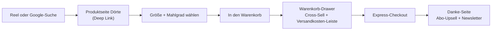
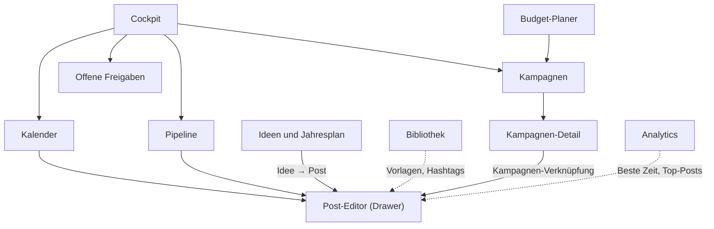

# Röstbrüder UX- und UI-Konzept

> **Design-System, Website-Relaunch und Admin-Dashboard „Röstbrüder Studio“ – aus einem Guss.**
> Warm wie eine Rösterei, klar wie eine gute Espresso-Rezeptur.

| | |
|---|---|
| **Stand** | 24.09.2026 · Version 1.0 |
| **Gilt für** | roestbrueder.com (Relaunch 2027) und Röstbrüder Studio (`/studio`) |
| **Begleitdokumente** | [`MASTERPLAN.md`](./MASTERPLAN.md) · [`SOCIAL-MEDIA-WERBUNG-PLAYBOOK.md`](./SOCIAL-MEDIA-WERBUNG-PLAYBOOK.md) |
| **Legende** | **[Vorschlag]** Empfehlung · **[Annahme]** zu prüfen · **[Richtwert]** Branchen-Orientierung · `[Platzhalter]` echten Wert eintragen |

Alle Zahlen in Wireframes (Preise, Bewertungen, KPIs) sind **Demo-Werte**. Mit `*` markierte Geschmacksnoten, Rabatte und Konditionen sind Platzhalter, die ihr festlegt.

---

## Inhaltsverzeichnis

1. [Design-Prinzipien](#1-design-prinzipien)
2. [Design-System](#2-design-system)
3. [Komponenten-Inventar](#3-komponenten-inventar)
4. [Website roestbrueder.com](#4-website-roestbruedercom)
5. [Admin-Dashboard Röstbrüder Studio](#5-admin-dashboard-röstbrüder-studio)
6. [Barrierefreiheit: WCAG 2.2 AA](#6-barrierefreiheit-wcag-22-aa)
7. [Responsiveness](#7-responsiveness)
8. [Performance-Budgets](#8-performance-budgets)
9. [Usability-Testplan](#9-usability-testplan)

---

## 1. Design-Prinzipien

Sieben Prinzipien, an denen jede Design-Entscheidung gemessen wird. Wenn zwei Lösungen gleich gut sind, gewinnt die, die mehr Prinzipien erfüllt.

| # | Prinzip | Was es bedeutet | Website-Beispiel | Studio-Beispiel |
|---|---|---|---|---|
| 1 | **Handwerk sichtbar machen** | Echte Hände, echte Trommel, echte Röstkurven statt Stockfotos und Deko | Röstprofil-Kurve im Bohnen-Pass, „Heute wird geröstet“-Ticker | Medien-Upload direkt vom Handy in die Pipeline, Röstprotokoll als Post-Vorlage |
| 2 | **Wärme statt Kälte** | Warme Farben, weiche Schatten, runde Ecken, menschliche Sprache | Crema-Flächen, Fraunces-Headlines, Microcopy mit Brüder-Humor | Begrüßung im Cockpit, freundliche Leerzustände statt „No data“ |
| 3 | **Jede Bohne hat einen Namen** | Persönlich statt anonym: Namen, Gesichter, Geschichten in jedem Touchpoint | Kaffee-Namen groß auf Karten, Quiz-Ergebnis als „Match“ | Verantwortliche mit Avatar, Säulen mit Namen statt Codes |
| 4 | **Klar wie am Tresen** | Eine Frage, eine Antwort. Pro Screen ein Hauptziel, max. eine Primäraktion | Hero mit genau drei Wegen: Kaufen · Abo · Vorbeikommen | Eine Primäraktion je Ansicht („Planen“, „Freigeben“) |
| 5 | **Ehrlich und transparent** | Keine Dark Patterns, Preise und Bedingungen immer sichtbar | Abo kündigen in 2 Klicks, Versandkosten früh zeigen, Röstdatum | Formeln hinter jeder KPI per Tooltip, Budget-Pacing ohne Schönfärberei |
| 6 | **Schnell ist freundlich** | Performance und kurze Wege sind Gastfreundschaft | LCP < 2,5 s mobil, Express-Checkout | Post in < 2 Min., Tastaturkürzel, Command Palette |
| 7 | **Für alle gemacht** | Barrierefreiheit ist Standard, nicht Extra | Kontraste AA, Tastaturbedienung, Alt-Texte | Drag & Drop immer mit Tastatur-Alternative |

---

## 2. Design-System

### 2.1 Farb-Tokens (Light Mode)

Kontrastwerte nach WCAG-Formel berechnet und gerundet; im Build mit einem Kontrast-Tool gegenprüfen. AA verlangt 4,5:1 für normalen Text, 3:1 für großen Text (≥ 24 px bzw. ≥ 18,66 px fett) und UI-Komponenten.

| Token | Name | Hex | Einsatz | Kontrast auf Paper `#FAF6F1` | Regel |
|---|---|---|---|---|---|
| `--color-espresso` | Espresso | `#1C130E` | Text, Headlines, dunkle Flächen | ≈ 17,0:1 ✅ AAA | Standard-Textfarbe |
| `--color-roestbraun` | Röstbraun | `#5B3A29` | Sekundäre Headlines, Footer-Fläche, Icons | ≈ 9,4:1 ✅ AAA | Auch für Fließtext geeignet |
| `--color-text-muted` | Kaffeesatz **[Vorschlag, neu]** | `#6E5A4C` | Meta-Infos, Hilfetexte, Platzhalter | ≈ 6,0:1 ✅ AA | Statt Grau – bleibt warm |
| `--color-kupfer` | Kupfer (Primär-Akzent) | `#C4702F` | Akzentflächen, Icons, Fokus-Ring, Illustration, große Headlines | ≈ 3,4:1 ⚠️ | **Nicht für Fließtext.** Nur große Schrift und UI-Elemente |
| `--color-kupfer-700` | Kupfer dunkel **[Vorschlag, neu]** | `#A55A22` | Primär-Button-Fläche (mit Weiß: ≈ 5,1:1), Textlinks | ≈ 4,8:1 ✅ AA | Löst das Kontrastproblem von Kupfer |
| `--color-crema` | Crema | `#E9D8C4` | Karten, Hover, Tags, Trennlinien | Espresso auf Crema ≈ 13,1:1 ✅ | Kupfer auf Crema nur dekorativ (≈ 2,6:1) |
| `--color-paper` | Milchschaum/Paper | `#FAF6F1` | Seiten-Hintergrund | – | `body` immer explizit setzen |
| `--color-salbei` | Salbei (Erfolg) | `#5F7F5A` | Erfolgs-Icons, Badges „Veröffentlicht“, positive Deltas | ≈ 4,2:1 ⚠️ | Weiß auf Salbei ≈ 4,5:1 (knapp AA) |
| `--color-salbei-700` | Salbei dunkel **[Vorschlag, neu]** | `#4A6646` | Erfolgs-Text | ≈ 6,0:1 ✅ AA | Für Text statt Salbei |
| `--color-kirsche` | Kirsche (Fehler) | `#B3261E` | Fehler, Löschen, Budget-Überschreitung | ≈ 6,1:1 ✅ AA | Weiß auf Kirsche ≈ 6,5:1 ✅ |
| `--color-honig` | Honig (Warnung) | `#D69A2D` | Warn-Flächen, „Review“-Status | ≈ 2,3:1 ❌ | **Nur als Fläche** mit Espresso-Text (≈ 7,4:1) |

**Farbanteile auf der Website [Vorschlag]:** 60 % Paper/Crema · 25 % Espresso/Röstbraun · 10 % Fotos · 5 % Kupfer. Kupfer ist das Salz in der Suppe – nie großflächig.

### 2.2 Dark Mode

| Token | Hex | Einsatz | Kontrast |
|---|---|---|---|
| `--bg` | `#15100C` | Seiten-Hintergrund | – |
| `--surface-1` | `#1F1712` | Karten, Sidebar | – |
| `--surface-2` | `#2A1F18` | Drawer, Popover, Hover | – |
| `--text` | `#F3EAE0` | Standardtext | ≈ 15,9:1 auf `--bg` ✅ |
| `--text-muted` **[Vorschlag]** | `#C9B8A6` | Meta-Text | ≈ 9,8:1 auf `--bg` ✅ |
| `--accent` | `#C4702F` | Kupfer: Buttons (mit Espresso-Text ≈ 5,0:1), Links auf `--bg` (≈ 5,1:1) | Auf `--surface-2` nur ≈ 4,4:1 ⚠️ |
| `--accent-strong` **[Vorschlag]** | `#D98A4B` | Links/Text-Akzent auf `--surface-2` | ≈ 5,9:1 ✅ |

**Regeln:** Tiefe entsteht durch hellere Flächen (`--surface-1` → `--surface-2`), nicht durch Schatten. Fotos im Dark Mode um ca. 5 % abdunkeln. Umschaltung: System-Einstellung (`prefers-color-scheme`) als Standard, manuell übersteuerbar über `data-theme` am `<html>`.

### 2.3 Plattform- und Säulenfarben (Studio)

| Kanal | Farbe | Kürzel im Kalender |
|---|---|---|
| Instagram | `#E1306C` | IG |
| TikTok | `#111111` + Akzent `#25F4EE` | TT |
| Facebook | `#1877F2` | FB |
| LinkedIn | `#0A66C2` | LI |
| Google Unternehmensprofil | `#34A853` | GB |
| Pinterest | `#E60023` | PI |
| YouTube | `#FF0000` | YT |
| Newsletter | Kupfer `#C4702F` | NL |

**Chip-Regel:** Plattformfarben erreichen mit weißer Schrift teils nur ≈ 4,2–4,3:1 (z. B. Instagram, Facebook). Deshalb: **Chip = 12 % Farbtönung als Fläche + 3-px-Farbbalken links + Espresso-Text + Kürzel.** Nie kleinen Text auf Vollfarbe.

| Säule | Schlüssel | Farbe [Vorschlag, falls im Code nicht anders definiert] |
|---|---|---|
| Bohne & Herkunft | `bohne` | Röstbraun `#5B3A29` |
| Röst-Handwerk | `roesten` | Kupfer `#C4702F` |
| Café-Leben Weimar | `cafe` | Salbei `#5F7F5A` |
| Brüh-Wissen | `bruehen` | Wasserblau `#3E6E8E` |
| Die Brüder & Team | `brueder` | Honig `#D69A2D` |
| Events & Workshops | `events` | Pflaume `#7A4E7E` |
| Shop & Abo | `shop` | Espresso `#1C130E` |

In Diagrammen Säulen zusätzlich über Beschriftung/Muster unterscheidbar machen (nie nur Farbe).

### 2.4 Typografie

| Familie | Rolle | Details |
|---|---|---|
| **Fraunces** (Serif, variabel) | Display, Headlines, Kaffee-Namen, Zitate | Achsen `opsz`, `wght`, `SOFT`, `WONK` nutzen: `SOFT` 50–100 für warme, handwerkliche Anmutung; nie unter 20 px |
| **Inter** (Sans, variabel) | UI, Fließtext, Tabellen, Zahlen | `font-feature-settings: "tnum"` für KPIs und Preise (Ziffern gleich breit) |

Beide Schriften **selbst hosten** (WOFF2, Subset Latin + Latin-Ext), keine Einbindung von Google-Servern.

| Token | px | rem | Zeilenhöhe | Gewicht | Schrift | Einsatz |
|---|---|---|---|---|---|---|
| `text-xs` | 12 | 0,75 | 16 | 500 | Inter | Chips, Labels, Meta |
| `text-sm` | 14 | 0,875 | 20 | 400/500 | Inter | Studio-Standard, Tabellen, Formulare |
| `text-base` | 16 | 1 | 24 | 400 | Inter | Fließtext Website, Inputs (verhindert iOS-Zoom) |
| `text-lg` | 18 | 1,125 | 28 | 400 | Inter | Lead-Text, Produktbeschreibung |
| `text-xl` | 20 | 1,25 | 28 | 600 | Fraunces | Kartentitel, Kaffee-Namen in Karten |
| `text-2xl` | 24 | 1,5 | 32 | 600 | Fraunces | H4, Studio-Seitentitel |
| `text-3xl` | 30 | 1,875 | 36 | 600 | Fraunces | H3, KPI-Werte (Inter, `tnum`) |
| `text-4xl` | 36 | 2,25 | 40 | 600 | Fraunces | H2, Hero mobil |
| `text-5xl` | 48 | 3 | 52 | 650 | Fraunces | H1, Hero Desktop |

**Regeln:** Zeilenlänge 60–75 Zeichen · `lang="de"` + `hyphens: auto` für saubere deutsche Silbentrennung · max. 2 Schriftgewichte pro Ansicht · Zahlen und Preise immer Inter.

### 2.5 Abstände, Radien, Elevation

**Spacing (4-px-Raster):**

| Token | px | Typischer Einsatz |
|---|---|---|
| `space-1` | 4 | Icon zu Label, Chip-Innenabstand vertikal |
| `space-2` | 8 | Abstand in Button-Gruppen, Chip-Innenabstand horizontal |
| `space-3` | 12 | Formularfeld zu Hilfetext, Tabellenzellen |
| `space-4` | 16 | Standard-Innenabstand Karten (Studio), Seitenrand mobil |
| `space-6` | 24 | Innenabstand Karten (Website), Abstand zwischen Karten |
| `space-8` | 32 | Abschnittsabstand Studio |
| `space-12` | 48 | Abschnittsabstand Website mobil |
| `space-16` | 64 | Abschnittsabstand Website Desktop |
| `space-24` | 96 | Hero-Innenabstand Desktop |

**Radien:** `radius-sm` 8 px (Inputs, Chips) · `radius-md` 12 px (Buttons, Studio-Karten) · `radius-lg` 16 px (Website-Karten, Drawer-Ecken) · `radius-xl` 24 px (Hero-Medien, Modals, Produktbilder) · `radius-full` (Avatare, Pills).

**Elevation (warme Schatten, Espresso statt Schwarz):**

| Token | Wert | Einsatz |
|---|---|---|
| `shadow-1` | `0 1px 2px rgb(28 19 14 / .06), 0 1px 1px rgb(28 19 14 / .04)` | Karten im Ruhezustand |
| `shadow-2` | `0 4px 12px rgb(28 19 14 / .08)` | Hover, Dropdowns |
| `shadow-3` | `0 12px 32px rgb(28 19 14 / .12)` | Gezogene Kalender-/Kanban-Karten, Popover |
| `shadow-4` | `0 24px 64px rgb(28 19 14 / .18)` | Drawer, Modals, Command Palette |

### 2.6 Ikonografie

- **Bibliothek:** Lucide, Strichstärke 1,75, Größen 16 (inline), 20 (Buttons, Navigation), 24 (Leerzustände, Feature-Icons).
- **Immer mit Label** oder `aria-label`; reine Icon-Buttons nur mit Tooltip.
- **Navigation Studio [Vorschlag]:** Cockpit `LayoutDashboard` · Kalender `CalendarDays` · Pipeline `SquareKanban` · Kampagnen `Megaphone` · Budget `Wallet` · Ideen `Lightbulb` · Analytics `ChartLine` (in älteren Versionen `LineChart`) · Bibliothek `Library` · Einstellungen `Settings`.
- **Marken-Icons:** `Coffee`, `Bean`, `Flame` (Röstung), `MapPin` (Standorte), `Store` (Online-Shop).
- **Plattform-Logos** als eigene SVGs (z. B. aus Simple Icons), Markenrichtlinien der Plattformen beachten; Lucide-Brand-Icons nicht verwenden.

### 2.7 Bildsprache

| Motiv | Umsetzung | Warum |
|---|---|---|
| **Hände** | Hände am Röster, beim Abwiegen, beim Latte-Art-Gießen, beim Verschließen der Tüte | Handwerk sichtbar machen |
| **Dampf und Bewegung** | Gegenlicht auf Dampf, Bohnen im Kühlsieb, fallender Kaffee | Sinnlichkeit, Frische |
| **Der Röster** | Trommel, Sichtfenster, Probenzieher, Röstkurve auf dem Laptop | Glaubwürdigkeit |
| **Die Brüder** | Nicht gestellt: im Gespräch, beim Cupping, lachend hinterm Tresen | Nähe |
| **Weimar** | Herderplatz, Altstadt-Dächer, Terrasse im Sommer, Kopfsteinpflaster, Jahreszeiten | Verortung, Tourismus |
| **Produkt** | Tüte mit Namen auf Crema-Papier oder Holz, immer gleicher Winkel (45°) und Licht | Wiedererkennung im Shop |

**Look:** warmes, natürliches Licht (Fensterlicht, goldene Stunde), leicht entsättigt, warme Weißbalance, echte Texturen (Holz, Jute, Keramik). **Nicht:** kalte Blautöne, grelle Blitzfotos, Stockfotos, Kaffeebohnen-Herzchen, generische Latte-Art-Bilder aus dem Netz.
**Formate:** 4:5 (Feed), 9:16 (Reels/Stories), 3:2 oder 16:9 (Website-Hero), 1:1 (Produkt-Kacheln), 2:3 (Pinterest).
**Rechtliches:** Gäste nur mit Einwilligung zeigen (Aushang + mündliches OK, bei Kampagnen schriftlich); Alt-Text für jedes Bild.

### 2.8 Motion

| Kategorie | Dauer | Easing | Beispiel |
|---|---|---|---|
| Mikro (Hover, Press) | 150 ms | `ease-out` | Button-Farbe, Karten-Anheben |
| Einblenden (Dropdown, Toast) | 200 ms | `cubic-bezier(0.2, 0.8, 0.2, 1)` | Toast gleitet 8 px nach oben |
| Flächen (Drawer, Modal) | 250 ms | `cubic-bezier(0.2, 0.8, 0.2, 1)` | Post-Editor fährt von rechts ein |
| Ausblenden | 150 ms | `ease-in` | Exits sind immer schneller als Entries |

**Signature-Momente [Vorschlag]:** „In den Warenkorb“ – die Tüte hüpft einmal (≤ 250 ms) · „Post geplant“ – Kupfer-Häkchen zeichnet sich · Karte ziehen im Kalender – `shadow-3` + 1,5° Neigung.
**`prefers-reduced-motion`:** keine Bewegungen/Parallaxe, nur Opacity-Fades ≤ 100 ms; Hero-Video wird zum Standbild; Autoplay aus.

### 2.9 Tokens als CSS (Referenz für Website und Studio)

```css
:root {
  /* Farben – Light */
  --color-espresso: #1C130E;
  --color-roestbraun: #5B3A29;
  --color-text-muted: #6E5A4C;
  --color-kupfer: #C4702F;
  --color-kupfer-700: #A55A22;
  --color-crema: #E9D8C4;
  --color-paper: #FAF6F1;
  --color-salbei: #5F7F5A;
  --color-salbei-700: #4A6646;
  --color-kirsche: #B3261E;
  --color-honig: #D69A2D;

  --bg: var(--color-paper);
  --surface-1: #FFFFFF;
  --surface-2: var(--color-crema);
  --text: var(--color-espresso);
  --accent: var(--color-kupfer);
  --accent-strong: var(--color-kupfer-700);
  --focus-ring: 0 0 0 3px rgb(196 112 47 / .45);

  /* Typografie */
  --font-display: "Fraunces", Georgia, serif;
  --font-ui: "Inter", system-ui, sans-serif;

  /* Radien & Motion */
  --radius-sm: 8px; --radius-md: 12px; --radius-lg: 16px; --radius-xl: 24px;
  --ease-out: cubic-bezier(0.2, 0.8, 0.2, 1);
  --dur-fast: 150ms; --dur-base: 200ms; --dur-slow: 250ms;
}

:root[data-theme="dark"] {
  --bg: #15100C; --surface-1: #1F1712; --surface-2: #2A1F18;
  --text: #F3EAE0; --color-text-muted: #C9B8A6;
  --accent: #C4702F; --accent-strong: #D98A4B;
}

@media (prefers-color-scheme: dark) {
  :root:not([data-theme="light"]) {
    --bg: #15100C; --surface-1: #1F1712; --surface-2: #2A1F18;
    --text: #F3EAE0; --color-text-muted: #C9B8A6;
    --accent: #C4702F; --accent-strong: #D98A4B;
  }
}

@media (prefers-reduced-motion: reduce) {
  *, *::before, *::after { animation-duration: 1ms !important; transition-duration: 1ms !important; }
}
```

---

## 3. Komponenten-Inventar

Alle Komponenten haben die Basis-Zustände **Default · Hover · Active/Pressed · Focus-visible (Kupfer-Ring 3 px) · Disabled**; Abweichungen und Zusatzzustände stehen in der Tabelle.

| Komponente | Varianten | Zusätzliche Zustände | Specs und Regeln | Web | Studio |
|---|---|---|---|---|---|
| **Button** | Primary (Kupfer-700, Weiß), Secondary (Outline Röstbraun), Ghost, Danger (Kirsche), Icon-Button | Loading (Spinner + Label bleibt), Success (kurzes Häkchen) | Höhen 32/40/48 px, mobil min. 44 × 44 px Touch-Fläche; max. 1 Primary pro Ansicht | ✅ | ✅ |
| **Input / Textarea** | Text, E-Mail, Zahl, Suche, Textarea mit Zähler | Error (Kirsche-Rand + Text + Icon), Success, Read-only | Label immer sichtbar über dem Feld, Hilfetext darunter, 16 px Schrift (kein iOS-Zoom) | ✅ | ✅ |
| **Select / Combobox** | Einfach, Mehrfach (Kanäle), mit Suche | Open, Empty-Result | Tastatur: Pfeile, Enter, Esc, Tippen zum Springen | ✅ | ✅ |
| **Checkbox / Radio / Switch** | – | Indeterminate (Checkbox) | Klickfläche inkl. Label; Switch nur für sofort wirksame Einstellungen | ✅ | ✅ |
| **Segmented Control** | 2–4 Optionen (Monat/Woche, Einmalkauf/Abo) | – | Aktive Option mit Fläche + Gewicht, nicht nur Farbe | ✅ | ✅ |
| **Chip (Plattform)** | IG, TT, FB, LI, GB, PI, YT, NL | Ausgewählt (Filter), Entfernbar | 12 % Tönung + 3-px-Balken + Kürzel; siehe 2.3 | – | ✅ |
| **Badge (Status)** | Idee (neutral), Entwurf (Crema), Review (Honig), Freigegeben (Salbei), Geplant (Kupfer), Veröffentlicht (Espresso) | – | Farbe + Text + Icon; nie nur Farbpunkt | – | ✅ |
| **Tag (Säule)** | 7 Säulen | – | Säulenfarbe als Punkt + Name | – | ✅ |
| **Produktkarte** | Standard, „Neue Ernte“, „Bestseller“, Ausverkauft | Hover (Bild-Zoom 1,03), Ausverkauft (Benachrichtigen-CTA) | Kaffee-Name in Fraunces 20 px, Herkunft, Geschmacksnoten, Preis ab, Schnellkauf | ✅ | – |
| **Karte (generisch)** | Info, Aktion, Statistik | Ausgewählt, Drag-Over | Studio `radius-md` + `space-4`; Website `radius-lg` + `space-6` | ✅ | ✅ |
| **KPI-Tile** | Mit/ohne Sparkline, mit Zielwert | Loading (Skeleton), Keine Daten, Fehler | Label, Wert (Inter `tnum` 30 px), Delta mit Pfeil **und** Text („+18 % ggü. Vormonat“), Tooltip mit Formel | – | ✅ |
| **Kalender-Zelle** | Tag (Monat), Zeitslot (Woche) | Heute (Kupfer-Rand), Vergangen (gedimmt), Wochenende, Drop-Target (gestrichelter Kupfer-Rand), Anlass (Banner oben) | Max. 3 Chips + „+2 mehr“; Klick auf leere Fläche = neuer Post an diesem Tag | – | ✅ |
| **Kanban-Karte** | Post, Idee | Dragging (`shadow-3`), Überfällig (Kirsche-Balken), Blockiert, Kommentar neu | Titel, Kanal-Icons, Säulen-Tag, Avatar, Datum, Checklisten-Fortschritt „3/5“, Kommentarzahl | – | ✅ |
| **Drawer** | Rechts 720 px (Desktop), Vollbild (mobil) | Ungespeicherte Änderungen (Rückfrage beim Schließen) | Fokusfalle, Esc schließt, Fokus kehrt zum Auslöser zurück | Warenkorb | Post-Editor |
| **Modal / Dialog** | Bestätigung, Formular | Destruktiv (Kirsche-Button rechts, Abbrechen links) | Nur für Entscheidungen, nicht für Inhalte | ✅ | ✅ |
| **Command Palette** | Global (⌘K / Strg+K) | Leer, Ergebnisse, Keine Treffer, Zuletzt verwendet | Suche über Posts, Kampagnen, Ideen, Seiten und Aktionen („Neuer Post“, „Dark Mode“) | – | ✅ |
| **Toast** | Erfolg, Info, Warnung, Fehler | Mit Aktion („Rückgängig“), Dauerhaft (Fehler) | 4–6 s, max. 3 gestapelt, `aria-live` polite (Fehler: assertive) | ✅ | ✅ |
| **Empty State** | Erstnutzung, Keine Treffer, Alles erledigt | – | Linienillustration (Tasse, Bohne), Headline, ein Satz, eine Aktion | ✅ | ✅ |
| **Skeleton** | Zeile, Karte, Chart | – | Crema-Fläche mit sanftem Shimmer (bei reduced motion statisch) | ✅ | ✅ |
| **Progress / Pacing-Bar** | Budget, Versandkosten, Workshop-Plätze | < 70 % Honig · 70–110 % Salbei · > 110 % Kirsche (Pacing) | Immer mit Zahl daneben | ✅ | ✅ |
| **Öffnungs-Badge** | Geöffnet, Schließt bald, Geschlossen, Sonderöffnung | – | „Jetzt geöffnet · bis 18:00“ mit Punkt + Text | ✅ | – |
| **Abo-Umschalter** | Einmalkauf / Abo | Abo-Vorteil hervorgehoben | Preisdifferenz in Euro und Prozent | ✅ | – |
| **Charts** | Linie (Wachstum), Balken (Säulen), Heatmap (Posting-Zeit), Funnel | Hover-Tooltip, Leer | Achsen beschriftet, Werte per Tabelle alternativ abrufbar | – | ✅ |

---

## 4. Website roestbrueder.com

### 4.1 Informationsarchitektur und Navigation

Die vollständige Sitemap steht im [Masterplan, Kapitel 6.2](./MASTERPLAN.md#62-informationsarchitektur-sitemap-vorschlag). Navigationsprinzipien:

| Element | Desktop (≥ 1024 px) | Mobil (< 768 px) |
|---|---|---|
| Hauptnavigation | 6 Punkte: Shop · Abo · Workshops · Cafés · Wissen · Über uns | Burger-Menü, Reihenfolge identisch, Cafés mit Live-Status |
| Utility | Suche, Konto, Warenkorb (Zähler) | Warenkorb-Icon immer sichtbar im Header |
| Mega-Menü „Shop“ | Espresso · Filter · Geschenke · Zubehör + Teaser „Geschmacksfinder“ | Akkordeon |
| Sticky-Elemente | Header schrumpft beim Scrollen | Produktseite: Sticky-Leiste „In den Warenkorb“ unten |
| Footer | Herkunft, Gastro & Büro, FAQ, Versand, Presse, Jobs, Rechtliches, **Verträge hier kündigen** | identisch, gestapelt |

### 4.2 Zentrale User Journeys

#### J1 · Bohnen kaufen (Persona Markus) – Ziel: ≤ 4 Klicks bis zur Kasse



Design-Entscheidungen: Mahlgrad-Auswahl mit Voreinstellung „Ganze Bohne (empfohlen)“ · Warenkorb als Drawer statt Seitenwechsel · Express-Checkout-Buttons bereits im Drawer · Danke-Seite fragt: „Diesen Kaffee alle 4 Wochen automatisch?“ (1 Klick, Abo-Konvertierung der Bestellung).

#### J2 · Abo abschließen (Persona Markus/Sophie) – Ziel: Abschluss in < 90 Sekunden

`Startseite/Produktseite` → **Abo-Konfigurator** (4 Schritte, Preis immer sichtbar) → Übersicht mit „Jederzeit pausieren, überspringen, kündigen“ → Checkout (Konto wird automatisch angelegt, Passwort per Magic Link) → Bestätigung mit **Abo-Cockpit-Link** („Mein Abo“: Liefertermin verschieben, Kaffee tauschen, pausieren).

#### J3 · Workshop buchen (Persona Sophie als Geschenk / Lena für sich)

`Instagram-Story „Noch 2 Plätze“` → Workshop-Kalender (Filter nach Typ) → Termin wählen → Plätze + Gutscheincode → Checkout → Bestätigung mit Kalender-Datei (.ics) und Anfahrt → Erinnerung 48 h vorher → nach dem Workshop: Mail mit Rezeptkarte + Abo-Angebot für Teilnehmende.
Ausgebucht: Warteliste mit automatischer Benachrichtigung, Alternativtermine direkt darunter.

#### J4 · Café finden (Persona Claudia & Thomas) – Ziel: Route in 2 Taps

`Google Maps / Website` → **Cafés** → Karte mit beiden Standorten und Live-Status → Standortseite (Öffnungsstatus, Terrasse, Fotos, Barrierefreiheit) → „Route starten“ (öffnet Karten-App). Auf dem Handy stehen Status und Route **über** dem Falz.

### 4.3 Wireframes

#### Startseite – mobil (360–430 px)

```text
┌────────────────────────────────────┐
│ [≡]  RÖSTBRÜDER      [Suche] [2]   │
├────────────────────────────────────┤
│ ░░░░░░░░░░░░░░░░░░░░░░░░░░░░░░░░░░ │
│ ░ Foto/Video: Vincent am Röster, ░ │
│ ░ Dampf, warmes Seitenlicht      ░ │
│ ░░░░░░░░░░░░░░░░░░░░░░░░░░░░░░░░░░ │
│ Jede Bohne hat einen Namen.        │
│ Specialty Coffee, von Hand         │
│ geröstet in Weimar.                │
│ [ Kaffee finden             → ]    │
│ [ Abo entdecken               ]    │
├────────────────────────────────────┤
│ (o) Espressobar · offen bis 18:00  │
│ ( ) Rösterei · öffnet Mi 12:00     │
│ Heute wird geröstet: 13–16 Uhr     │
├────────────────────────────────────┤
│ AKTUELL IN DER TROMMEL        >    │
│ ┌─────────────┐  ┌─────────────┐   │
│ │ [Tüte]      │  │ [Tüte]      │   │
│ │ Dörte       │  │ Bergböe     │   │
│ │ Brasilien   │  │ Espresso    │   │
│ │ ab X,XX €   │  │ ab X,XX €   │   │
│ │ [+ Korb]    │  │ [+ Korb]    │   │
│ └─────────────┘  └─────────────┘   │
├────────────────────────────────────┤
│ Welcher Bruder-Kaffee passt zu     │
│ dir? 5 Fragen, 1 Minute.           │
│ [ Quiz starten              → ]    │
├────────────────────────────────────┤
│ KAFFEE-ABO                         │
│ Frisch aus der Trommel, alle       │
│ 2, 4 oder 6 Wochen. Pausierbar.    │
│ [ Abo konfigurieren           ]    │
├────────────────────────────────────┤
│ WORKSHOPS                          │
│ Sa 17.10. · Espresso-Basics        │
│ ████░░ noch 2 Plätze   [Buchen]    │
├────────────────────────────────────┤
│ Google 4,x · European Coffee Trip  │
│ · Röster-Guide · seit 2020         │
├────────────────────────────────────┤
│ Neue Ernten zuerst erfahren:       │
│ [ E-Mail-Adresse      ] [ OK ]     │
├────────────────────────────────────┤
│ [Shop]  [Abo]  [Cafés]  [Korb 2]   │
└────────────────────────────────────┘
```

#### Startseite – Desktop (≥ 1280 px)

```text
┌──────────────────────────────────────────────────────────────────────────────────────────────────┐
│ RÖSTBRÜDER     Shop   Abo   Workshops   Cafés   Wissen   Über uns      [Suche] [Konto] [Korb 2]  │
├──────────────────────────────────────────────────────────────────────────────────────────────────┤
│ Jede Bohne hat einen Namen.                  ┌──────────────────────────────────────────────┐    │
│                                              │ Hero-Video, stumm, 8 s Loop: Bohnen fallen   │    │
│ Specialty Coffee, von Hand geröstet in       │ aus der Trommel, Hände, Dampf. Poster-Bild   │    │
│ Weimar. Von Collin und Vincent.              │ als Fallback; statisch bei reduced motion.   │    │
│                                              │                                              │    │
│ [ Kaffee finden → ]   [ Abo entdecken ]      └──────────────────────────────────────────────┘    │
│                                                                                                  │
│ (o) Espressobar geöffnet bis 18:00   ( ) Rösterei öffnet Mi 12:00   Heute geröstet: 13–16 Uhr    │
├──────────────────────────────────────────────────────────────────────────────────────────────────┤
│ AKTUELL IN DER TROMMEL                                                           Alle Kaffees >  │
│ ┌────────────────────┐  ┌────────────────────┐  ┌────────────────────┐  ┌────────────────────┐   │
│ │ [Tüten-Foto]       │  │ [Tüten-Foto]       │  │ [Tüten-Foto]       │  │ [Tüten-Foto]       │   │
│ │ Hausbrüh           │  │ Dörte              │  │ Bergböe            │  │ Jörg               │   │
│ │ Espresso · 80/20   │  │ Brasilien Santos   │  │ Espresso           │  │ Filter             │   │
│ │ Schoko · Nuss*     │  │ Nuss · Kakao*      │  │ [Notes]*           │  │ [Notes]*           │   │
│ │ ab X,XX €  [+]     │  │ ab X,XX €  [+]     │  │ ab X,XX €  [+]     │  │ ab X,XX €  [+]     │   │
│ └────────────────────┘  └────────────────────┘  └────────────────────┘  └────────────────────┘   │
├──────────────────────────────────────────────────────────────────────────────────────────────────┤
│ ┌────────────────────────────────────────────┐  ┌────────────────────────────────────────────┐   │
│ │ Welcher Bruder-Kaffee passt zu dir?        │  │ KAFFEE-ABO · frisch aus der Trommel        │   │
│ │ 5 Fragen · 1 Minute · dein Match mit       │  │ Alle 2/4/6 Wochen · pausierbar             │   │
│ │ Rezept.                                    │  │ in 2 Klicks · auch zum Verschenken         │   │
│ │ [ Quiz starten → ]                         │  │ [ Abo konfigurieren ]                      │   │
│ └────────────────────────────────────────────┘  └────────────────────────────────────────────┘   │
├──────────────────────────────────────────────────────────────────────────────────────────────────┤
│ ┌────────────────────────────┐  ┌────────────────────────────┐  ┌────────────────────────────┐   │
│ │ RÖSTEREI & CAFÉ            │  │ ESPRESSOBAR                │  │ WORKSHOPS                  │   │
│ │ Richard-Wagner-Str. 17     │  │ Kaufstr. 19 / Herderplatz  │  │ Sa 17.10. Espresso-Basics  │   │
│ │ Mi–So 12–18 Uhr (prüfen)   │  │ Di–So 9–18 Uhr (prüfen)    │  │ Do 22.10. Filterkaffee     │   │
│ │ „Kaffee trinken, während   │  │ Aussicht + Sommerterrasse  │  │ Sa 31.10. Latte Art        │   │
│ │ der Röster läuft.“         │  │ Terrasse: geöffnet         │  │ noch 2 / 4 / 5 Plätze      │   │
│ │ [Route] [Mehr]             │  │ [Route] [Mehr]             │  │ [Alle Termine]             │   │
│ └────────────────────────────┘  └────────────────────────────┘  └────────────────────────────┘   │
├──────────────────────────────────────────────────────────────────────────────────────────────────┤
│ DIE BRÜDER   [Foto Collin + Vincent an der Trommel]   „Seit März 2020 rösten wir in Weimar …“    │
│ Google-Bewertungen 4,x · European Coffee Trip · Röster-Guide · deutscheroestereien.de            │
├──────────────────────────────────────────────────────────────────────────────────────────────────┤
│ Newsletter: Neue Ernten zuerst + Rezeptkarte gratis   [ E-Mail-Adresse          ] [Eintragen]    │
│ Footer: Herkunft · Gastro & Büro · FAQ · Versand · Impressum · Datenschutz · AGB · Widerruf      │
└──────────────────────────────────────────────────────────────────────────────────────────────────┘
```

`*` Geschmacksnoten sind Platzhalter – mit echten Cupping-Notes ersetzen.

#### Produktseite (Desktop; mobil einspaltig mit Sticky-Kaufleiste)

```text
┌──────────────────────────────────────────────────────────────────────────────────────────────────┐
│ Shop > Espresso & Filter > Dörte                                                                 │
├──────────────────────────────────────────────────────────────────────────────────────────────────┤
│ ┌──────────────────────────────────┐    Dörte                                  4,8 * (23)        │
│ │                                  │    Brasilien · Santos · Espresso & Filter                   │
│ │                                  │    „Nussig, schokoladig, unkompliziert.“*                   │
│ │    [Tüten-Foto + Bohnen,         │    Geröstet am 21.10.2026 · Versand in 1–2 Tagen            │
│ │     warmes Licht, Holz]          │                                                             │
│ │                                  │    ( ) Einmalkauf                     X,XX €                │
│ │                                  │    (o) Abo, 10 % günstiger*           X,XX €                │
│ │                                  │        Lieferung alle [ 4 Wochen v ]                        │
│ └──────────────────────────────────┘    Größe:     [250 g]  [500 g]  [1 kg]                      │
│   [o] [o] [o] [o] Galerie               Mahlgrad:  [ Ganze Bohne v ]  Mahlgrad-Guide ?           │
│   Tüte · Bohnen · Tasse · Röster        [ -  1  + ]   [      In den Warenkorb      ]             │
│                                         Noch 8,50 € bis versandkostenfrei  [██████░░░]           │
│                                         Pausieren & kündigen in 2 Klicks · Sichere Zahlung       │
├──────────────────────────────────────────────────────────────────────────────────────────────────┤
│ [ Bohnen-Pass ]  [ Namensgeber ]  [ Rezepte ]  [ Bewertungen (23) ]                              │
│                                                                                                  │
│ ┌────────────────────────────────────────────┐  ┌────────────────────────────────────────────┐   │
│ │ BOHNEN-PASS                                │  │ WER IST DÖRTE?                             │   │
│ │ Land/Region: Brasilien · [Region]          │  │ [Foto/Illustration]                        │   │
│ │ Farm/Koop.: [eintragen]                    │  │ „[Namensgeber-Story, 2–3 Sätze,            │   │
│ │ Varietät: [eintragen]                      │  │ von Vincent erzählt]“                      │   │
│ │ Aufbereitung: [eintragen]                  │  │                                            │   │
│ │ Importweg: [Partner/Direkt]                │  │ REZEPT V60: 15 g · 250 ml · 93 °C*         │   │
│ │ Röstprofil: [Kurve ansehen]                │  │ 2:45 min · Mahlgrad mittel-fein            │   │
│ └────────────────────────────────────────────┘  └────────────────────────────────────────────┘   │
├──────────────────────────────────────────────────────────────────────────────────────────────────┤
│ PASST DAZU:  [V60 + Filter]  [Handmühle]  [Probierset 3 × 250 g]  [Workshop Filterkaffee]        │
└──────────────────────────────────────────────────────────────────────────────────────────────────┘
```

#### Abo-Konfigurator (Schritt 1 von 4)

```text
┌──────────────────────────────────────────────────────────────────────────────────────────────────┐
│ Kaffee-Abo › Konfigurator                                                                        │
│ (1) Zubereitung ── (2) Kaffee ── (3) Menge & Rhythmus ── (4) Mahlgrad ── Übersicht               │
├──────────────────────────────────────────────────────────────────────────────────────────────────┤
│ Schritt 1 von 4: Wie brühst du?                               ┌──────────────────────────────┐   │
│                                                               │ DEIN ABO                     │   │
│ ┌────────────────┐  ┌────────────────┐  ┌────────────────┐    │                              │   │
│ │ Espresso       │  │ Filter         │  │ Beides         │    │ Zubereitung: Espresso        │   │
│ │ Siebträger,    │  │ V60, Chemex,   │  │ abwechselnd    │    │ Kaffee: Saisonkaffee         │   │
│ │ Vollautomat    │  │ French Press   │  │ Espr. + Filter │    │   („Überrasch mich“)         │   │
│ │                │  │                │  │                │    │ Menge: 500 g                 │   │
│ │      (o)       │  │      ( )       │  │      ( )       │    │ Rhythmus: alle 4 Wochen      │   │
│ └────────────────┘  └────────────────┘  └────────────────┘    │ Mahlgrad: ganze Bohne        │   │
│                                                               │                              │   │
│ Unsicher? [Geschmacksfinder starten]                          │ X,XX € / Lieferung           │   │
│                                                               │ statt X,XX € (−10 %*)        │   │
│ [x] Als Geschenk (3/6/12 Monate, Wunschstart,                 │ Versand: kostenlos*          │   │
│     Grußkarte) → Konfigurator wechselt in                     │                              │   │
│     den Geschenkmodus                                         │ [   Weiter zu Schritt 2   ]  │   │
│                                                               └──────────────────────────────┘   │
│ Jederzeit pausieren · überspringen · kündigen                                                    │
│ Erste Lieferung: innerhalb von 2 Werktagen*                                                      │
└──────────────────────────────────────────────────────────────────────────────────────────────────┘
```

Mobil: Zusammenfassung als einklappbare Leiste am unteren Rand („Dein Abo · X,XX € ▲“).

#### Workshop-Buchung

```text
┌──────────────────────────────────────────────────────────────────────────────────────────────────┐
│ Workshops › Termine                                                                              │
├──────────────────────────────────────────────────────────────────────────────────────────────────┤
│ ┌──────────────────────┐  TERMINE IM OKTOBER                        ┌──────────────────────────┐ │
│ │ <   Oktober 2026   > │                                            │ DEINE BUCHUNG            │ │
│ │                      │  ┌──────────────────────────────────────┐  │                          │ │
│ │ Mo Di Mi Do Fr Sa So │  │ Sa 17.10. · 10–13 Uhr · Rösterei     │  │ Espresso-Basics          │ │
│ │          01 02 03 04 │  │ Espresso-Basics · [Preis] €          │  │ Sa 17.10. · 10–13 Uhr    │ │
│ │ 05 06 07 08 09 10 11 │  │ ████░░ 2 von 6 frei        [Wählen]  │  │ Richard-Wagner-Str. 17   │ │
│ │ 12 13 14 15 16[17]18 │  └──────────────────────────────────────┘  │                          │ │
│ │ 19 20 21[22]23 24 25 │  ┌──────────────────────────────────────┐  │ Plätze: [ - 1 + ]        │ │
│ │ 26 27 28 29 30[31]   │  │ Do 22.10. · 18–20 Uhr · Rösterei     │  │ Gutscheincode: [       ] │ │
│ │                      │  │ Filterkaffee · [Preis] €             │  │                          │ │
│ │ [x] Espresso-Basics  │  │ ██░░░░ 4 von 6 frei        [Wählen]  │  │ Inklusive: 250 g Kaffee, │ │
│ │ [x] Filterkaffee     │  └──────────────────────────────────────┘  │ Skript, Getränke         │ │
│ │ [x] Latte Art        │  ┌──────────────────────────────────────┐  │                          │ │
│ │ [ ] Cupping          │  │ Sa 31.10. · 10–13 Uhr · Rösterei     │  │ Summe: [Preis] €         │ │
│ │ [ ] Firmen-Workshop  │  │ Latte Art · [Preis] €                │  │ [   Jetzt buchen   ]     │ │
│ └──────────────────────┘  │ ██████ ausgebucht      [Warteliste]  │  │ Storno bis 72 h vorher*  │ │
│                           └──────────────────────────────────────┘  └──────────────────────────┘ │
│                                                                                                  │
│                           Gruppe oder Firma? [Anfrage stellen]                                   │
└──────────────────────────────────────────────────────────────────────────────────────────────────┘
```

### 4.4 Conversion- und Trust-Elemente

| Element | Wo | Wirkung |
|---|---|---|
| **Röstdatum** „Geröstet am …“ | Produktkarte, Produktseite, Warenkorb | Frische-Beweis, Differenzierung zum Supermarkt |
| **Bohnen-Pass** | Produktseite, QR auf Tüte | Transparenz, Premium-Begründung |
| **Live-Öffnungsstatus** | Header (mobil), Startseite, Café-Seiten | Besuchs-Trigger |
| **Versandkosten-Fortschritt** | Warenkorb, Produktseite | Höherer Warenkorbwert |
| **Abo-Vorteil in € und %** | Produktseite, Abo-Seite | Abo-Quote |
| **„Pausieren & kündigen in 2 Klicks“** | Abo-Umschalter, Checkout | Senkt Abo-Hürde |
| **Kündigungsbutton „Verträge hier kündigen“** | Footer, Konto | Gesetzlich vorgeschrieben für Online-Abos (§ 312k BGB) – und vertrauensbildend |
| **Bewertungen mit Hinweis zur Echtheitsprüfung** | Produktseite | Social Proof, rechtssicher |
| **Guide-Badges** (European Coffee Trip, Röster-Guide) | Startseite, Über uns | Autorität |
| **Brüder-Foto + Signatur** | Startseite, Danke-Seite, Abo-Mails | Nähe |
| **Schmeckt-nicht-Garantie** [Vorschlag] | Produktseite, FAQ | Risiko-Umkehr |
| **Zahlungsarten-Logos** | Warenkorb, Footer | Sicherheit |

### 4.5 Microcopy

| Situation | Standard (vermeiden) | Röstbrüder-Stil |
|---|---|---|
| Artikel im Warenkorb | „Artikel wurde hinzugefügt.“ | „Dörte ist im Korb. Gute Wahl.“ |
| Leerer Warenkorb | „Ihr Warenkorb ist leer.“ | „Hier ist noch nichts drin. Wie wär's mit dem, was gerade frisch aus der Trommel kommt?“ |
| Ausverkauft | „Nicht verfügbar.“ | „Dörte macht gerade Pause – die nächste Ernte ist unterwegs. Sollen wir dir Bescheid sagen?“ |
| Mahlgrad-Hilfe | „Mahlgrad auswählen“ | „Keine Mühle? Kein Problem – wir mahlen passend für deine Zubereitung.“ |
| Abo pausieren | „Abonnement pausieren“ | „Urlaub? Pausier dein Abo – wir halten die Trommel warm.“ |
| Formularfehler | „Ungültige Eingabe.“ | „Die E-Mail-Adresse sieht unvollständig aus – fehlt ein @?“ |
| Newsletter-CTA | „Abonnieren“ | „Neue Ernten zuerst erfahren“ |
| Workshop ausgebucht | „Ausgebucht.“ | „Ausgebucht – wir setzen dich gern auf die Warteliste.“ |
| Bestellung abgeschlossen | „Vielen Dank für Ihre Bestellung.“ | „Danke! Wir rösten, packen und schicken. Die Bestätigung ist schon in deinem Postfach.“ |
| 404-Seite | „Seite nicht gefunden.“ | „Hier ist nur Kaffeesatz. Zurück zur Startseite oder direkt in den Shop?“ |
| Checkout-Button | – | **Bleibt rechtlich fix:** „Zahlungspflichtig bestellen“ (§ 312j BGB) |
| Cookie-Banner | Juristendeutsch | Klar und freundlich: „Wir nutzen Cookies für Statistik und Werbung – nur, wenn du zustimmst.“ + gleichwertige Buttons „Alle akzeptieren“ / „Nur notwendige“ |

---

## 5. Admin-Dashboard Röstbrüder Studio

### 5.1 Informationsarchitektur und Navigation

| Gruppe | Module (Route) |
|---|---|
| **Planen** | Cockpit (`/`) · Redaktionskalender (`/kalender`) · Content-Pipeline (`/pipeline`) · Ideen & Jahresplan (`/ideen`) |
| **Werben** | Kampagnen & Werbung (`/kampagnen`, `/kampagnen/:id`) · Budget-Planer (`/budget`) |
| **Auswerten** | Analytics (`/analytics`) |
| **Ressourcen** | Bibliothek (`/bibliothek`) |
| **System** | Einstellungen (`/einstellungen`) |

**Globale Elemente:** Sidebar (einklappbar auf Icon-Leiste) · Topbar mit Command Palette, „+ Neuer Post“, Freigabe-Glocke mit Zähler, Theme-Umschalter, Avatar · Post-Editor als Drawer, von überall per `N` erreichbar.
**Mobil (< 768 px):** Bottom-Tab-Bar mit Cockpit · Kalender · **+** · Pipeline · Mehr. Der Editor öffnet im Vollbild; Kalender startet in der Agenda-Ansicht (Liste statt Raster).



### 5.2 Wireframes

#### Cockpit (`/`)

```text
┌──────────────────────────────────────────────────────────────────────────────────────────────────┐
│ RÖSTBRÜDER STUDIO     [ Suchen … Cmd+K ]                       [N] Neuer Post   (CV)             │
├─────────────────┬────────────────────────────────────────────────────────────────────────────────┤
│ > Cockpit       │ Guten Morgen, Collin.   KW 41 · 05.–11.10.2026    [30 Tage v]                  │
│   Kalender      │ ┌────────────┐ ┌────────────┐ ┌────────────┐ ┌────────────┐ ┌────────────┐     │
│   Pipeline      │ │ Reichweite │ │ Engagement │ │ Follower   │ │ Ad-Spend   │ │ ROAS       │     │
│   Kampagnen     │ │ 12.480     │ │ 4,2 %      │ │ +312       │ │ 412/800 €  │ │ 3,4        │     │
│   Budget        │ │ +18 %      │ │ +0,6 Pp    │ │ +2,9 %     │ │ Pace 98 %  │ │ Ziel 3,0   │     │
│   Ideen         │ │ ▁▂▃▃▅▆▇    │ │ ▃▃▄▅▄▆▆    │ │ ▁▁▂▃▄▅▆    │ │ ▂▃▃▄▅▅▆    │ │ ▃▄▄▅▅▆▇    │     │
│   Analytics     │ └────────────┘ └────────────┘ └────────────┘ └────────────┘ └────────────┘     │
│   Bibliothek    │ ┌──────────────────────────────────────────────┐ ┌───────────────────────────┐ │
│   Einstellungen │ │ NÄCHSTE POSTS                   [Kalender >] │ │ OFFENE FREIGABEN  (3)     │ │
│                 │ │ Heute 18:00  IG Reel    Röstprotokoll #12    │ │ Reel: Dörte ist zurück    │ │
│ [+ Neuer Post]  │ │ Mi 07:30     IG Story   Weimar am Morgen     │ │   Team · seit 50 Std. [!] │ │
│ [+ Kampagne]    │ │ Do 12:00     TT Video   Brüderzwist: V60/AP  │ │ Karussell: V60-Guide      │ │
│                 │ │ Fr 09:00     GB Post    Zwiebelmarkt-Zeiten  │ │ Ad: Geschenk-Abo Q4       │ │
│                 │ │ Fr 17:00     NL         Neue Ernte: Jörg     │ │ [Alle prüfen >]           │ │
│                 │ └──────────────────────────────────────────────┘ └───────────────────────────┘ │
│                 │ ┌──────────────────────────────────────────────┐ ┌───────────────────────────┐ │
│                 │ │ AKTIVE KAMPAGNEN            Budget   Pacing  │ │ CONTENT-MIX  Ist / Soll   │ │
│                 │ │ Lokal Awareness Weimar Meta ███████░  98 %   │ │ bohne    ███░  18 / 20 %  │ │
│                 │ │ Workshops Oktober      Meta █████░░░ 121 % ! │ │ roesten  ███░  15 / 15 %  │ │
│                 │ │ Search Rösterei Weimar Ads  ████░░░░  95 %   │ │ cafe     ████  24 / 20 %  │ │
│                 │ │ [Alle Kampagnen >]                           │ │ bruehen  ██░░  10 / 15 %  │ │
│                 │ └──────────────────────────────────────────────┘ │ brueder  ██░░  10 / 10 %  │ │
│                 │                                                  │ events   ██░░  12 / 10 %  │ │
│                 │                                                  │ shop     ██░░  11 / 10 %  │ │
│                 │                                                  └───────────────────────────┘ │
│                 │ Nächster Anlass: Zwiebelmarkt (Termin prüfen) · 3 Posts geplant                │
└─────────────────┴────────────────────────────────────────────────────────────────────────────────┘
```

Hinweise: KPI-Tiles zeigen Delta immer mit Text, Tooltip mit Formel (siehe Masterplan 11.2). Pacing > 110 % wird Kirsche und erscheint zusätzlich als Warnung. Klick auf eine Säule im Content-Mix filtert den Kalender.

#### Redaktionskalender (`/kalender`, Monatsansicht)

```text
┌──────────────────────────────────────────────────────────────────────────────────────────┐
│ Redaktionskalender  < Okt 2026 >  [Monat|Woche]  Kanal v  Säule v  Status v  [+ Post]    │
├────────────┬────────────┬────────────┬────────────┬────────────┬────────────┬────────────┤
│ Mo         │ Di         │ Mi         │ Do         │ Fr         │ Sa         │ So         │
├────────────┼────────────┼────────────┼────────────┼────────────┼────────────┼────────────┤
│ 28.09.     │ 29.09.     │ 30.09.     │ 01.10.     │ 02.10.     │ 03.10.     │ 04.10.     │
│ IG Karuss. │ IG Story   │ IG Reel    │ *Kaffeetag │ NL #18     │ IG Story   │ FB Event   │
│            │            │ TT Video   │ IG Reel    │            │            │            │
│            │            │            │ GB Post ×2 │            │            │            │
├────────────┼────────────┼────────────┼────────────┼────────────┼────────────┼────────────┤
│ 05.10.     │ 06.10.     │ 07.10.     │ 08.10.     │ 09.10.     │ 10.10.     │ 11.10.     │
│ IG Foto    │ LI Beitrag │ IG Reel    │ PI 5 Pins  │ *Zwiebelm. │ *Zwiebelm. │ *Zwiebelm. │
│            │            │ TT Video   │            │ GB Post ×2 │ IG Story   │ IG Reel    │
│            │            │            │            │            │            │            │
├────────────┼────────────┼────────────┼────────────┼────────────┼────────────┼────────────┤
│ 12.10.     │ 13.10.     │ 14.10.     │ 15.10.     │ 16.10.     │ 17.10.     │ 18.10.     │
│ IG Karuss. │            │ IG Reel    │ YT Short   │ NL #19     │ IG Story   │ IG Reel    │
│            │            │ TT Video   │            │ GB Post ×2 │ *Workshop  │            │
│            │            │            │            │            │            │            │
├────────────┴────────────┴────────────┴────────────┴────────────┴────────────┴────────────┤
│ … KW 43–44 · Ansicht scrollt; Drag & Drop verschiebt Posts; Tastatur: Alt+Pfeil          │
│ Legende: IG Instagram · TT TikTok · FB Facebook · GB Google · PI Pinterest · LI LinkedIn │
│          YT YouTube · NL Newsletter · * Anlass (Key Date)                                │
└──────────────────────────────────────────────────────────────────────────────────────────┘
```

Hinweise: Chips tragen Plattformfarbe (12 % Fläche + Balken) und Status-Symbol. Anlässe (`*`) liegen als Banner über dem Tag und kommen aus `/ideen`. Hover über Chip zeigt Mini-Vorschau; Klick öffnet den Editor. **Tastatur-Alternative zu Drag & Drop:** Chip fokussieren → `Alt+Pfeil` verschiebt um einen Tag, `M` öffnet „Verschieben nach …“.

#### Post-Editor (Drawer mit Live-Vorschau)

```text
┌──────────────────────────────────────────────────────────────────────────────────────────────────┐
│ Hintergrund: Kalender (abgedunkelt) · Drawer 720 px von rechts · Esc schließt                    │
├──────────────────────────────────────────────────────────────────────────────────────────────────┤
│ NEUER POST                          [Esc] [x]            VORSCHAU                                │
│                                                          [ Instagram v ] [ Reel v ]              │
│ Kanäle   [x] Instagram  [x] Facebook  [ ] TikTok                                                 │
│          [ ] Google  [ ] Pinterest  [ ] Newsletter       ┌──────────────────────────┐            │
│ Format   (o) Reel  ( ) Feed  ( ) Story  ( ) Karussell    │ roestbrueder · Weimar    │            │
│ Säule    [ Röst-Handwerk v ]  Ort [ Rösterei v ]         │ ░░░░░░░░░░░░░░░░░░░░░░   │            │
│ Wer      [ Vincent v ]        Kampagne [ – v ]           │ ░                    ░   │            │
│ Wann     [ Mi 07.10.2026 ] [ 18:00 ]                     │ ░   9:16 Reel-Cover  ░   │            │
│          Beste Zeit: Mi 18–19 Uhr (aus Heatmap)          │ ░   „First Crack“    ░   │            │
│                                                          │ ░                    ░   │            │
│ Caption                           312 / 2.200            │ ░░░░░░░░░░░░░░░░░░░░░░   │            │
│ ┌──────────────────────────────────────────────┐         │ [Like] [Komm.] [Teilen]  │            │
│ │ Der First Crack klingt wie Popcorn – und     │         │ roestbrueder Der First   │            │
│ │ genau da entscheidet Vincent, wie Dörte      │         │ Crack klingt wie …mehr   │            │
│ │ schmeckt. Röstprotokoll #12 …                │         └──────────────────────────┘            │
│ └──────────────────────────────────────────────┘         IG 312/2.200 ok · FB ok                 │
│ Hashtags [ Pool: Röst-Handwerk v ]       4 / 5           Safe Zone: Text nicht ins               │
│ Medien   [reel_roestprotokoll_12.mp4] [+ Upload]         untere Drittel (UI-Overlay)             │
│ Check    [x] Untertitel  [x] Cover  [ ] Alt-Text                                                 │
│          [x] Musik lizenziert  [x] UTM-Link                                                      │
│                                                                                                  │
│ [Entwurf]   [Zur Freigabe]   [ Planen ]                                                          │
└──────────────────────────────────────────────────────────────────────────────────────────────────┘
```

Hinweise: Zeichenzähler je Kanal ([Richtwert] Instagram 2.200, TikTok 2.200, Facebook sehr lang, LinkedIn 3.000, Google-Post 1.500, Pinterest-Beschreibung 500) – der **strengste** gewählte Kanal bestimmt die Warnung. Hashtag-Zähler mit Limit je Kanal (Instagram erlaubt inzwischen nur noch wenige Hashtags pro Beitrag, aktuell max. 5 – Stand prüfen und in `/einstellungen` pflegen); Hashtag-Sets sind Pools, aus denen der Editor passende Tags vorschlägt. „Beste Zeit“ stammt aus der Heatmap in `/analytics` und ist bis zur Datenbasis von ≥ 8 Wochen als **[Annahme]** gekennzeichnet.

#### Kampagnen-Detail (`/kampagnen/:id`)

```text
┌──────────────────────────────────────────────────────────────────────────────────────────────────┐
│ RÖSTBRÜDER STUDIO     [ Suchen … Cmd+K ]                       [K] Neue Kampagne  (CV)           │
├─────────────────┬────────────────────────────────────────────────────────────────────────────────┤
│   Cockpit       │ Kampagnen › Black Coffee Friday: Abo verschenken                               │
│   Kalender      │ [Aktiv]  [Meta Ads] [Google PMax]  Ziel: Verkäufe     [Bearbeiten] [Pausieren] │
│   Pipeline      │ ┌────────────────┐ ┌────────────────┐ ┌────────────────┐ ┌────────────────┐    │
│ > Kampagnen     │ │ Impressionen   │ │ Klicks         │ │ CTR            │ │ CPC            │    │
│   Budget        │ │ 48.200         │ │ 820            │ │ 1,70 %         │ │ 0,66 €         │    │
│   Ideen         │ └────────────────┘ └────────────────┘ └────────────────┘ └────────────────┘    │
│   Analytics     │ ┌────────────────┐ ┌────────────────┐ ┌────────────────┐ ┌────────────────┐    │
│   Bibliothek    │ │ Conversions    │ │ Umsatz         │ │ ROAS           │ │ CPA            │    │
│   Einstellungen │ │ 41             │ │ 1.845 €        │ │ 3,4            │ │ 13,17 €        │    │
│                 │ └────────────────┘ └────────────────┘ └────────────────┘ └────────────────┘    │
│ [+ Neuer Post]  │ ┌─────────────────────────────────────┐ ┌────────────────────────────────────┐ │
│ [+ Kampagne]    │ │ BUDGET-PACING   ─ Plan   █ Ist      │ │ FUNNEL                             │ │
│                 │ │ 600 € ┤                   ──        │ │ Impressionen 48.200 ██████████     │ │
│                 │ │ 450 € ┤             ──██            │ │ Klicks          820 ████           │ │
│                 │ │ 300 € ┤       ──████                │ │ Warenkorb        96 ██             │ │
│                 │ │ 150 € ┤  ─████                      │ │ Kauf             41 █              │ │
│                 │ │   0 € ┼────┬────┬────┬────┬         │ │                                    │ │
│                 │ │      20.11 23.  26.  29.  01.12     │ │ Abbruch Warenkorb: 57 %            │ │
│                 │ │ Ist 540 € von 600 € · 98 %          │ │ → Retargeting aktiv                │ │
│                 │ └─────────────────────────────────────┘ └────────────────────────────────────┘ │
│                 │ ┌────────────────────────────────────────────────────────────────────────────┐ │
│                 │ │ EINSTELLUNGEN                                                              │ │
│                 │ │ Ziel: Verkäufe · Kanäle: Meta Ads, Google PMax                             │ │
│                 │ │ Laufzeit: 20.11.–01.12.2026 · Tageslimit 50 €                              │ │
│                 │ │ Zielgruppe: DE, 25–55, Geschenke/Kaffee + Retargeting 30 T                 │ │
│                 │ │ Angebot: Geschenk-Abo 3 Monate + Grußkarte                                 │ │
│                 │ │ Landingpage: /abo-verschenken                                              │ │
│                 │ │ UTM: ?utm_source=instagram&utm_medium=paid_social                          │ │
│                 │ │      &utm_campaign=2026-11_blackfriday_abo                                 │ │
│                 │ │      &utm_content=reel-geschenk-v1   [Kopieren]                            │ │
│                 │ └────────────────────────────────────────────────────────────────────────────┘ │
└─────────────────┴────────────────────────────────────────────────────────────────────────────────┘
```

### 5.3 Zentrale Admin-Journeys

#### A1 · Post in unter 2 Minuten planen

| Schritt | Aktion | Zeit-Budget | UX-Hebel |
|---|---|---|---|
| 1 | `N` drücken (oder „+“ im Kalendertag) | 1 s | Datum aus Kontext vorbelegt |
| 2 | Kanäle wählen | 5 s | Letzte Auswahl gemerkt |
| 3 | Format + Säule | 5 s | Säule schlägt sich aus Format/Vorlage vor |
| 4 | Caption aus Vorlage (`/` im Textfeld öffnet Vorlagen) | 45 s | Platzhalter wie `{Kaffee}` springen per Tab |
| 5 | Hashtag-Set wählen | 5 s | Set passend zur Säule vorgeschlagen |
| 6 | Medien hochladen | 30 s | Drag & Drop, Handy-Upload per QR-Link (Phase 2) |
| 7 | „Beste Zeit übernehmen“ | 2 s | Ein Klick |
| 8 | „Zur Freigabe“ oder „Planen“ (`⌘+Enter`) | 2 s | Toast mit „Rückgängig“ |
| | **Summe** | **≈ 95 s** | |

#### A2 · Kampagne anlegen (Wizard, 5 Schritte)

1. **Ziel** (Bekanntheit, Traffic, Verkäufe, Café-Besuche, Leads, Interaktion) → schlägt Kanäle und KPIs vor.
2. **Kanäle** (Meta Ads, Google Ads, TikTok Ads, Pinterest Ads, Print/Flyer, Influencer, Lokal/Weimar, E-Mail).
3. **Budget und Laufzeit** → Tageslimit wird automatisch berechnet; Warnung, wenn der Budget-Planer für den Monat überschritten würde.
4. **Zielgruppe und Radius** (Vorlagen: „Weimar 15 km“, „Weimar + Erfurt + Jena 25 km“, „Deutschland – Home-Baristas“), **Angebot**, **Landingpage**.
5. **UTM-Builder** erzeugt den Link nach Konvention (`JJJJ-MM_anlass_ziel`) → Speichern als Entwurf oder Aktiv.

#### A3 · Freigabe erteilen

Cockpit „Offene Freigaben“ → Review-Ansicht (Vorschau je Kanal links, Caption + Checkliste rechts) → **Freigeben** (`A`) oder **Änderungen anfordern** (`R`, Kommentar Pflicht) → Status wechselt, Ersteller:in wird benachrichtigt (Phase 2), Toast bestätigt. Werbeanzeigen, Gewinnspiele und Kooperationen verlangen zwei Freigaben (Masterplan 7.4).

#### A4 · Monatsreport in 15 Minuten

`/analytics` → Zeitraum „Letzter Monat“ → Abschnitte werden automatisch befüllt (Follower, Reichweite, Engagement je Kanal, Top-3/Flop-3-Posts, Säulen-Performance, Kampagnen-KPIs, Budget Plan vs. Ist) → Pflichtfelder „3 Learnings · 3 Entscheidungen“ → Export (Druckansicht/PDF, in Phase 1 zusätzlich JSON-Export aus `/einstellungen`).

### 5.4 Tastaturkürzel [Vorschlag]

| Kürzel | Aktion | Kontext |
|---|---|---|
| `⌘K` / `Strg+K` | Command Palette | global |
| `N` | Neuer Post | global |
| `K` | Neue Kampagne | global |
| `I` | Neue Idee | global |
| `G` dann `C` | Gehe zu Cockpit | global |
| `G` dann `K` | Gehe zu Kalender | global |
| `G` dann `P` | Gehe zu Pipeline | global |
| `G` dann `W` | Gehe zu Kampagnen (Werbung) | global |
| `G` dann `B` | Gehe zu Budget | global |
| `G` dann `A` | Gehe zu Analytics | global |
| `G` dann `I` | Gehe zu Ideen | global |
| `/` | Suche/Filter fokussieren | Listen, Kalender |
| `T` | Heute | Kalender |
| `←` / `→` | Vorheriger/nächster Monat bzw. Woche | Kalender |
| `Alt+Pfeil` | Fokussierten Post verschieben | Kalender, Pipeline |
| `A` / `R` | Freigeben / Änderungen anfordern | Review |
| `⌘+Enter` | Speichern und planen | Editor |
| `⌘+S` | Entwurf speichern | Editor |
| `Esc` | Drawer/Dialog schließen | global |
| `?` | Übersicht aller Kürzel | global |

Einbuchstaben-Kürzel greifen nie, solange ein Eingabefeld fokussiert ist, und lassen sich in den Einstellungen abschalten (WCAG 2.1.4).

### 5.5 Leerzustände

| Ort | Headline | Text | Aktion |
|---|---|---|---|
| Cockpit (Erststart) | „Willkommen im Studio, Röstbrüder.“ | „Legt eure Kanäle an und plant den ersten Post – oder schaut euch mit Demo-Daten um.“ | „Kanäle einrichten“ · „Demo-Daten laden“ |
| Kalender (leerer Monat) | „Noch ganz frisch geröstet.“ | „Für diesen Monat ist noch nichts geplant. Anlässe findet ihr in den Ideen.“ | „Post planen“ · „Anlässe ansehen“ |
| Pipeline-Spalte „Review“ | „Alles freigegeben.“ | „Nichts wartet auf euch. Zeit für einen Kaffee.“ | – |
| Kampagnen | „Noch keine Kampagne.“ | „Startet mit ‚Lokal Awareness Weimar‘ – die Vorlage ist schon vorbereitet.“ | „Kampagne aus Vorlage“ |
| Analytics (zu wenig Daten) | „Die Bohnen ruhen noch.“ | „Nach 2–4 Wochen Posten zeigen wir hier Muster und beste Zeiten.“ | „Daten importieren“ |
| Suche ohne Treffer | „Nichts gefunden zu ‚{Begriff}‘.“ | „Andere Schreibweise? Oder direkt anlegen.“ | „Neuer Post ‚{Begriff}‘“ |

### 5.6 Fehler- und Grenzzustände

| Situation | Verhalten | Microcopy |
|---|---|---|
| Browser-Speicher voll / privater Modus (Phase 1, localStorage) | Banner oben, Export anbieten | „Wir können gerade nicht speichern. Sichert eure Daten per Export, bevor ihr das Fenster schließt.“ |
| JSON-Import ungültig | Import abbrechen, nichts überschreiben, Fehlerstelle nennen | „Die Datei passt nicht zum Studio-Format (Feld ‚posts‘ fehlt). Es wurde nichts geändert.“ |
| Caption zu lang für einen Kanal | Zähler Kirsche, Planen blockiert nur für diesen Kanal | „Für Google 312 Zeichen zu lang – kürzen oder Google abwählen.“ |
| Zeitkonflikt (zwei Posts gleicher Kanal, < 3 Std.) | Hinweis, kein Blocker | „Um 18:00 geht schon ein Reel raus. Trotzdem planen?“ |
| Budget überschritten | Warnung im Wizard und Cockpit | „Damit liegt der November 120 € über Plan. Budget anpassen oder trotzdem speichern?“ |
| Offline | Grauer Banner, Änderungen lokal vormerken (Phase 2) | „Offline – wir speichern, sobald ihr wieder verbunden seid.“ |
| API-Token abgelaufen (Phase 3) | Kanal-Status rot, geplante Posts pausieren | „Instagram braucht eine neue Anmeldung. 3 geplante Posts warten.“ |
| Veröffentlichung fehlgeschlagen (Phase 3) | Post zurück in „Geplant“ mit Fehlerbadge, Push/Mail | „Das Reel konnte nicht veröffentlicht werden (Video > 90 s). Kürzen und erneut planen.“ |
| Löschen | Bestätigungsdialog + 10 s „Rückgängig“ | „Post gelöscht. Rückgängig?“ |

---

## 6. Barrierefreiheit: WCAG 2.2 AA

**Rechtlicher Rahmen:** Das Barrierefreiheitsstärkungsgesetz (BFSG) gilt seit 28.06.2025 u. a. für B2C-Onlineshops. Kleinstunternehmen (weniger als 10 Beschäftigte **und** höchstens 2 Mio. € Jahresumsatz bzw. Bilanzsumme) sind bei Dienstleistungen ausgenommen – ob das auf Röstbrüder zutrifft, bitte prüfen. **Empfehlung:** unabhängig davon AA umsetzen – es verbessert Conversion und SEO.

### Checkliste

**Wahrnehmbar**
- [ ] Textkontraste ≥ 4,5:1, großer Text und UI-Elemente ≥ 3:1 (Tokens aus 2.1/2.2, Kupfer-700 für Buttons)
- [ ] Informationen nie nur über Farbe (Status-Badges mit Text, Deltas mit Pfeil + Text, Charts mit Beschriftung)
- [ ] Alt-Texte für alle inhaltlichen Bilder; dekorative Bilder `alt=""`
- [ ] Videos mit Untertiteln; Hero-Video ohne Ton und pausierbar
- [ ] Text bis 200 % zoombar ohne Funktionsverlust; Reflow bis 320 px Breite ohne horizontales Scrollen
- [ ] Charts im Studio zusätzlich als Datentabelle abrufbar

**Bedienbar**
- [ ] Alles per Tastatur erreichbar, logische Fokus-Reihenfolge, sichtbarer Fokus (Kupfer-Ring 3 px)
- [ ] **2.4.11 Fokus nicht verdeckt (neu in 2.2):** Sticky-Header und Kaufleiste verdecken den fokussierten Inhalt nicht (`scroll-padding`)
- [ ] **2.5.7 Ziehbewegungen (neu in 2.2):** Drag & Drop im Kalender und Kanban immer mit Alternative (Menü „Verschieben nach …“, `Alt+Pfeil`)
- [ ] **2.5.8 Zielgröße (neu in 2.2):** Klickziele mind. 24 × 24 px (Empfehlung mobil 44 × 44 px)
- [ ] Skip-Link „Zum Inhalt springen“, Landmarks (`header`, `nav`, `main`, `footer`)
- [ ] Keine Zeitlimits im Checkout; Karussells pausierbar
- [ ] Einbuchstaben-Kürzel abschaltbar (2.1.4)

**Verständlich**
- [ ] `lang="de"` gesetzt; Fremdwörter wie „Cupping“ beim ersten Auftreten erklärt
- [ ] Formulare: sichtbare Labels, Fehler mit Text und Lösungsvorschlag, Fehlerzusammenfassung oben
- [ ] **3.2.6 Konsistente Hilfe (neu in 2.2):** Hilfe/Kontakt an gleicher Stelle auf allen Seiten
- [ ] **3.3.7 Redundante Eingaben (neu in 2.2):** Adressen im Checkout nicht doppelt abfragen („Rechnungsadresse = Lieferadresse“ vorausgewählt)
- [ ] **3.3.8 Barrierefreie Authentifizierung (neu in 2.2):** Login ohne kognitive Tests – Magic Link oder Passwort-Manager-fähige Felder, kein Captcha-Rätsel

**Robust**
- [ ] Semantisches HTML vor ARIA; Komponenten (Drawer, Combobox, Tabs) nach WAI-ARIA Authoring Practices
- [ ] Statusmeldungen per `aria-live` (Toasts, Warenkorb-Zähler)
- [ ] Test mit NVDA/Firefox, VoiceOver/Safari (iOS + macOS), TalkBack/Chrome; automatisiert mit axe in der CI

---

## 7. Responsiveness

| Breakpoint | Breite | Website | Studio |
|---|---|---|---|
| `base` | < 640 px (Referenz 360–430) | 1 Spalte, Burger, Sticky-Kaufleiste, 16 px Seitenrand | Bottom-Tab-Bar, Agenda statt Monatsraster, Editor Vollbild |
| `sm` | ≥ 640 px | Produktgrid 2 Spalten | wie base, Karten 2-spaltig |
| `md` | ≥ 768 px | Produktgrid 2–3 Spalten, Café-Karten nebeneinander | Sidebar als Icon-Leiste, Kalender Wochenansicht Standard |
| `lg` | ≥ 1024 px | Volle Navigation, Produktseite 2-spaltig | Sidebar ausgeklappt, Monatsraster, Drawer 720 px |
| `xl` | ≥ 1280 px | Content max. 1200 px, Hero 2-spaltig | Cockpit 5 KPI-Tiles in einer Reihe |
| `2xl` | ≥ 1536 px | Mehr Weißraum, keine breiteren Textspalten | Kalender + Vorschau-Panel nebeneinander |

**Regeln:** Mobile first · Container Queries für Karten (Produktkarte, KPI-Tile) · keine horizontale Seitenscrollbar – breite Tabellen scrollen in ihrem eigenen Container · Touch-Ziele mobil ≥ 44 px · Bilder mit `srcset`/`sizes` je Breakpoint.

---

## 8. Performance-Budgets

| Metrik | Website (mobil, 75. Perzentil) | Studio (Desktop) |
|---|---|---|
| **LCP** (Largest Contentful Paint) | < 2,5 s | < 2,0 s |
| **INP** (Interaction to Next Paint) | < 200 ms | < 200 ms (auch bei 500 Posts im Kalender) |
| **CLS** (Cumulative Layout Shift) | < 0,1 | < 0,05 |
| **TTFB** | < 0,8 s | – (statisch ausgeliefert) |
| JavaScript initial (gzip) | ≤ 170 KB | ≤ 250 KB, Code-Splitting je Route |
| CSS (gzip) | ≤ 50 KB | ≤ 60 KB |
| Schriften | ≤ 2 WOFF2-Dateien, ≤ 120 KB gesamt | identisch |
| Hero-Medium | Bild ≤ 150 KB (AVIF/WebP), Video ≤ 1,5 MB, Poster zuerst | – |
| Seitengewicht Startseite | ≤ 1,5 MB | – |
| Lighthouse | Performance ≥ 90 · Accessibility ≥ 95 · SEO ≥ 95 | Accessibility ≥ 95 |

**Durchsetzung:** Lighthouse-CI bzw. PageSpeed-Check vor jedem Release; Budgets als Fehler im Build (z. B. `size-limit` fürs Studio); monatlicher Core-Web-Vitals-Blick in der Search Console (Teil des Monatsreports).

---

## 9. Usability-Testplan

### 9.1 Setup

| | Website | Studio |
|---|---|---|
| **Ziel** | Finden Nutzer:innen Kaffee, Abo, Workshop und Café ohne Hilfe? | Schafft das Team Kernaufgaben schnell und fehlerfrei? |
| **Teilnehmende** | 5 Personen: je 1 aus den Personas Lena, Markus, Claudia/Thomas, Sophie + 1 Stammgast | 5 Personen: Collin, Vincent, 2 Baristas, 1 externe Social-Media-Person |
| **Methode** | Moderiert, Think-Aloud, 45 Min., im Café oder remote; Prototyp (Figma o. Ä.) vor Umsetzung, Live-Seite vor Go-live | Moderiert, 30 Min., am echten Studio mit Demo-Daten |
| **Zeitpunkt** | Prototyp-Test Feb 2027, Pre-Launch-Test Mitte März 2027 | Nach MVP (Nov 2026), erneut nach Phase 2 (Mär 2027) |
| **Dankeschön** | 250 g Kaffee + Getränk | Kaffee + Kuchen 😉 |

### 9.2 Aufgaben

| # | Website-Aufgabe | Erfolgskriterium |
|---|---|---|
| W1 | „Du hast eine French Press und magst es schokoladig. Kauf 250 g passend gemahlen.“ | Im Checkout mit richtigem Mahlgrad, < 3 Min. |
| W2 | „Richte ein Espresso-Abo ein: 500 g alle 4 Wochen. Wie würdest du es im Urlaub pausieren?“ | Abo konfiguriert + Pausieren-Funktion gefunden |
| W3 | „Buch einen Workshop für 2 Personen an einem Samstag im Oktober.“ | Buchung bis zur Zahlungsseite |
| W4 | „Du stehst am Goethehaus. Hat die Espressobar gerade offen, und wie kommst du hin?“ | Status + Route in < 60 s |
| W5 | „Woher kommt Dörte, und wer hat sie importiert?“ | Bohnen-Pass gefunden |

| # | Studio-Aufgabe | Erfolgskriterium |
|---|---|---|
| S1 | „Plane ein Instagram-Reel für Mittwoch 18 Uhr mit dem Hashtag-Set ‚Röst-Handwerk‘.“ | Geplant, < 2 Min. |
| S2 | „Verschiebe den Post von Donnerstag auf Freitag – einmal mit Maus, einmal nur mit Tastatur.“ | Beides erfolgreich |
| S3 | „Gib den wartenden Post frei, aber bitte um eine kürzere Caption.“ | Änderung angefordert mit Kommentar |
| S4 | „Lege eine Workshop-Kampagne mit 200 € Budget an und kopiere den UTM-Link.“ | Kampagne gespeichert, Link korrekt |
| S5 | „Welche Content-Säule lief letzten Monat am besten?“ | Richtige Säule in < 60 s |

### 9.3 Metriken und Auswertung

| Metrik | Ziel [Zielwert] |
|---|---|
| Aufgabenerfolg (ohne Hilfe) | ≥ 80 % je Aufgabe |
| Zeit pro Aufgabe | siehe Erfolgskriterien |
| Fehler/Umwege | ≤ 1 pro Aufgabe |
| SEQ (Single Ease Question, 1–7) | Ø ≥ 5,5 |
| SUS (System Usability Scale) | ≥ 75 (Website), ≥ 80 (Studio) |

**Auswertung:** Befunde nach Schweregrad 1–4 (kosmetisch → blockierend) · alles mit Grad 3–4 wird vor Go-live behoben · Ergebnisse als Idee-Karten in `/ideen` (Tag „UX“) · Retest der geänderten Stellen mit 2–3 Personen.

---

*Röstbrüder UX- und UI-Konzept · Version 1.0 · Änderungen am Design-System immer zuerst hier, dann in Code und Studio.*
